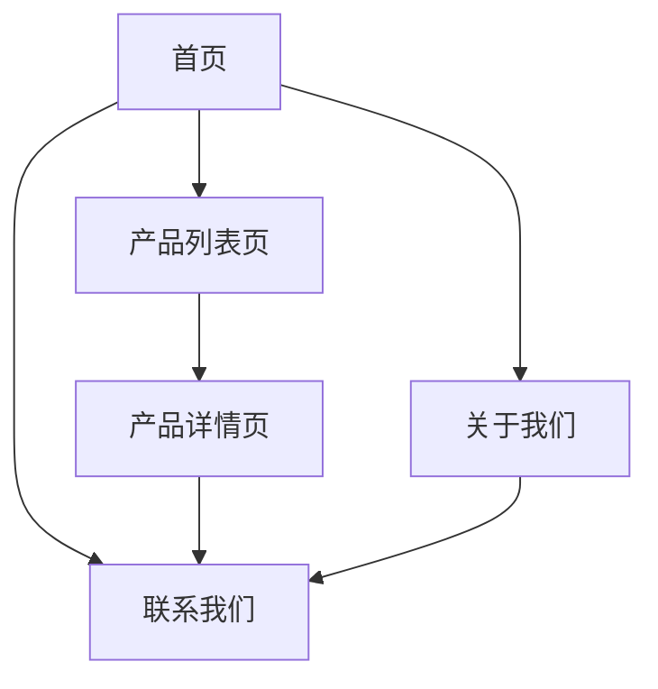

## 1. 产品概述

无人机产品展示静态网站，专注于展示公司无人机产品线。为潜在客户提供产品信息浏览、技术规格查看和联系方式，提升品牌形象和产品认知度。

**核心SEO目标**：网站必须极易被搜索引擎索引，用户通过搜索关键字（如"工业无人机"、"专业航拍设备"等）能直接跳转到网站，获得高排名和流量转化。

目标用户：对无人机产品感兴趣的潜在客户、合作伙伴、行业用户。通过专业的产品展示和SEO优化，帮助用户通过搜索引擎快速找到产品信息，促进业务咨询和销售转化。

## 2. 核心功能

### 2.1 用户角色

本网站为静态展示网站，无需用户注册登录功能。所有访问者均为普通浏览用户，拥有相同的浏览权限。

### 2.2 功能模块

网站包含以下核心页面，所有页面都必须具备SEO优化功能：

1. **首页**：品牌展示、特色产品推荐、公司优势介绍，配置关键词"无人机厂家"、"工业级无人机"
2. **产品列表页**：所有无人机产品分类展示、筛选功能，支持按SEO关键词筛选
3. **产品详情页**：单个产品详细介绍、技术规格、应用场景，每个产品页面都有独立的SEO配置
4. **关于我们**：公司介绍、发展历程、团队展示，突出行业专业性和技术实力
5. **联系我们**：联系方式、地图位置、在线咨询，包含地理位置SEO优化

### 2.3 页面详情

| 页面名称   | 模块名称   | 功能描述                                                    |
| ---------- | ---------- | ----------------------------------------------------------- |
| 首页       | 顶部导航   | 显示Logo、主导航菜单，固定在页面顶部                        |
| 首页       | 轮播横幅   | 自动轮播展示主打产品和品牌标语                              |
| 首页       | 特色产品   | 展示3-4款核心产品的缩略图和简介                             |
| 首页       | 公司优势   | 图文展示技术实力、服务优势等核心卖点                        |
| 首页       | 页脚信息   | 包含联系方式、社交媒体链接、版权信息                        |
| 产品列表页 | 产品分类   | 按用途分类展示（消费级、工业级、专业级）                    |
| 产品列表页 | 产品卡片   | 显示产品图片、名称、简要描述、查看详情按钮                  |
| 产品列表页 | 筛选功能   | 按价格区间、用途、续航时间等条件筛选                        |
| 产品详情页 | 产品图片   | 高清产品图片展示，支持放大查看                              |
| 产品详情页 | 技术规格   | 详细参数表格（尺寸、重量、续航、载荷等）                    |
| 产品详情页 | 应用场景   | 图文介绍产品适用领域和成功案例                              |
| 产品详情页 | 相关产品   | 推荐相似或配套产品                                          |
| 关于我们   | 公司简介   | 公司历史、发展理念、企业文化                                |
| 关于我们   | 发展历程   | 时间轴形式展示重要里程碑                                    |
| 关于我们   | 团队介绍   | 核心团队成员照片和简介                                      |
| 联系我们   | 联系信息   | 电话、邮箱、地址等基本信息                                  |
| 联系我们   | 地图展示   | 嵌入公司位置地图                                            |
| 联系我们   | 在线表单   | 简单的留言咨询表单（姓名、电话、需求）                      |
| SEO优化    | 页面元数据 | 每个页面可配置独立的Title、Meta Description、Keywords       |
| SEO优化    | 结构化数据 | 产品页面包含JSON-LD格式的结构化数据（价格、评分、技术参数） |
| SEO优化    | 站点地图   | 自动生成XML格式的sitemap，包含所有页面和产品链接            |
| SEO优化    | robots.txt | 配置搜索引擎爬虫访问规则，引导索引重要页面                  |
| SEO优化    | 性能优化   | Core Web Vitals指标优化，确保页面加载速度                   |
| SEO优化    | 移动端适配 | 确保移动设备上的搜索体验和排名优势                          |

## 3. 核心流程

用户访问流程（SEO优化版）：

1. 用户通过搜索引擎输入关键词（如"工业无人机厂家"）
2. 搜索结果中显示优化后的页面标题和描述
3. 用户点击搜索结果直达相关页面（首页/产品页）
4. 页面加载速度快，内容相关度高，降低跳出率
5. 用户浏览产品信息，通过内部链接发现更多相关产品
6. 通过结构化数据在搜索结果中显示产品评分和价格
7. 最终通过联系我们页面提交咨询或获取联系方式

SEO爬虫流程：

1. 搜索引擎爬虫通过sitemap发现所有页面
2. 页面提供清晰的标题、描述和关键词
3. 结构化数据帮助搜索引擎理解产品信息
4. 良好的页面结构和内部链接传递权重
5. 移动端友好的设计获得排名加成

## 4. 用户界面设计

### 4.1 设计风格

- **主色调**：深蓝色（#1a365d）搭配科技银（#c0c0c0）
- **辅助色**：亮蓝色（#3182ce）用于强调和交互元素
- **按钮样式**：圆角矩形，悬停时有颜色变化和轻微阴影
- **字体选择**：中文使用思源黑体，英文使用Roboto，标题24-32px，正文16px
- **布局风格**：现代化卡片式布局，大量留白，顶部固定导航
- **图标风格**：线性图标，简洁现代，符合科技产品定位

### 4.2 页面设计概览

| 页面名称   | 模块名称 | UI元素                                                         |
| ---------- | -------- | -------------------------------------------------------------- |
| 首页       | 轮播横幅 | 全宽设计，高度500px，自动切换间隔5秒，包含指示器和左右切换按钮 |
| 产品列表页 | 产品卡片 | 网格布局（3列），卡片圆角8px，悬停时有上浮动画，阴影加深       |
| 产品详情页 | 图片展示 | 左侧大图（60%宽度），右侧信息（40%宽度），图片支持灯箱放大     |
| 关于我们   | 时间轴   | 垂直时间轴，节点使用蓝色圆点，连接线使用淡灰色                 |
| 联系我们   | 表单区域 | 简洁的输入框设计，必填项用红色星号标注，提交按钮醒目           |

### 4.3 响应式设计

采用桌面端优先设计，适配不同设备：

- 桌面端：1200px以上，完整展示所有元素
- 平板端：768px-1199px，适当调整布局和字体大小
- 移动端：767px以下，采用单列布局，简化导航为汉堡菜单

所有交互元素都针对触摸操作进行优化，确保在移动设备上有良好的用户体验。

### 4.4 SEO设计规范

- **URL结构**：使用语义化URL，如`/products/industrial-drone-x8`
- **标题规范**：首页标题包含品牌词+核心关键词，产品页标题包含产品型号+应用场景
- **描述优化**：每个页面有独特的meta description，突出产品卖点和公司优势
- **关键词布局**：自然融入内容，避免关键词堆砌
- **图片优化**：所有产品图片包含描述性alt属性，文件名包含关键词
- **内链策略**：相关产品推荐、面包屑导航、上下文链接
