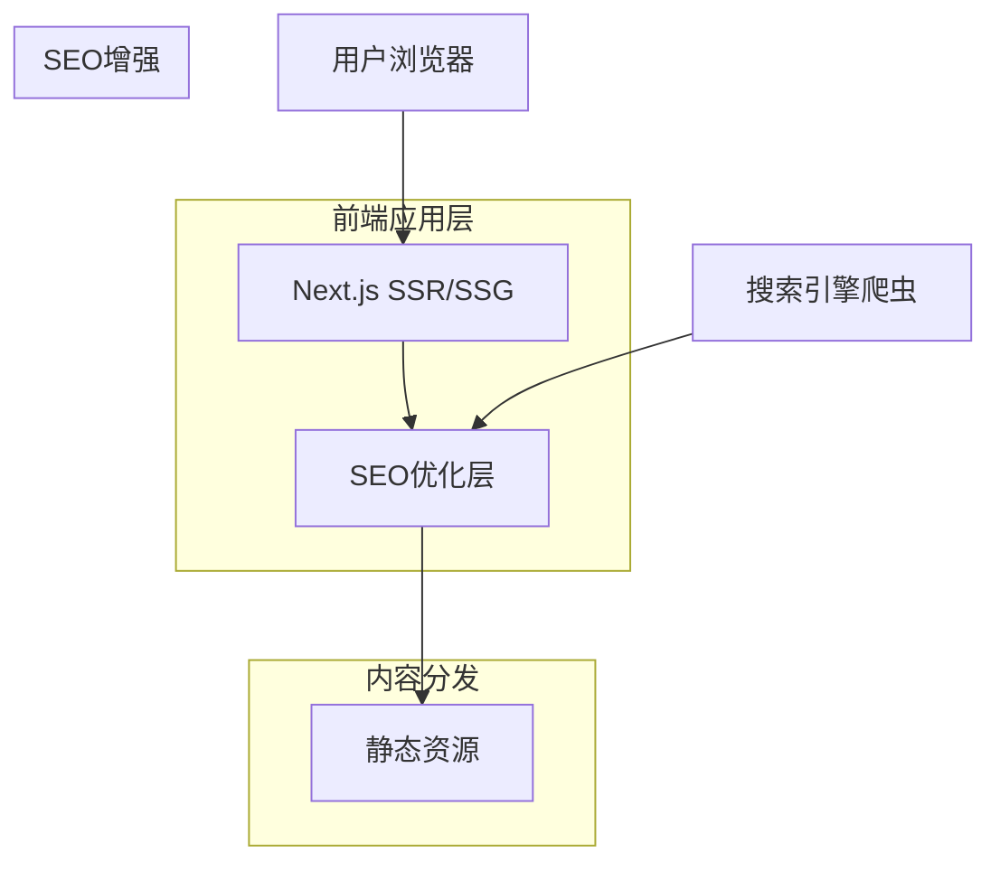

## 1. 架构设计



## 2. 技术描述

为满足SEO优化需求，技术栈升级为：

- **前端框架**: Next.js 14 (React 18) - 支持SSR/SSG，天生SEO友好
- **初始化工具**: create-next-app
- **CSS框架**: Tailwind CSS 3（快速样式开发）
- **SEO库**: next-seo（专业的SEO管理）
- **结构化数据**: nextjs-schema-org（JSON-LD生成）
- **站点地图**: next-sitemap（自动生成）
- **性能分析**: @next/bundle-analyzer（包大小优化）
- **部署平台**: Vercel（Next.js原生支持，全球CDN）
- **图片优化**: Next.js Image组件（自动WebP转换、响应式）

## 3. 路由定义

| 路由 | 目的 | SEO配置 |
|-------|---------|---------|
| / | 首页，展示品牌信息和主打产品 | 标题："无人机厂家_工业级无人机专业制造商-品牌名" |
| /products | 产品列表页，展示所有无人机产品 | 标题："无人机产品大全_工业级|消费级|专业级无人机-品牌名" |
| /products/[slug] | 产品详情页，显示特定产品的详细信息 | 动态标题："[产品型号]_[应用场景]无人机-[产品类别]-品牌名" |
| /about | 关于我们页面，公司介绍和发展历程 | 标题："关于我们_无人机行业领先企业-品牌名" |
| /contact | 联系我们页面，提供联系方式和咨询表单 | 标题："联系我们_无人机厂家联系方式-品牌名" |
| /sitemap.xml | 自动生成的站点地图 | 包含所有页面URL和更新频率 |
| /robots.txt | 爬虫访问规则 | 指导搜索引擎索引策略 |

## 4. 文件结构

```
drone-showcase/
├── public/
│   ├── images/
│   │   ├── products/
│   │   ├── banners/
│   │   └── icons/
│   └── favicon.ico
├── src/
│   ├── assets/
│   │   ├── css/
│   │   │   └── main.css
│   │   └── js/
│   │       ├── main.js
│   │       └── components/
│   ├── pages/
│   │   ├── index.html
│   │   ├── products.html
│   │   ├── product-detail.html
│   │   ├── about.html
│   │   └── contact.html
│   ├── components/
│   │   ├── header.html
│   │   ├── footer.html
│   │   └── product-card.html
│   └── data/
│       └── products.json
├── vite.config.js
├── tailwind.config.js
└── package.json
```

## 5. 性能优化

### 5.1 图片优化
- 使用WebP格式减少图片大小
- 实现图片懒加载
- 提供不同尺寸的响应式图片
- 使用CDN加速图片加载

### 5.2 代码优化
- CSS和JS文件压缩
- 移除未使用的CSS（PurgeCSS）
- 启用Gzip压缩
- 设置合理的缓存策略

### 5.3 SEO优化（核心功能）
- **服务器端渲染**: Next.js SSR确保爬虫能够读取完整内容
- **动态Meta标签**: 每个页面配置独立的title、description、keywords
- **结构化数据**: 产品页面使用Schema.org标准，包含：
  - Product类型（名称、描述、价格、品牌）
  - Review类型（用户评分、评论）
  - Organization类型（公司信息）
- **站点地图**: 自动生成sitemap.xml，包含所有产品页面
- **robots.txt**: 配置爬虫访问规则，优先索引产品页面
- **Canonical URL**: 避免重复内容问题
- **Open Graph**: 支持社交媒体分享预览
- **Twitter Cards**: 优化Twitter分享展示
- **面包屑导航**: 增强页面结构理解
- **内部链接**: 产品间相互推荐，传递页面权重

## 6. 开发规范

### 6.1 HTML规范
- 使用HTML5语义化标签
- 确保所有图片都有alt属性
- 表单元素使用正确的label关联
- 遵循W3C标准

### 6.2 CSS规范
- 使用BEM命名规范
- 移动端优先的响应式设计
- 避免使用!important
- 保持选择器简洁

### 6.3 JavaScript规范
- 使用ES6+语法
- 模块化管理代码
- 添加适当的错误处理
- 避免全局变量污染

## 7. 部署配置

### 7.1 构建配置
```javascript
// vite.config.js
export default {
  build: {
    outDir: 'dist',
    assetsDir: 'assets',
    minify: 'terser',
    terserOptions: {
      compress: {
        drop_console: true,
        drop_debugger: true
      }
    }
  }
}
```

### 7.2 SEO配置示例
```javascript
// next-seo.config.js
export default {
  title: '无人机厂家_工业级无人机专业制造商-品牌名',
  description: '专业生产工业级、消费级、专业级无人机，提供航拍、测绘、巡检等解决方案，技术领先，品质保证',
  canonical: 'https://www.example.com',
  openGraph: {
    type: 'website',
    locale: 'zh_CN',
    url: 'https://www.example.com',
    siteName: '品牌名无人机',
    images: [
      {
        url: 'https://www.example.com/og-image.jpg',
        width: 1200,
        height: 630,
        alt: '品牌名无人机产品展示',
      },
    ],
  },
  twitter: {
    handle: '@brandname',
    site: '@brandname',
    cardType: 'summary_large_image',
  },
};
```

### 7.3 产品页面SEO配置
```javascript
// pages/products/[slug].js
import { NextSeo } from 'next-seo';
import { ProductJsonLd } from 'nextjs-schema-org';

export default function ProductPage({ product }) {
  return (
    <>
      <NextSeo
        title={`${product.model}_${product.application}无人机-${product.category}-品牌名`}
        description={product.seoDescription}
        canonical={`https://www.example.com/products/${product.slug}`}
        openGraph={{
          url: `https://www.example.com/products/${product.slug}`,
          title: product.name,
          description: product.description,
          images: [
            {
              url: product.mainImage,
              width: 800,
              height: 600,
              alt: product.name,
            },
          ],
        }}
      />
      <ProductJsonLd
        productName={product.name}
        images={[product.mainImage]}
        description={product.description}
        brand="品牌名"
        reviews={product.reviews}
        aggregateRating={{
          ratingValue: product.rating,
          reviewCount: product.reviewCount,
        }}
        offers={{
          price: product.price,
          priceCurrency: 'CNY',
          availability: 'https://schema.org/InStock',
        }}
      />
      {/* 页面内容 */}
    </>
  );
}
```

### 7.4 性能指标（Core Web Vitals）
- **LCP (Largest Contentful Paint)**: < 2.5秒
- **FID (First Input Delay)**: < 100毫秒
- **CLS (Cumulative Layout Shift)**: < 0.1
- **FCP (First Contentful Paint)**: < 1.8秒
- **TTI (Time to Interactive)**: < 3.8秒

### 7.5 部署配置
```javascript
// next.config.js
module.exports = {
  images: {
    domains: ['cdn.example.com'],
    formats: ['image/webp', 'image/avif'],
  },
  i18n: {
    locales: ['zh-CN'],
    defaultLocale: 'zh-CN',
  },
  trailingSlash: true, // 有利于SEO的URL格式
  generateRobotsTxt: true,
  generateSitemap: true,
};
```

### 7.6 部署注意事项 (TODO)
- **Vercel 部署**: 
  - 项目将部署在 Vercel 平台上，利用其对 Next.js 的原生支持。
  - **国内访问优化**: 由于 Vercel 的默认节点在国内访问可能不稳定，需要考虑配置国内 CDN 加速（如阿里云 CDN、腾讯云 CDN）或使用中转方案。
  - **自定义域名**: 配置自定义域名并开启 SSL 证书。
- **环境变量**: 确保生产环境变量（如 API 地址、统计代码 ID）在 Vercel 后台正确配置。