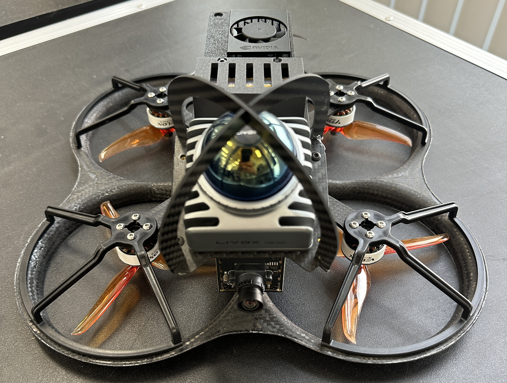
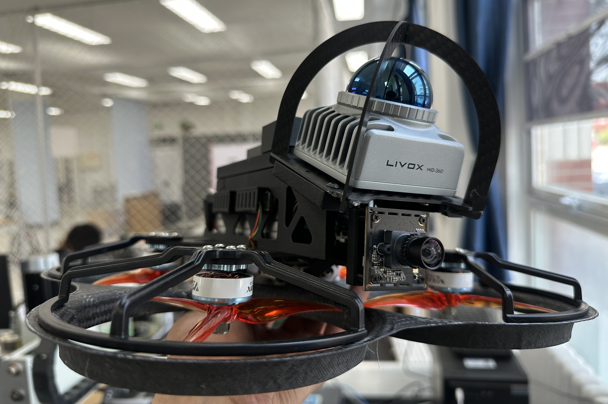

# 六好学生


因六好学生原始版本是5寸桨和普通电池 续航会很低 现在的新机架用的是7寸桨和半固态电池

六好学生无人机，是一款高性能，多功能、小巧灵活的通用无人机平台,适配了最新的 fastlivo2（只包含雷达定位部分，SLAM 定位精度更加强悍）！性能、续航、体积之间做到了优质的平衡！

更新：机体中间和下方加入了减震优化结构；加入了防炸机保护，检测到无人机定位数据紊乱后自动切换降落保护模式，用起来更安心；优化了视觉识别内容，速度更快，内存占用更小。








## 详细介绍


### 1.所使用的模块
1. 飞控：塔式飞控（PX4）已升级至工业级飞控 或 Nxt PX4！
2. 雷达：mid360
3. 机载电脑：jetson orin nx super


4. USB 摄像头：星光级1080P_2.6mm无畸变[水平100度](支持硬件同步且提供同步驱动源码)
5. 遥控器：Radiomaster POCKET遥控器（常规的美国手操作）

[自己进来找不同吧|相机小型化|fastlivo2改_哔哩哔哩_bilibili](https://www.bilibili.com/video/BV1SBT6zPEqk/)

[[开源]精美彩点云|小小小相机同步驱动|优雅地飞行_哔哩哔哩_bilibili](https://www.bilibili.com/video/BV1yagDzfEmF/?vd_source=4289c781adc3a9ced242221ce6b3f4e0)

基于地面站进行室内自主巡检

[我们工作室的无人机终于有专属的地面站了！_哔哩哔哩_bilibili](https://www.bilibili.com/video/BV1wUvFzVEAy/?vd_source=4289c781adc3a9ced242221ce6b3f4e0)


### 2.电池、载重、续航、体积 、定位精度
六好学生整机重量

电池：4s 5300mah

最大起飞重量：1.9kg

续航： 5 寸桨飞 9 分钟（可改装为七寸桨，飞 13 分钟）

体积：轴距 210mm  最外围 30 * 30cm

定位精度：<0.5 cm（Fast livo2）。

飞机重量：900g（不包含电池）

六好学生囊括了四好学生的所有功能哦！基础操作部分同下：

[【发货使用】“四好学生”通用无人机平台详细说明](https://www.yuque.com/woshihenyouxiude/lwkpvm/kuld1zdq69o0d0gt)

** SLAM 功能**

获取无人机的定位数据并进行三维扫描建图（一键启动）。

```bash
./3DSLAM.sh
```

获取无人机的定位数据并进行三维建图（一键启动）。

```bash
./fastlivo2.sh
```

**自主避障导航功能**

获取无人机的定位数据，记得检查定位数据是否正常输出。

```bash
./3DSLAM.sh
```

启动 egoplanner，使用 mid360 提供的障碍物点云信息。

```bash
roslaunch ego_planner single_run_in_expmid.launch
```

启动 ego 控制器，上至航点程序，下至 egoplanner 算法。

```bash
roslaunch egoctrl_v1 egoctrl.launch
```

启动 task_node 综合指令发布程序。

```bash
roslaunch egoctrl_v1 run_mid_ego.launch
```

解锁无人机，按下 offboard 模式按键。无人机会在机载电脑的控制下，按照 task_node 综合指令发布程序自主飞行。

新手建议：

获取无人机的定位数据，记得检查定位数据是否正常输出。

```bash
./3DSLAM.sh
```

启动 egoplanner，使用 mid360 提供的障碍物点云信息。

```bash
roslaunch ego_planner single_run_in_expmid.launch
```

启动控制器，上至 rviz，下至 egoplanner 算法。

```bash
roslaunch egoctrl_v1 egoctrl_yuanshi.launch
```

解锁无人机，按下 offboard 模式按键。无人机会在机载电脑的控制下飞到 1 m，然后按照 rviz 打点的位置进行飞行。

在 rviz 上打点飞行。

启动并获取无人机的定位数据，记得检查定位数据是否正常输出。

```bash
./3DSLAM.sh
```

遥控器切换到定点模式。

解锁无人机。

油门杆向上推动，0-50%的范围无效，50%-100%的范围内开始启动，缓慢推动加速无人机起飞，飞到一定高度后，将油门杆回中，此时无人机将保持悬停状态。

遥控器控制运动。

遥控器拨到降落模式降落。

启动并获取无人机的定位数据，记得检查定位数据是否正常输出。

```bash
./3DSLAM.sh
```

快捷指令，此指令将启动深度相机并将像素强制改为640*480。

```bash
qidongd435
```

开启动态障碍物检测。

```bash
roslaunch onboard_detector detector_with_learning_module.launch
```

打开显示地图的 rviz。

```bash
roslaunch remote_control dynamic_navigation_rviz.launch
```

执行导航，无人机自动解锁并飞到1m，等待 rviz 打点飞行，按 ctrl+c 降落。

```bash
roslaunch autonomous_flight dynamic_navigation.launch
```

启动并获取无人机的定位数据，记得检查定位数据是否正常输出。

```bash
./3DSLAM.sh
```

打开显示所有地图的 rviz。

```bash
roslaunch remote_control navigation_rviz.launch
```

执行导航，无人机自动解锁并飞到1m，等待 rviz 打点飞行，按 ctrl+c 降落。

```bash
roslaunch autonomous_flight navigation.launch
```

**自主探索+避障导航功能**

启动并获取无人机的定位数据，记得检查定位数据是否正常输出。

```bash
./3DSLAM.sh
```

快捷指令，此指令将启动深度相机并将像素强制改为640*480。

```bash
qidongd435
```

第二行和第三行启不启动都可以，默认别启动。

```bash
roslaunch onboard_detector detector_with_learning_module.launch
```

打开显示地图的 rviz。

```bash
roslaunch remote_control exploration_rviz.launch
```

执行探索，无人机自动解锁并飞到1m，等待用户按回车指令继续，按 ctrl+c 降落。

```bash
roslaunch autonomous_flight dynamic_exploration.launch
```

**智能识别功能**

无人机不需要起飞，给机载电脑上电和mid360上电，这是单独的一个纯检测功能。

启动并获取无人机的定位数据，记得检查定位数据是否正常输出。

```bash
./3DSLAM.sh
```

快捷指令，此指令将启动深度相机并将像素强制改为640*480。

```bash
qidongd435
```

开启动态障碍物检测。

```bash
roslaunch onboard_detector detector_with_learning_module.launch
```

```bash
cd ~/YOLO/
python YOLO.py
```

在 YOLO.py 中替换为你的权重文件。数字是你的 USB 摄像头编号，识别结果可保存为视频、图片、文字输出等。


**便捷网络功能**

快捷指令，连接本地的 clash（在 ./bashrc 内填写 ip 和端口号即可）。

```bash
tizi
```

**便捷 更换 wifi 功能**

开启 wifi。

```bash
sudo nmcli radio wifi on
```

扫描 wifi。

```bash
sudo iwlist wlan0 scan | grep ESSID
```

连接指定 wifi。

```bash
sudo nmcli dev wifi connect "你的WiFi名称" password "你的WiFi密码"
sudo nmcli dev wifi connect "summer" password "11111111"
```

所有 offboard 模式起飞前，都建议切换到定点模式，油门遥感在最低位起飞，这样再退出offboard 模式后，无人机会丝滑地缓慢下降！


## 售价
1. 机载jetson orin super nx 软件环境，支持完全二次开发，所有的代码都在无人机上的机载电脑内。
2. 提供完善的设备维护和使用支持，官方提供标准机型用户操作视频供参考，教程视频会通过百度网盘链接提供。
3. 支持任意发票，可直接向我的公司账户付款，也可在 B 站工房内下单，详情请咨询狗弟工作室 QQ:480475357。
