# 鲤鱼门 X8

## 基础信息

- slug：`liyumen-x8`
- 来源文件：`out/p/liyumenx8.md`、`out/liyumenx8.md`
- 关联 Wiki：`wiki/liyumen-x8-user-guide.md`
- 当前网站位置：`/products/liyumen-x8`，产品卡片数据在 `src/data/products.ts`

## 快速摘要

鲤鱼门 X8 是面向复杂受限空间的工业级勘测无人机，解决地下隧道、矿山、林业等场景中“进不去、看不清、联不通”的痛点。最新资料包含 Mid360 方案和推荐的 Odin1 方案，强调触屏遥控、融合定位、彩色点云、航迹录制和复飞。

## 产品定位

X8 面向工业勘测和复杂空间数据采集，重点不是教学入门，而是高可靠飞行、真实场景还原、弱网/无 GNSS 环境下的感知和建图能力。

## 核心卖点

- 无 GNSS、弱光、强磁干扰、弱网环境下的自主飞行和勘测能力。
- 推荐 Odin1 方案，融合相机、雷达、IMU，免标定，同时获得点云、RGB、深度数据。
- 触屏遥控可直接操作机载 Ubuntu 和 ROS，减少外接电脑、显示器、键鼠需求。
- 支持一键扫描、彩色地图保存、Bag 录制、航迹录制、航迹复飞。
- 三维彩色点云“一比一现实还原”。
- MindCloud Studio 支持地图处理和多格式导出。
- 新机使用 7 寸桨和半固态电池，来源称续航 15.9min+，Odin1 方案续航 15 到 20 分钟区间。

## 关键参数

| 参数 | 数值 | 备注 |
| --- | --- | --- |
| 飞控 | PX4 | 最新资料称全系标配。 |
| 动力 | 7 寸桨、60A 电调、半固态电池 | 保留最新来源。 |
| 电池容量 | 最新套装来源为 7500mAh；DOCX 转换资料中出现 9000mAh | 公开使用前需确认。 |
| 遥控器 | H12PRO / 触屏遥控 | 来源同时提到触屏遥控和 H12PRO 套装表。 |
| 雷达/传感器 | 推荐 Odin1，也有 Mid360 方案 | 保留来源中的两套方案。 |
| 机载电脑 | 全能版 Jetson Orin NX 16G，标准版 Jetson Orin NX 8G | 来自套装表。 |
| 续航 | 15.9min+；Odin1 方案 15-20min；旧 DOCX 来源写 12min/18min | 公开参数需最终确认。 |
| 外围尺寸 | 最新来源写 410mm x 410mm，轴距 285mm | 保留来源参数。 |
| 点云输出 | 最高 70 万点/秒 | DOCX 转换来源。 |
| FOV | 120 x 90 度 | DOCX 转换来源。 |
| 相机 | 深度 240 x 180 + RGB 1600 x 1296 | DOCX 转换来源。 |
| 位姿更新频率 | 400Hz | DOCX 转换来源。 |
| 探测距离 | 90% 反射率 70m，10% 反射率 30m | DOCX 转换来源。 |

## 功能能力

- 实时空间感知和彩色点云查看。
- 遥控器一体化可视化。
- Odin1 空间记忆。
- MindSLAM 融合定位。
- MindCloud Studio 地图处理。
- 多格式点云导出。
- 适用场景包括边坡、隧道、下水道、杂乱草丛、炉膛、涵洞、矿洞、桥梁等。

## 价格与套装信息

最新来源包含套装价格：

| 套装 | 来源价格 | 备注 |
| --- | --- | --- |
| Mid360 全能版 | 5.1 万一套 | 包含遥控器可视化、FastLio、FastLivo2、super 自主避障导航、航迹录制复飞、传感器驱动。 |
| Mid360 标准版 | 2.5w | 偏硬件本体，不含可视化遥控器和软件包，只有硬件售后。 |
| Odin 全能版 | 7.9w | 来源标注推荐。 |
| Odin 标准版 | 2.7w | 偏硬件本体，不含可视化遥控器和软件包，只有硬件售后。 |

网站可用性：价格可能敏感，公开使用前需要确认。

## 网页修改参考

- 当前页面如遇参数冲突，应优先参考 `out/p/liyumenx8.md`，旧 DOCX 转换资料作为补充。
- 电池容量、续航、重量单位等需要标注待确认。
- 产品页放营销信息；APP 操作、雷达启动、Bag 录制、地图保存、航迹复飞等放 Wiki。
- `src/pages/products/liyumen-x8.tsx` 已做过一次 X8 资料更新，后续继续修改前应以本资料库作为参考点。

## 图片资产

图片来源清单：`docs/content-library/assets/products/liyumen-x8/_manifest.md`。以下按来源文档中的图片顺序保留，便于结合前文判断用途。

### image-1：点云/扫描

- 来源：`out/p/liyumenx8.md`
- 文件：`docs/content-library/assets/products/liyumen-x8/liyumen-x8-pointcloud-001-1b9dc446.png`
- 备注：已下载

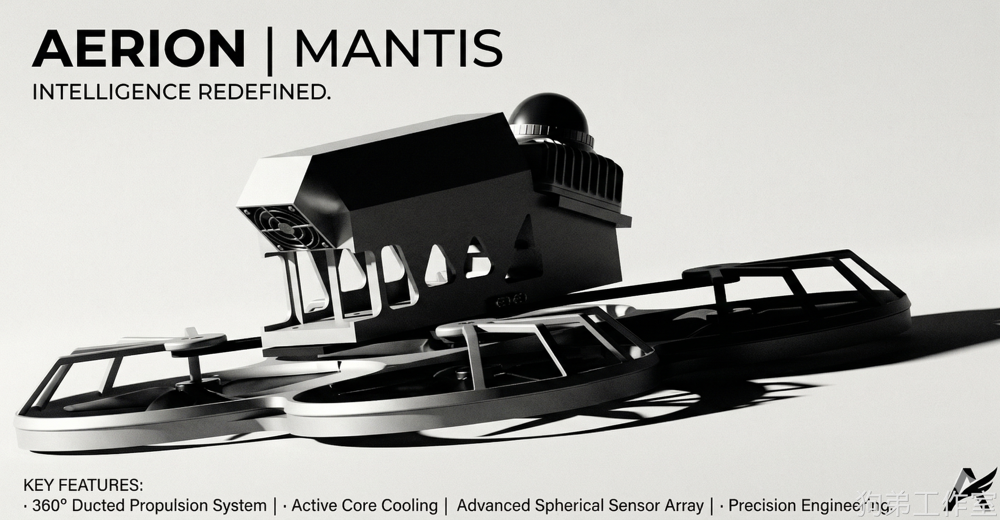

### image-2：硬件

- 来源：`out/p/liyumenx8.md`
- 文件：`docs/content-library/assets/products/liyumen-x8/liyumen-x8-hardware-002-5482330a.png`
- 备注：已下载

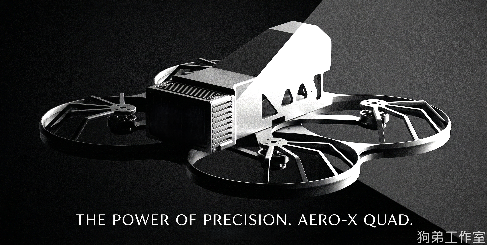

### image-3：点云/扫描

- 来源：`out/p/liyumenx8.md`
- 文件：`docs/content-library/assets/products/liyumen-x8/liyumen-x8-pointcloud-003-5bebdeed.png`
- 备注：已下载

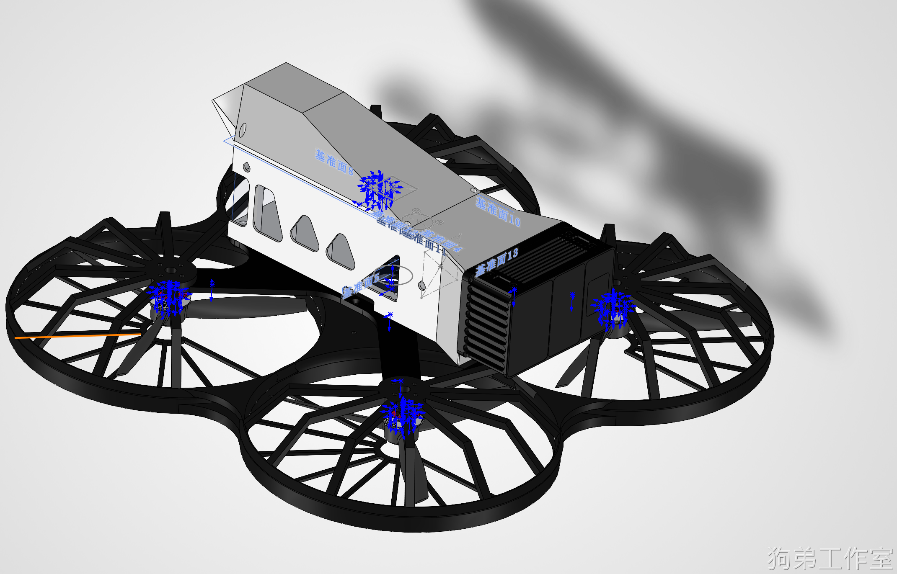

### image-4：点云/扫描

- 来源：`out/p/liyumenx8.md`
- 文件：`docs/content-library/assets/products/liyumen-x8/liyumen-x8-pointcloud-004-73ec7004.png`
- 备注：已下载

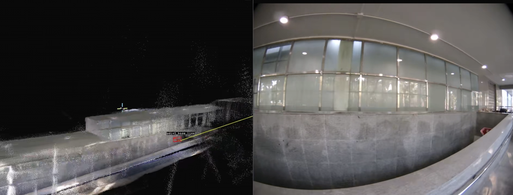

### image-14：接线/配置

- 来源：`out/p/liyumenx8.md`
- 文件：`docs/content-library/assets/products/liyumen-x8/liyumen-x8-wiring-014-9fa751b7.png`
- 备注：已下载

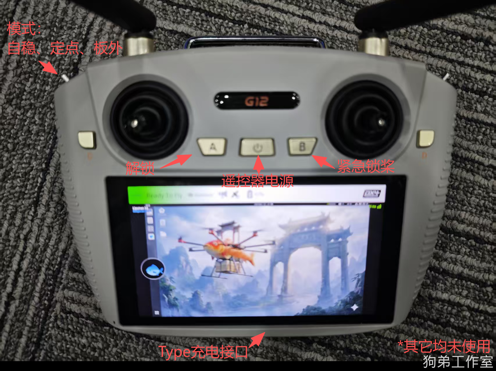

### image-15：接线/配置

- 来源：`out/p/liyumenx8.md`
- 文件：`docs/content-library/assets/products/liyumen-x8/liyumen-x8-wiring-015-c9cc0fd3.png`
- 备注：已下载

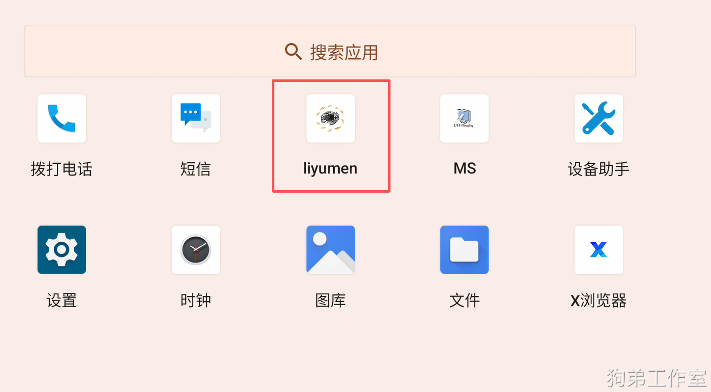

### image-16：接线/配置

- 来源：`out/p/liyumenx8.md`
- 文件：`docs/content-library/assets/products/liyumen-x8/liyumen-x8-wiring-016-9db6501a.png`
- 备注：已下载

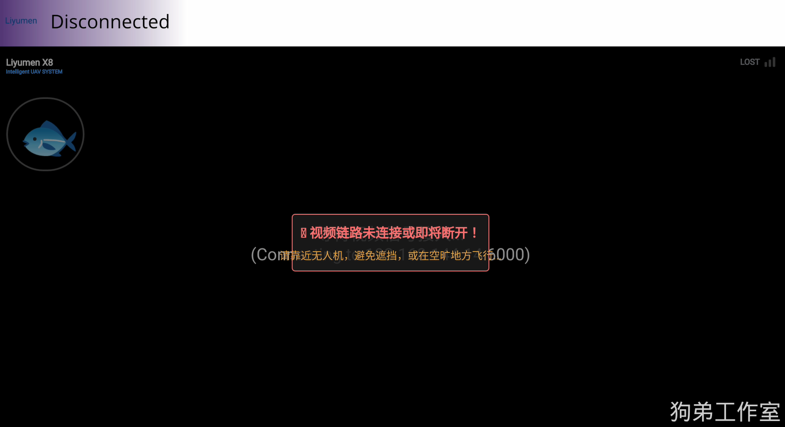

### image-17：接线/配置

- 来源：`out/p/liyumenx8.md`
- 文件：`docs/content-library/assets/products/liyumen-x8/liyumen-x8-wiring-017-5b57e931.png`
- 备注：已下载

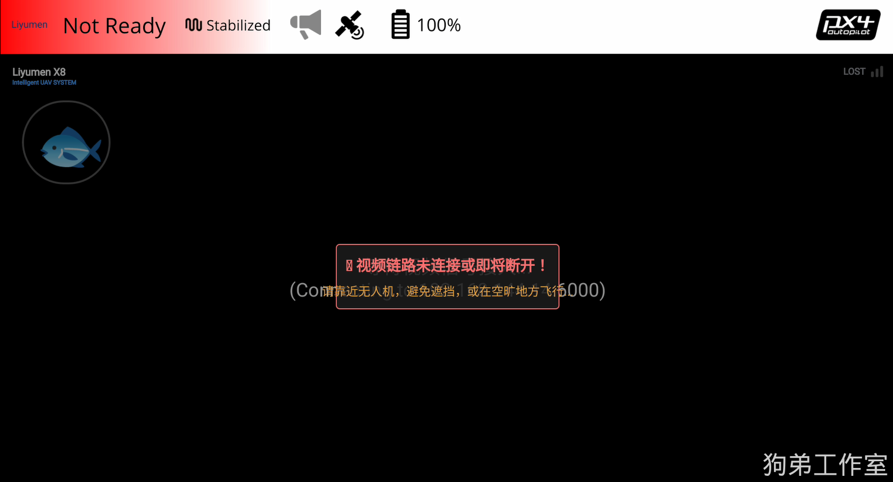

### image-18：硬件

- 来源：`out/p/liyumenx8.md`
- 文件：`docs/content-library/assets/products/liyumen-x8/liyumen-x8-hardware-018-1e1440c1.png`
- 备注：已下载

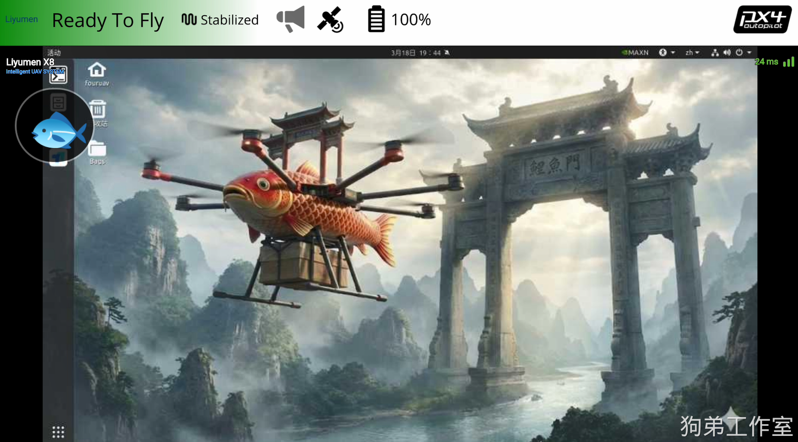

### image-19：硬件

- 来源：`out/p/liyumenx8.md`
- 文件：`docs/content-library/assets/products/liyumen-x8/liyumen-x8-hardware-019-41a7c1ef.png`
- 备注：已下载

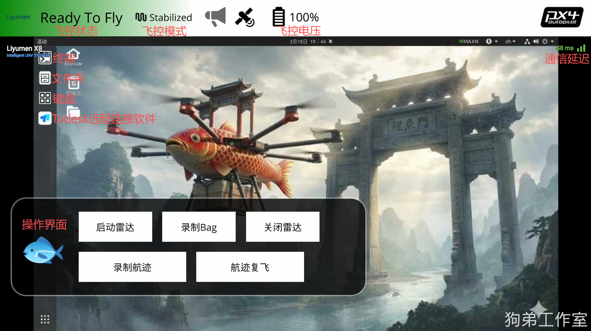

### image-20：点云/扫描

- 来源：`out/p/liyumenx8.md`
- 文件：`docs/content-library/assets/products/liyumen-x8/liyumen-x8-pointcloud-020-f76ca4cc.png`
- 备注：已下载

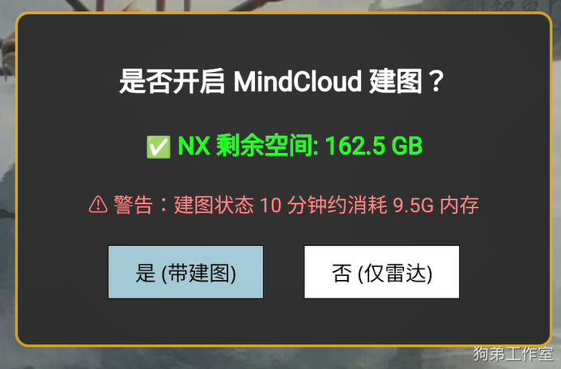

### image-21：点云/扫描

- 来源：`out/p/liyumenx8.md`
- 文件：`docs/content-library/assets/products/liyumen-x8/liyumen-x8-pointcloud-021-f1ca3265.png`
- 备注：已下载

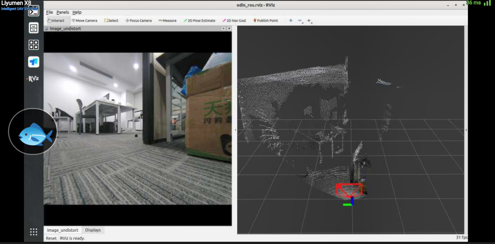

### image-22：硬件

- 来源：`out/p/liyumenx8.md`
- 文件：`docs/content-library/assets/products/liyumen-x8/liyumen-x8-hardware-022-c2b46718.png`
- 备注：已下载

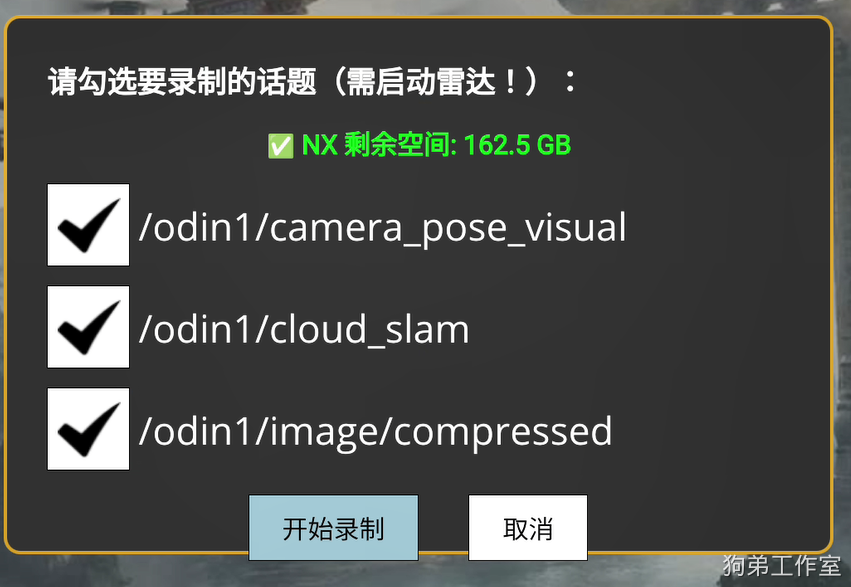

### image-23：硬件

- 来源：`out/p/liyumenx8.md`
- 文件：`docs/content-library/assets/products/liyumen-x8/liyumen-x8-hardware-023-395f88dd.png`
- 备注：已下载

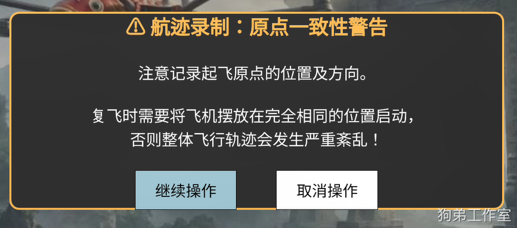

### image-24：硬件

- 来源：`out/p/liyumenx8.md`
- 文件：`docs/content-library/assets/products/liyumen-x8/liyumen-x8-hardware-024-d72f91b4.png`
- 备注：已下载

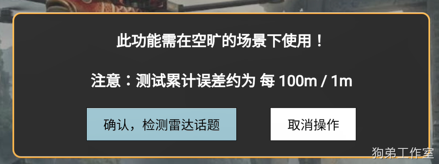

### image-25：遥控器/交互

- 来源：`out/p/liyumenx8.md`
- 文件：`docs/content-library/assets/products/liyumen-x8/liyumen-x8-remote-control-025-a5e1190b.png`
- 备注：已下载

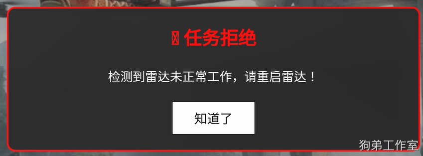

### image-26：接线/配置

- 来源：`out/p/liyumenx8.md`
- 文件：`docs/content-library/assets/products/liyumen-x8/liyumen-x8-wiring-026-b749d1b5.png`
- 备注：已下载

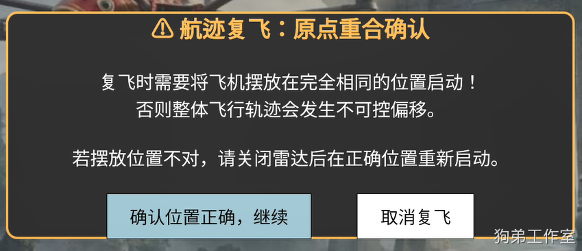

### image-27：图片

- 来源：`out/p/liyumenx8.md`
- 文件：`docs/content-library/assets/products/liyumen-x8/liyumen-x8-image-027-4b402992.png`
- 备注：已下载

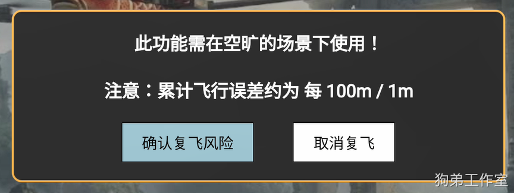

### image-28：图片

- 来源：`out/p/liyumenx8.md`
- 文件：`docs/content-library/assets/products/liyumen-x8/liyumen-x8-image-028-3785c7ca.png`
- 备注：已下载

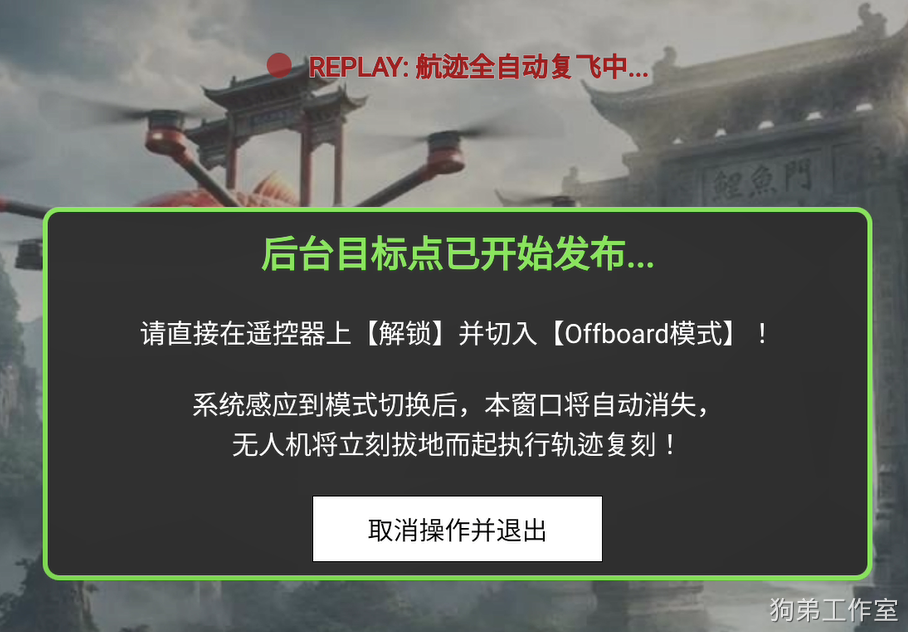

### image-1：点云/扫描

- 来源：`out/liyumenx8.md`
- 文件：`docs/content-library/assets/products/liyumen-x8/liyumen-x8-pointcloud-001-357552fb.jpg`
- 备注：已迁入

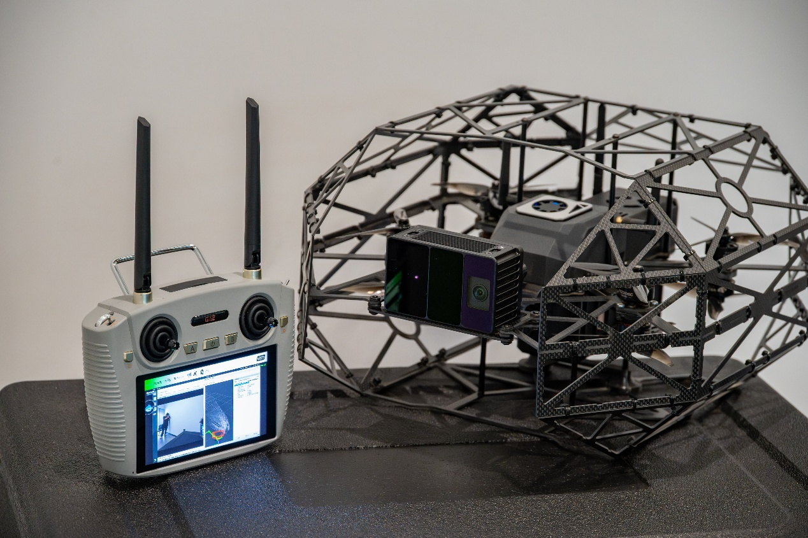

### image-2：图片

- 来源：`out/liyumenx8.md`
- 文件：`docs/content-library/assets/products/liyumen-x8/liyumen-x8-image-002-70d85c23.jpg`
- 备注：已迁入

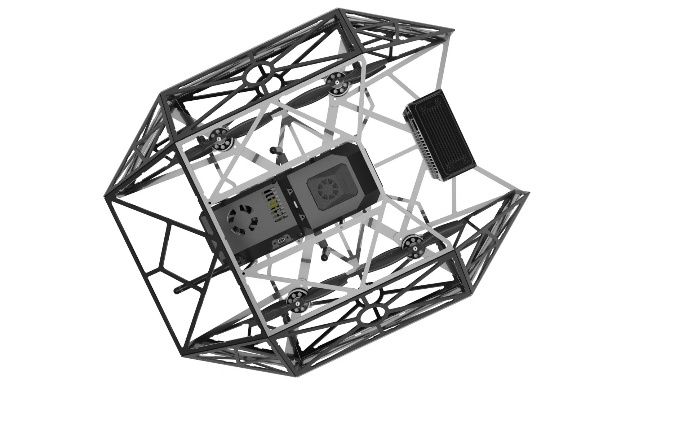

### image-3：图片

- 来源：`out/liyumenx8.md`
- 文件：`docs/content-library/assets/products/liyumen-x8/liyumen-x8-image-003-8b3dc034.jpg`
- 备注：已迁入

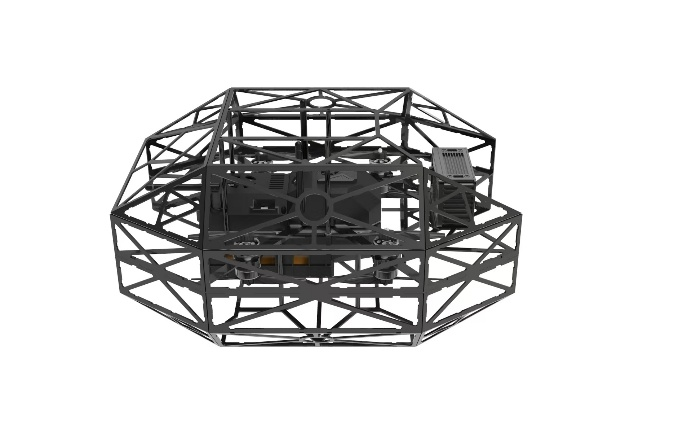

### image-5：点云/扫描

- 来源：`out/liyumenx8.md`
- 文件：`docs/content-library/assets/products/liyumen-x8/liyumen-x8-pointcloud-005-e6e658a2.png`
- 备注：已迁入

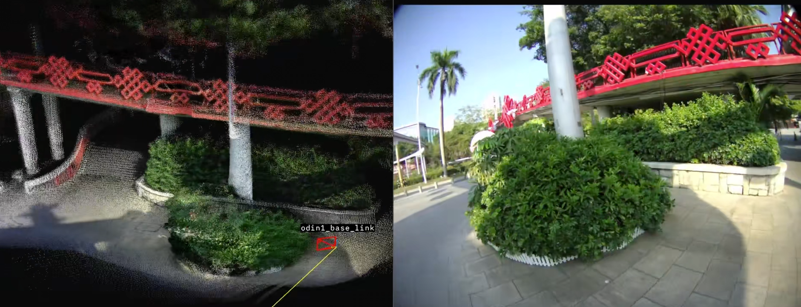

### image-6：点云/扫描

- 来源：`out/liyumenx8.md`
- 文件：`docs/content-library/assets/products/liyumen-x8/liyumen-x8-pointcloud-006-93af7d53.png`
- 备注：已迁入

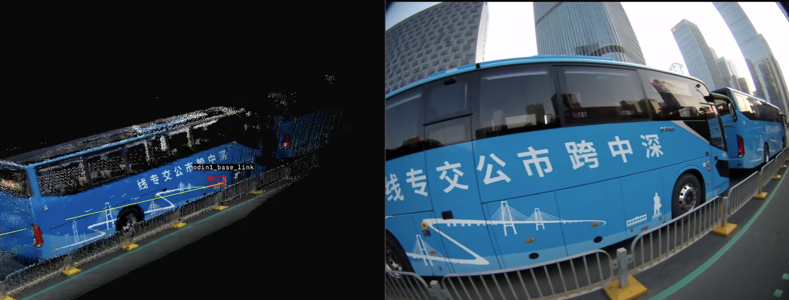

### image-7：点云/扫描

- 来源：`out/liyumenx8.md`
- 文件：`docs/content-library/assets/products/liyumen-x8/liyumen-x8-pointcloud-007-66ff731b.png`
- 备注：已迁入

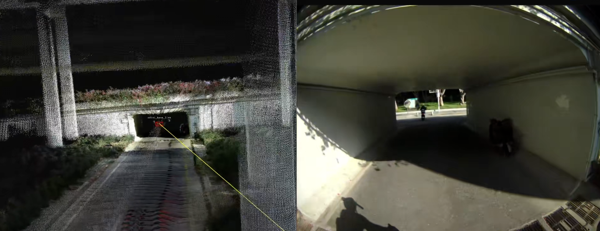

### image-8：点云/扫描

- 来源：`out/liyumenx8.md`
- 文件：`docs/content-library/assets/products/liyumen-x8/liyumen-x8-pointcloud-008-bb8146c4.png`
- 备注：已迁入

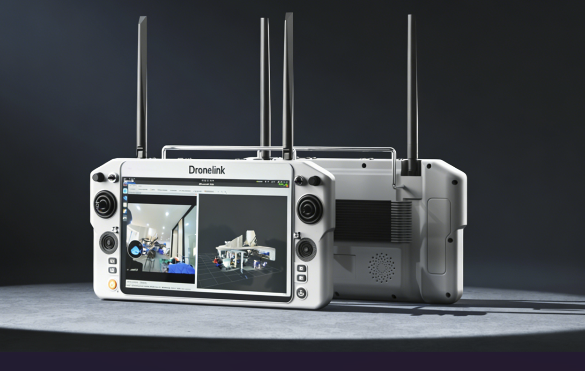

### image-9：产品图

- 来源：`out/liyumenx8.md`
- 文件：`docs/content-library/assets/products/liyumen-x8/liyumen-x8-product-009-927619fb.png`
- 备注：已迁入

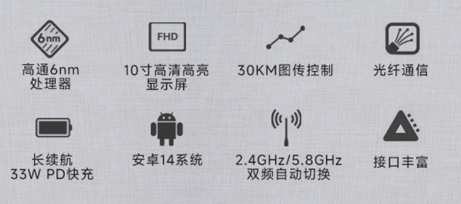

### image-10：遥控器/交互

- 来源：`out/liyumenx8.md`
- 文件：`docs/content-library/assets/products/liyumen-x8/liyumen-x8-remote-control-010-b76ffa7a.png`
- 备注：已迁入

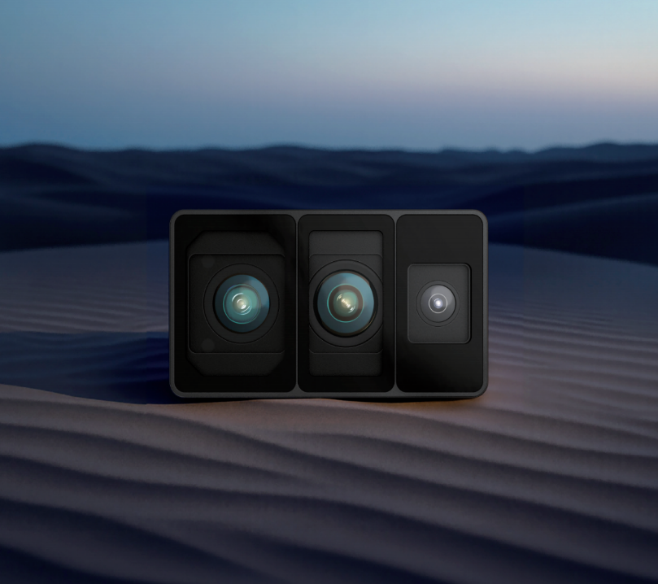

### image-11：点云/扫描

- 来源：`out/liyumenx8.md`
- 文件：`docs/content-library/assets/products/liyumen-x8/liyumen-x8-pointcloud-011-58416449.png`
- 备注：已迁入

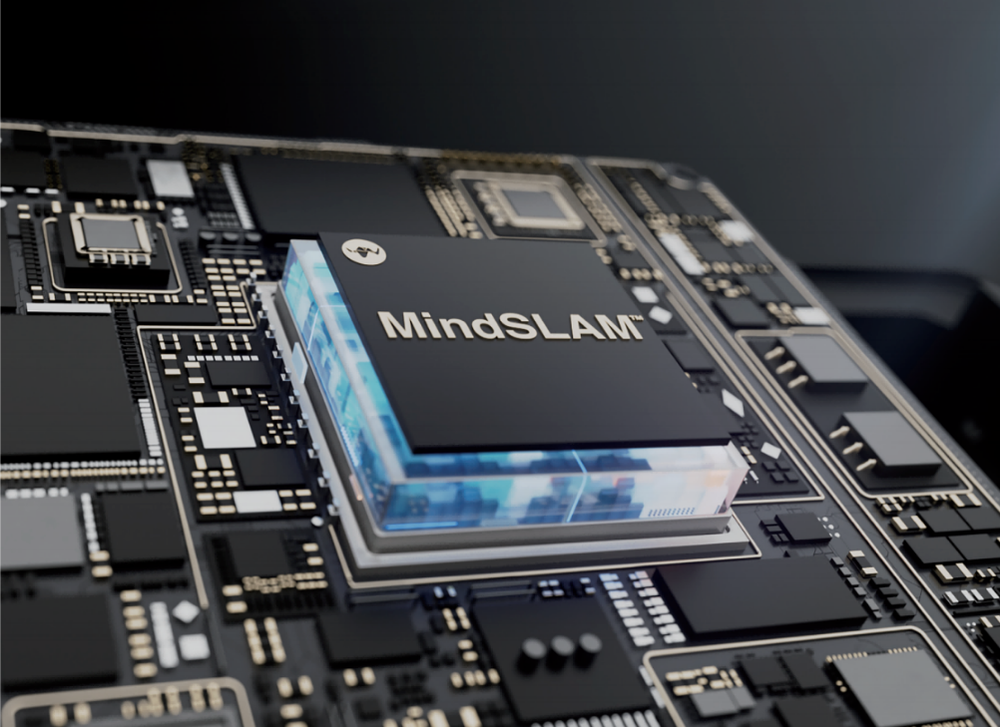

### image-12：点云/扫描

- 来源：`out/liyumenx8.md`
- 文件：`docs/content-library/assets/products/liyumen-x8/liyumen-x8-pointcloud-012-59f81fab.png`
- 备注：已迁入

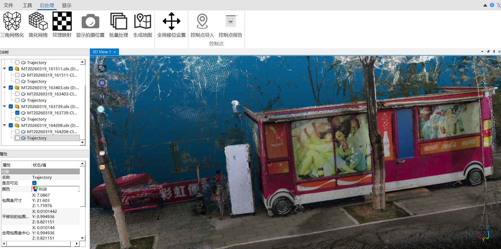

### image-13：图片

- 来源：`out/liyumenx8.md`
- 文件：`docs/content-library/assets/products/liyumen-x8/liyumen-x8-image-013-452bef40.png`
- 备注：已迁入

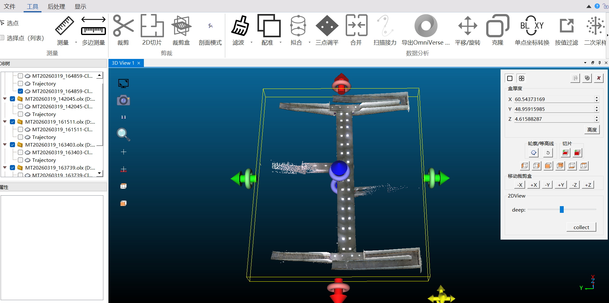

### image-14：图片

- 来源：`out/liyumenx8.md`
- 文件：`docs/content-library/assets/products/liyumen-x8/liyumen-x8-image-014-82908d03.png`
- 备注：已迁入

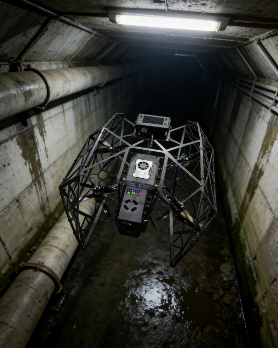

### image-15：图片

- 来源：`out/liyumenx8.md`
- 文件：`docs/content-library/assets/products/liyumen-x8/liyumen-x8-image-015-d4c6762f.png`
- 备注：已迁入

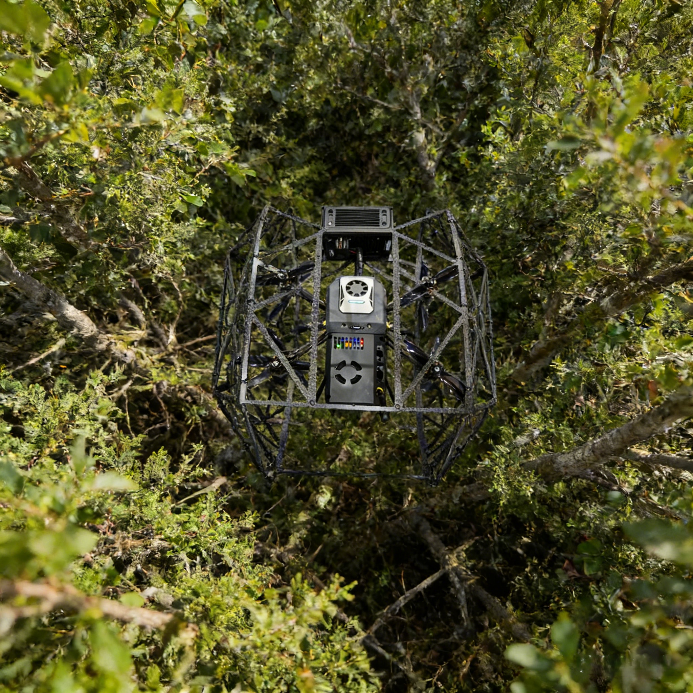

### image-16：图片

- 来源：`out/liyumenx8.md`
- 文件：`docs/content-library/assets/products/liyumen-x8/liyumen-x8-image-016-4edd93fe.png`
- 备注：已迁入

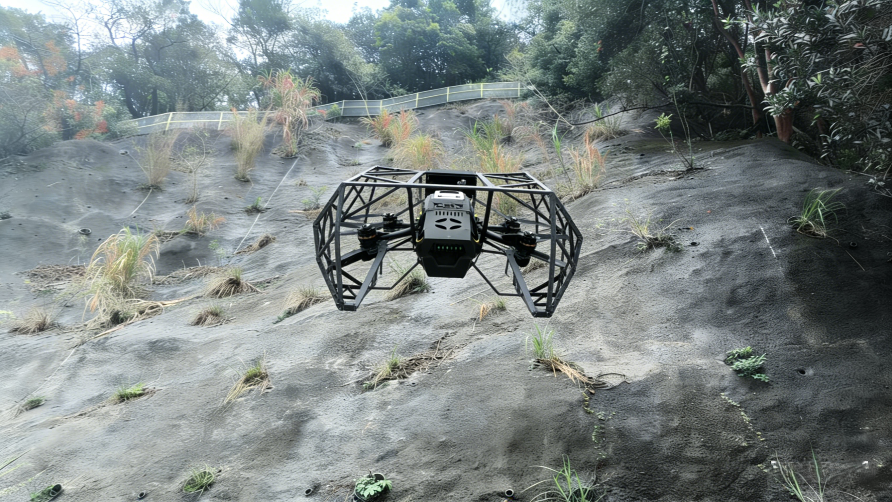

### image-17：图片

- 来源：`out/liyumenx8.md`
- 文件：`docs/content-library/assets/products/liyumen-x8/liyumen-x8-image-017-e4cfe45d.png`
- 备注：已迁入

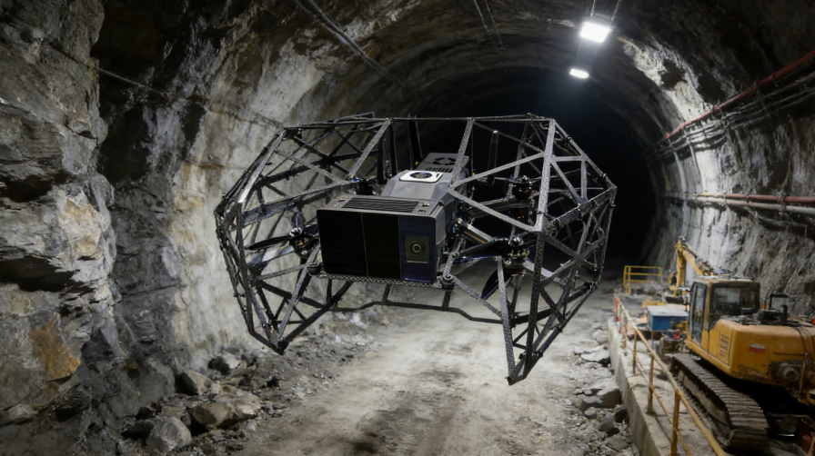

## 来源备注

最新主要来源：`out/p/liyumenx8.md`。补充手册来源：`out/liyumenx8.md`。
