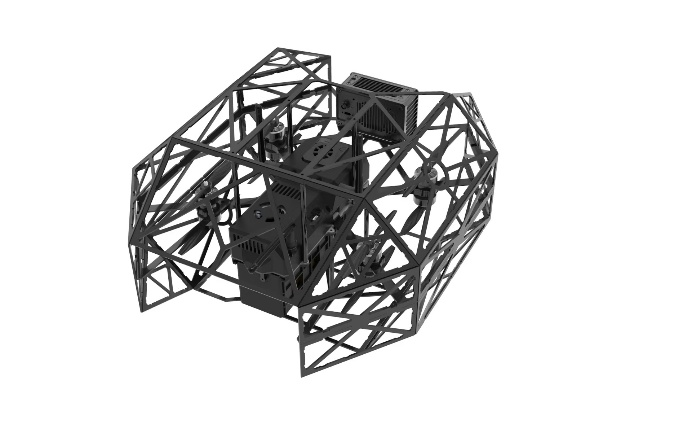
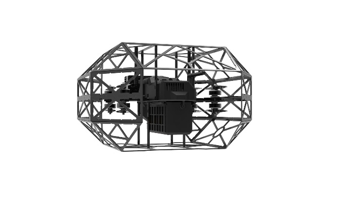

# 鲤鱼门 X8 使用资料

## liyumenx8

## （一）升级说明（全系标配）
- [x] **飞控： PX4（经过重重测试，我们选定了市面上 稳定、好用的飞控，并做了升级改造。）**

- [x] **遥控器：升级为带屏幕飞控，黑客级别通信架构链路！**

**遥控屏幕可直接触屏操作机载电脑内部的 ubuntu 和 ros 系统的所有内容（包括文件夹、终端、wifi 等），超级方便，相当于把机载电脑上的显示屏、鼠标、键盘全部放进了一个屏幕里面，超级超级颠覆性的便捷。而且超级丝滑！**

- [x] **动力部分：原始版本是5寸桨和普通电池 续航会很低 现在的新机用的是7寸桨和半固态电池，大幅提升了续航（15.9min+）和稳定性。最外围轴距 410mm*410mm，轴距 285mm。**

- [x] **SSH 远程连接：我们基于数传提供一套全新的 SSH 远程登陆方式，比传统通过 wifi 的方式相比，流畅度超大幅提升。**

- [x] **传感器：传统的 mid360 在运行 Fastlio 或 Fastlivo2 时小概率会出现 bug, 而且在特征稀疏的走廊或空旷场景无法正常定位，升级款 Odin 方案使用的相机+雷达+IMU融合定位模式，而且免标定、而且可同时拿到点云、RGB、深度数据，不用装很多类型的传感器。**

- [x] **优雅翻墙：内置便捷翻墙工具，终端内优雅 git**

- [x] **优雅细节：支持适配器给无人机供电、电调不会一直滴滴叫、上电内置防打火、内置防尘网和散热风道、防尘防泼溅设计、7 寸桨最小轴距设计。**

## 清单
 飞控：PX4 、动力：7寸桨、电池类型：半固态电池、电池容量：7500 mAh、遥控器：触屏遥控、雷达：Odin1/Mid360、机载电脑：Jetson orin nx

注意：遥控器交互和可视化相关代码不开源，你只可以使用，但是不会影响你任何其它的功能，防抄袭，谢谢理解！

遥控器交互和可视化超级方便，传统方式需要很繁琐的拿着自己电脑找 ip 然后配置半天，出了问题就要整个显示屏，鼠标，键盘给接在飞机，外出作业也要带着电脑，电脑不插电源就会很卡，rviz 就会爆卡无比。我们这个很颠覆性的丝滑和方便。

其它的代码都是源码形式开源，并且带视频教程和说明书教你如何去用。

## （二）mid360 方案
Mid360提供了360°的高精度点云数据，再加上FastLivo2(仅用雷达)的高精度和高鲁棒性的SLAM算法，为无人机的基础飞行和后续算法开发提供了稳定的基石。

Jetson Orin Nx 为用户提供了高性能的机载工控机，这是现阶段别无二选的机载电脑。

## 售价
销售价格（计算单位：元/人民币）

| 名称 | mid360 无人机（带遥控器可视化、带 FastLio、FastLivo2、super 自主避障导航、航迹录制和航迹复飞、以及传感器驱动） |
| --- | --- |
| 价格 | 5.1 万一套 （全能版） |

如果只要飞机本体，不带遥控器可视化（不影响其它任何功能，相当于退回到传统的无人机远程登陆控制方案）、 FastLio2、FastLivo2、super 自主避障导航、航迹录制和航迹复飞软件代码，售价为 2.5w（标准版）。主要就是我们把飞机给设计组装好，挣个辛苦费和组装费，都是硬件，没有软件上的售后。只有硬件的售后。

| | 全能版 | 标准版 |
| --- | --- | --- |
| 雷达 | mid360 | 同全能版一致 |
| 基础动力 | 7 寸桨+60A 电调+PX4 飞控 | 同全能版一致 |
| 机架 | 3D 打印+碳纤维板 | 同全能版一致 |
| 遥控器 | H12PRO | 同全能版一致 |
| 电池 | 半固态-容量：7500 mAh（4 块） | 同全能版一致（2 块） |
| 机载电脑 | Jetson orin nx 16G | Jetson orin nx 8G |
| 前视相机 | D435 RGBD 相机 | 普通 usb 相机 |
| 遥控器触控交互及可视化 | √ | × |
| super 自主避障导航 | √ | × |
| 航迹录制和航迹复飞 | √ | × |
|  FastLio2、FastLivo2（仅雷达） | √ | × |
| 售后 | 软硬件售后 | 仅硬件售后 |

## （三）Odin1方案（推荐）

使用Odin1，可以同时拿到**点云、RGB、深度数据**，节省安装空间，不用装很多类型的传感器；直接提供标定好的相机、雷达、IMU的外参数据；Odin1传感器内置芯片，自带重定位和SLAM算法功能，使用的是相机+雷达+IMU融合定位模式。

自带配套软件，点击即可开始启动，可以录制 bag 等操作，配套后端电脑软件对所记录的三维模型进行处理。

Jetson Orin Nx super  (GPU强大) 为用户提供了高性能的机载工控机，这是现阶段别无二选的机载电脑。

续航在 15 到 20 分钟区间

## 售价
销售价格（计算单位：元/人民币）

| 名称 | Odin 无人机（带遥控器可视化、带装好的驱动、super 自主避障导航、航迹录制和航迹复飞、以及传感器驱动） |
| --- | --- |
| 价格 | 7.9w（全能版） 推荐 |

如果只要飞机本体，不带遥控器可视化（不影响其它任何功能，相当于退回到传统的无人机远程登陆控制方案）、 super 自主避障导航、航迹录制和航迹复飞软件代码，售价为 2.7w（标准版）。主要就是我们把飞机给设计组装好，挣个辛苦费和组装费，都是硬件，没有软件上的售后。只有硬件的售后。

| | 全能版 | 标准版 |
| --- | --- | --- |
| 雷达+深度+IMU+RGB | Odin1 | 同全能版一致 |
| 基础动力 | 7 寸桨+60A 电调+PX4 飞控 | 同全能版一致 |
| 机架 | 3D 打印+碳纤维板 | 同全能版一致 |
| 遥控器 | H12PRO | 同全能版一致 |
| 电池 | 半固态-容量：7500 mAh（4 块） | 同全能版一致（2 块） |
| 机载电脑 | Jetson orin nx 16G | Jetson orin nx 8G |
| 云台 | √ | × |
| 遥控器触控交互及可视化 | √ | × |
| super 自主避障导航 | √ | × |
| 航迹录制和航迹复飞 | √ | × |
| 传感器驱动 | √ | × |
| 售后 | 软硬件售后 | 仅硬件售后 |

## **Real-time spatial perception**
**实时空间感知**

突破传统RGBD相机和原始点云局限，支持实时查看**“一比一现实还原”****三维彩色点云**

隧道扫描

桥梁扫描

车辆扫描

桥洞扫描

不同场景下实时可视化结果（左、右侧分别为彩色点云和鱼眼相机的可视化展示）

## **Convenient remote control interaction**
**便捷一体化交互**

无人机控制系统和可视化系统融为一体，无需额外设备及操作，开机直连，便捷跃然指尖

屏幕实时显示高清图像和彩色点云。支持⼀键扫描、支持生成与现实世界颜色一致的彩色点云、支持彩色地图保存、支持一键录制传感器及无人机数据包、支持航迹录制及航迹复飞。

**强悍性能**

**高通安卓系统****: **6nm工艺、安卓14系统

**高清大屏****: **可选5.5寸或10寸高清阳光屏，即使在户外阳光直射下，依然能清晰呈现画面

**续航****: **6-8小时超长续航、PD快充

**光纤通信（可选）: **遥控器顶部预留光纤接口，在严重密闭遮挡环境中依旧能够保障通信质量

## **SPATIAL MEMORY**
**空间记忆**

Liyumen无人机深度融合了颠覆性Odin1模组，赋予无人机长期稳定的环境认知和定位建图能力

**超远距探测****: **最远测距范围70m (90%反射率)/30m(10%反射率)，提升探测距离

**超广视场角****: **120x90°FOV，覆盖更大范围，减少盲区

**高密度点云****: **70万点/秒，实现高密度深度数据采集

**高分辨率数据采集****: **240x180深度模组+1600x1296RGB，全局曝光，提供清晰的高

保真三维重建数据

**突破传统**

**稳定性：**相较于传统雷达算法，内置MindSLAM高性能融合SLAM算法，使用**“点云****+****相机****+****多冗余****IMU****”**融合定位，鲁棒性和稳定性大幅提升

**更新频率：**高频**400HZ**位姿更新，相较于传统20HZ更新频率，提升20倍

## **Multi-functional map processing**
**多功能地图处理**

支持通过配套电脑软件MindCloud Studio，对无人机扫描数据进行处理。（高效空间数据标注与处理、回环检测、平差优化、运动物体滤除、SOR滤波处理等）。

保存所选数据，支持保存文件为以下格式：

CloudCompare entities (*.bin)；

ASCII cloud (*.txt *.asc *.neu *.xyz *.pts *.csv)；

LAS file (*.las *.laz)；

E57 cloud (*.e57)；

lx points (*.lx)；

Simple binary file (*.sbf)；

PLY mesh (*.ply)；

VTK cloud or mesh (*.vtk)；

DXF geometry (*.dxf)；

Point Cloud Library cloud (*.pcd)；

SHP entity (*.shp)；

LAS 1.3 or 1.4 (*.las *.laz)；

Clouds + sensor info. [meta][ascii] (*.pov)；

Point+Normal cloud (*.pn)；Point+Value cloud (*.pv) 。

## 遥控器使用介绍

### APP 软件界面说明：
1.遥控器长按电源键开机后，打开应用 liyumen

初始未连接状态，无人机机载电脑开机大约需要 45s，飞控开机大约需要 5s

飞控开机后会自动连接软件

无人机机载电脑开机后会自动连接软件

操作界面说明：

1. 点击启动雷达后，弹出下图。点击“否”代表仅启动雷达定位；点击“是”代表着开启雷达的同时也会在后台静默地保存地图（地图会保存在无人机 NX 内，需要将其文件拷贝到自己的 U 盘中，随后使用配套的 windows 软件 MindCloud 软件打开。请注意，这会占用大量存储空间。测试显示10分钟的数据是9.5G）。

启动雷达是你一切飞行动作的基础。它启动了 雷达、相机、并且开启了和飞控的通信，为飞控飞行提供了定位数据。

成功开启后如下图所示，左侧图像数据、右侧彩色点云数据。

2. 点击 录制 Bag 后弹窗如下，可自行选择要录制的话题（开启雷达后才有这些话题），录制完成后再次点击结束录制。bag 包将会保存在 NX 桌面上的 Bags 文件夹内。

3. 关闭雷达 会将雷达停止运行，注意，不可在飞行中关闭雷达，因为雷达为飞行提供的定位数据！只有飞机在地面上静止时才可以关闭！

4.录制航迹

随后点击录制航迹后依次弹出提示：

录制航迹的前提是 需要开启雷达为无人机提供定位数据，若此时雷达未开启会弹窗

如果之前有录制的旧轨迹，会弹窗提醒你去覆盖旧文件。

若满足条件则开始记录，使用遥控器控制飞机飞行。

飞行结束后不要降落，让无人机在空中任意高度保持悬停，然后再次点击按钮完成录制。

随后再将无人机降落到地面。

5. 轨迹复飞

前提，已开启雷达、遥控器切换到定点模式、并且飞控自检通过变为绿色的 Ready ，无人机在地面上平稳地搁置

点击轨迹复飞后弹窗提醒

确认后弹窗

## liyumenx8

LiyumenX8工业级勘测无人机

致力于解决地下隧道、矿山、林业等复杂受限空间中面临的**"进不去、看不清、联不通"**等核心痛点。具备在无GNSS信号、极度弱光、强磁干扰及严重弱网环境下，实现高可靠自主飞行、三维彩色点云"一比一现实还原"建图、以及航迹精准复飞的智能勘测功能。

俯视图

后侧俯视图

侧视图

后视图

无人机外观多方位的展示图

**Real-time spatial perception**

**实时空间感知**

突破传统RGBD相机和原始点云局限，支持实时查看 **"一比一现实还原"
三维彩色点云**

隧道扫描

桥梁扫描

车辆扫描

桥洞扫描

不同场景下实时可视化结果（左、右侧分别为彩色点云和鱼眼相机的可视化展示）

**Convenient remote control interaction**

**便捷一体化交互**

无人机控制系统和可视化系统融为一体，无需额外设备及操作，开机直连，便捷跃然指尖

屏幕实时显示高清图像和彩色点云。支持⼀键扫描、支持生成与现实世界颜色一致的彩色点云、支持彩色地图保存、支持一键录制传感器及无人机数据包、支持航迹录制及航迹复飞。

**强悍性能**

**高通安卓系统:** 6nm工艺、安卓14系统

**高清大屏:**
可选5.5寸或10寸高清阳光屏，即使在户外阳光直射下，依然能清晰呈现画面

**续航:** 6-8小时超长续航、PD快充

**光纤通信:**
遥控器顶部预留光纤接口，在严重密闭遮挡环境中依旧能够保障通信质量

**SPATIAL MEMORY**

**空间记忆**

Liyumen无人机深度融合了颠覆性Odin1模组，赋予无人机长期稳定的环境认知和定位建图能力

**超远距探测:** 最远测距范围70m (90%反射率)/30m(10%反射率)，提升探测距离

**超广视场角:** 120x90°FOV，覆盖更大范围，减少盲区

**高密度点云:** 70万点/秒，实现高密度深度数据采集

**高分辨率数据采集:**
240x180深度模组+1600x1296RGB，全局曝光，提供清晰的高

保真三维重建数据

**突破传统**

**稳定性：**相较于传统雷达算法，内置MindSLAM高性能融合SLAM算法，使用**"点云+相机+多冗余IMU"**融合定位，鲁棒性和稳定性大幅提升

**更新频率：**高频**400HZ**位姿更新，相较于传统20HZ更新频率，提升20倍

**Multi-functional map processing**

**多功能地图处理**

支持通过配套电脑软件MindCloud
Studio，对无人机扫描数据进行处理。（高效空间数据标注与处理、回环检测、平差优化、运动物体滤除、SOR滤波处理等）。

保存所选数据，支持保存文件为以下格式：

CloudCompare entities (\*.bin)；

ASCII cloud (\*.txt \*.asc \*.neu \*.xyz \*.pts \*.csv)；

LAS file (\*.las \*.laz)；

E57 cloud (\*.e57)；

lx points (\*.lx)；

Simple binary file (\*.sbf)；

PLY mesh (\*.ply)；

VTK cloud or mesh (\*.vtk)；

DXF geometry (\*.dxf)；

Point Cloud Library cloud (\*.pcd)；

SHP entity (\*.shp)；

LAS 1.3 or 1.4 (\*.las \*.laz)；

Clouds + sensor info. \[meta\]\[ascii\] (\*.pov)；

Point+Normal cloud (\*.pn)；Point+Value cloud (\*.pv) 。

**Application scenarios**

**应用场景**

Liyumen无人机作为一款**通用型勘测无人机**，可以在山坡、隧道、下水道、杂乱草丛、炉膛等多种场景飞行。

针对你想勘测的场景，只需手动或自动让无人机在场景附近飞行一圈，即可拿到该场景的"一比一场景还原"三维彩色地图，**无需其它额外操作，**方便快捷。

下水道

杂乱树丛

边坡检测

矿洞隧道

**Detailed parameters of the drone**

**无人机详细参数**

  参数名称           规格/数值
  激光雷达波长       905nm

  激光安全等级       Class1 人眼安全

  FOV                水平120°、竖直 90°

  点云输出           最高70万点/秒

  相机               深度模组240 X 180+RGB模组1600 x 1296

  算力               最高144TOPS

  CPU                8 核 ARM® CORTEX ® - A78AE V8.2 64 位CPU 2MB L2 + 4MB L3

  GPU                1024 NVIDIA® CUDA® Core & 32 Tensor Core

  遥控器             触屏遥控（5寸或10寸选配）

  标准起飞质量       2450kg

  最大起飞质量       4000kg

  笼体尺寸           375×460×235mm

  桨叶尺寸           5寸/三叶

  电机轴距           270mm

  机体结构           X型八旋翼共轴双桨冗余结构

  材质               碳纤维/工程塑料

  电池安装           推拉式快拆

  电池参数           6s/8s 高压半固态电池 9000mha

  飞行速度           5m/s max

  飞行高度           50m

  续航时间           12min/18min（选配不同电池）

  抗风等级           5级

  可穿越最小涵洞     400mm（圆直径）

  光纤通讯           1km max（选配）

  链路距离           3-15km（空旷）/5堵墙（穿透）

  安全工作环境温度   -20℃\~45℃

  安全等级           防尘/防泼溅/防爆

  避障能力           前向或360度
