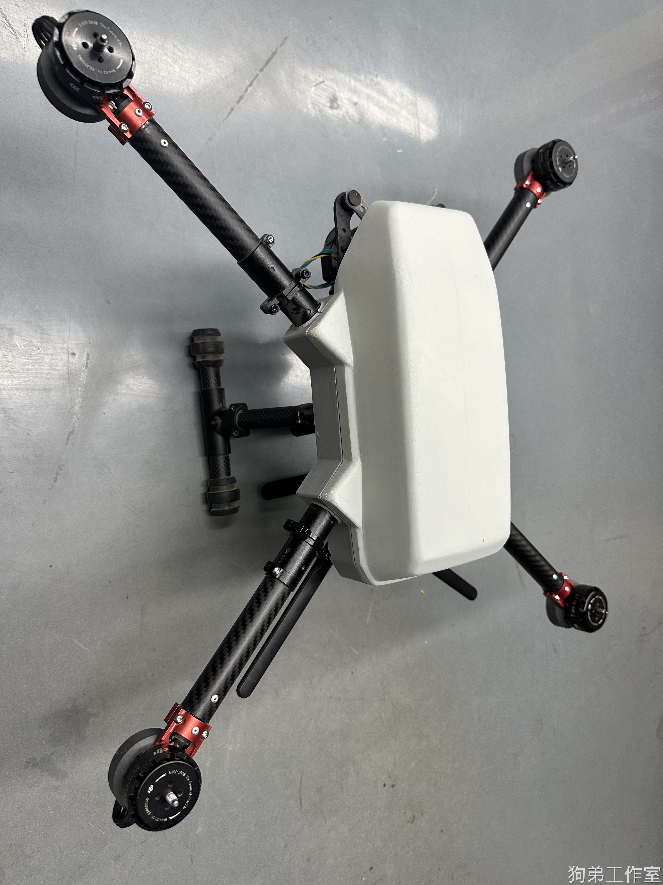
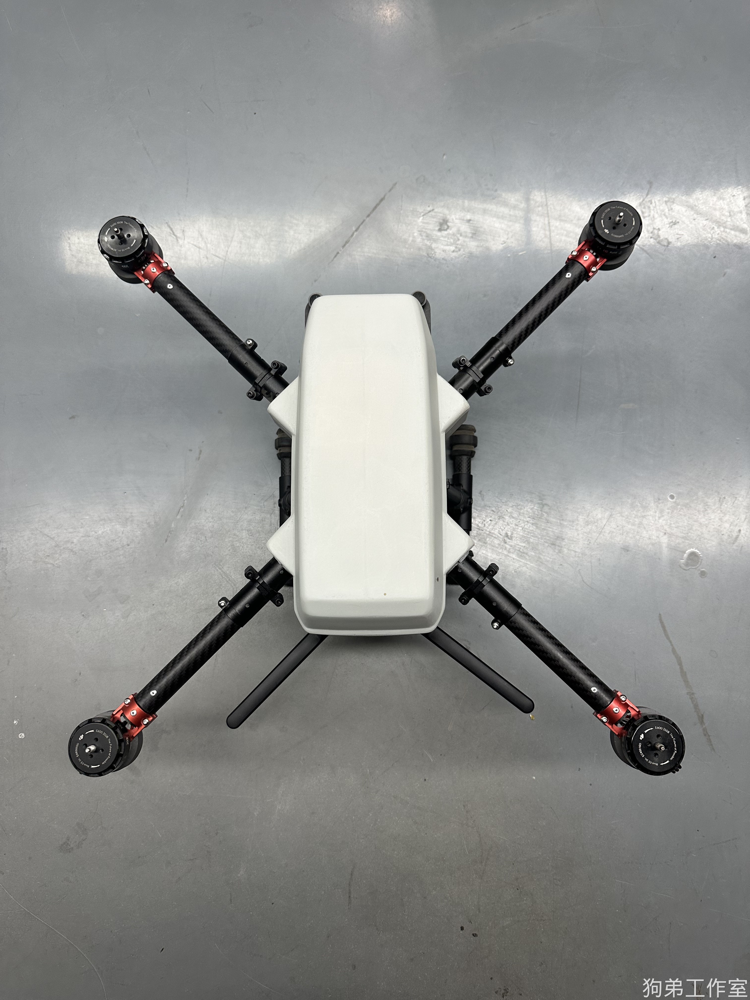
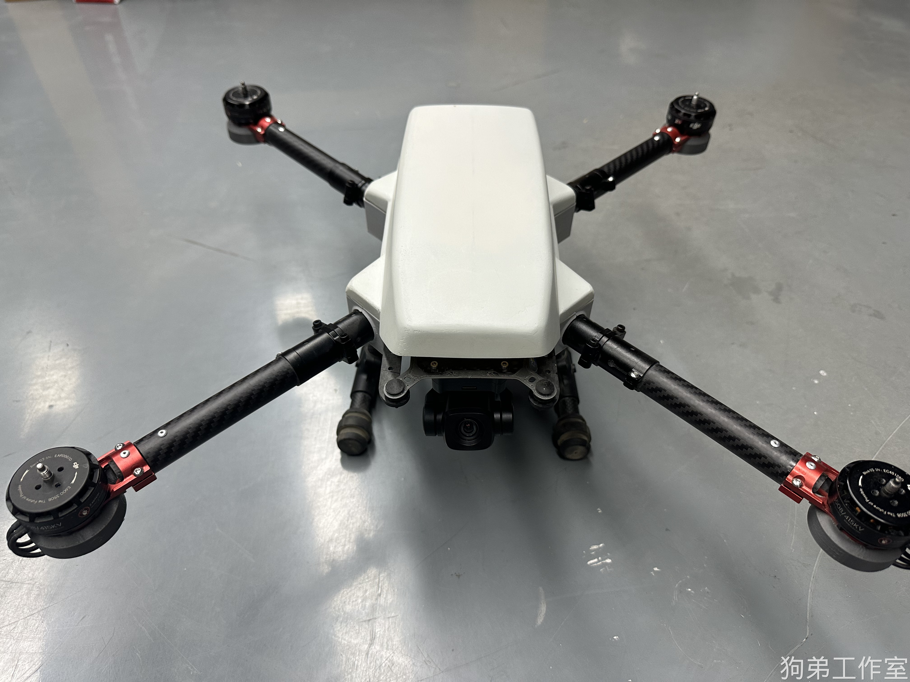
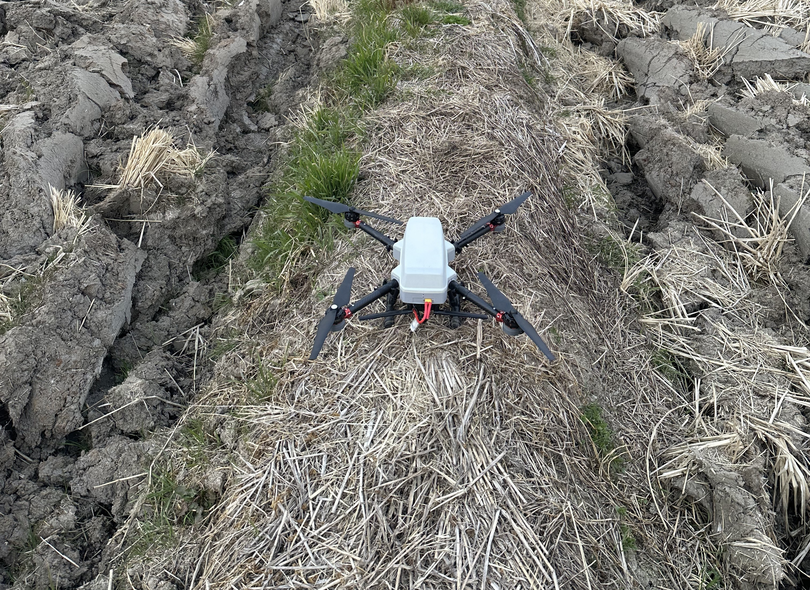
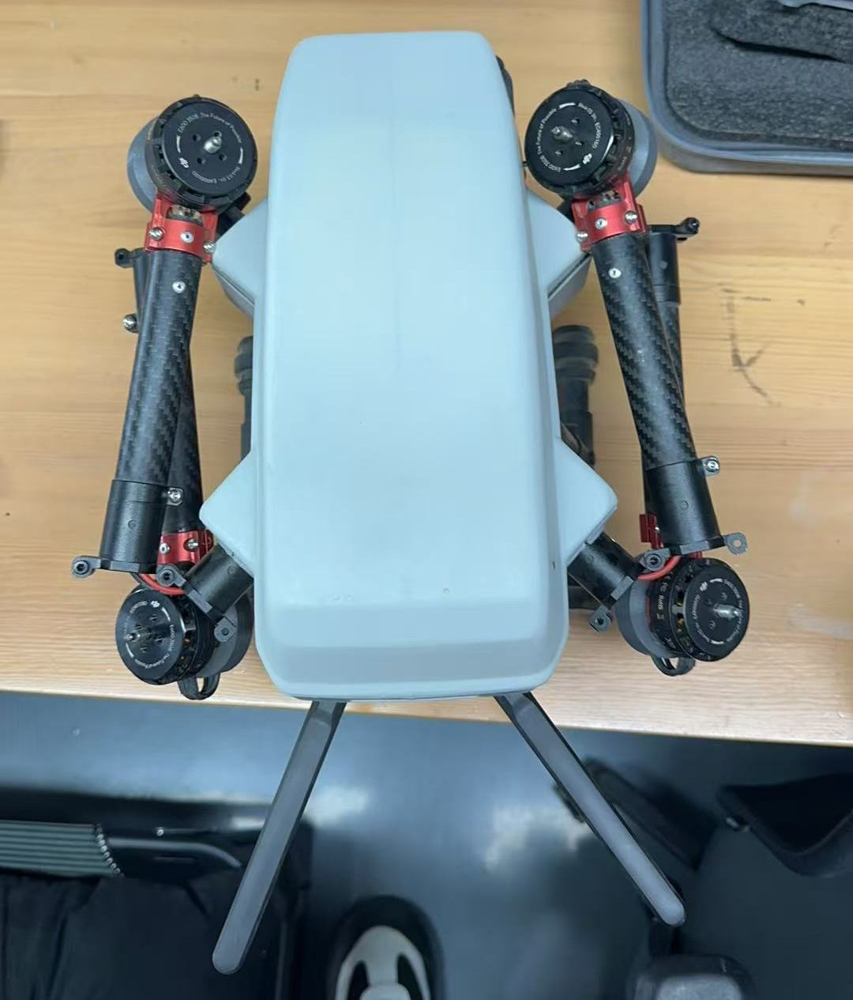
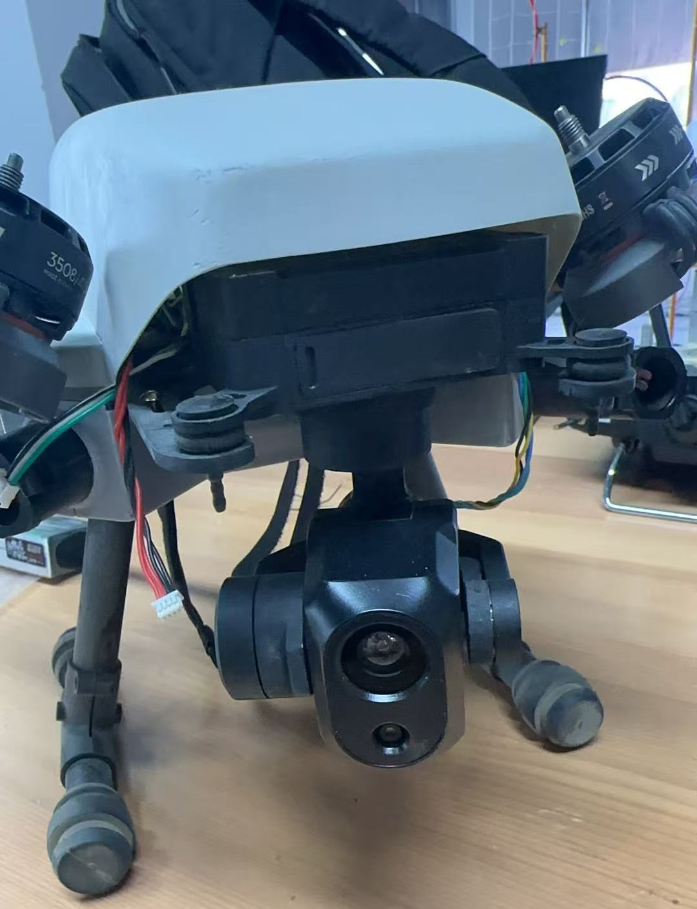

# 七好学生

七好学生无人机，是一款大折叠，高续航的通用无人机平台

## 详细介绍

### 1.所使用的模块
> 1.飞控：PX4
>
> 2.雷达：mid360
>
> 3.机载电脑：NUC 13/jetson orin nx
>
> 4.图传+云台+可视化遥控器
>

支持该系列无人机的所有算法的预部署哦~ 拿到手以后就有一个稳定的平台，也可定制功能。

### 2.电池、续航、体积
电池：高电压 4.35v 一串的电池，14000mah

续航：40 分钟

体积：折叠状态 30cm*26cm 上桨后对角线 85cm

>
>

## 售价
> 1. 机载 NUC13/jetson orin nx 软件环境，支持完全二次开发，所有的代码都在无人机上的机载电脑内。
>
> 2. 提供完善的设备维护和使用支持，官方提供标准机型用户操作视频供参考，教程视频会通过百度网盘链接提供。
>
> 3.支持任意发票，可直接向我的公司账户付款，也可在 B 站工房内下单，详情请咨询狗弟工作室 QQ:480475357。
>
