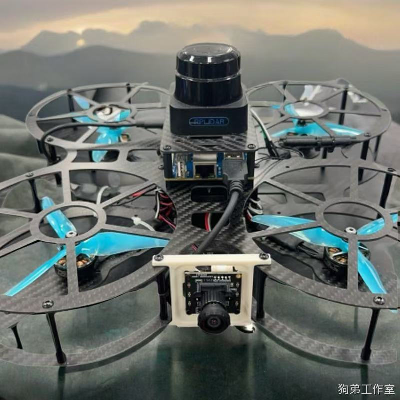
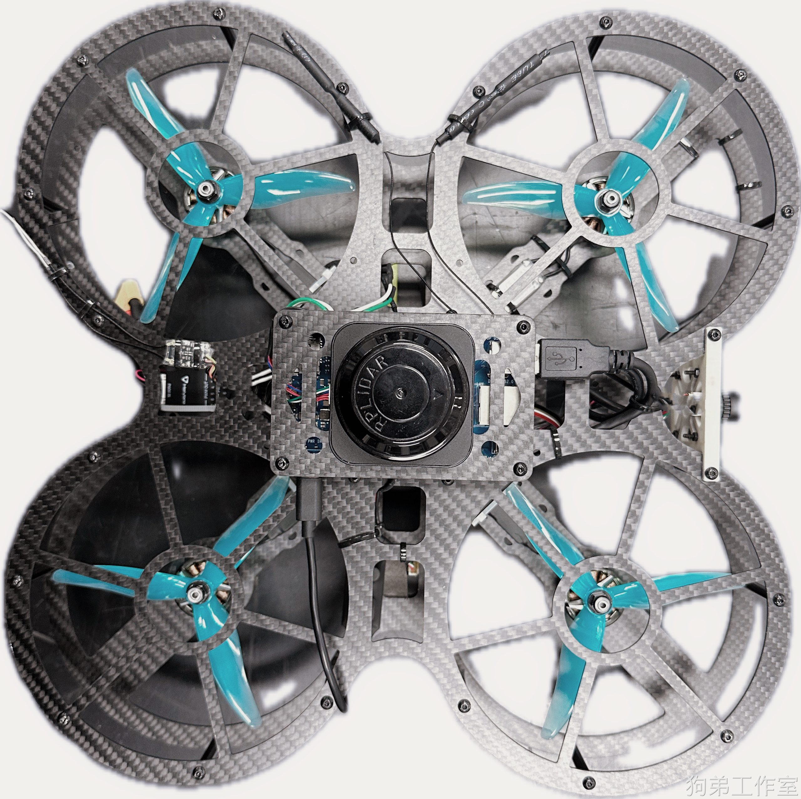

# 三好学生

三好学生无人机，是一款轻量化，高性价比的通用无人机平台

## 详细介绍

### 1.所使用的模块

1. 飞控：Holybro pixhawk 6c
2. 雷达：思岚 S1
3. 机载电脑：Orangepi 5B (RK3588s 主芯片) 8+64g
4. USB 摄像头：星光级1080P_2.6mm无畸变[水平130度]
5. 遥控器：Radiomaster POCKET遥控器（常规的美国手操作）

### 2.电池、载重、续航、速度、体积 、定位精度

三好学生整机重量1.0 kg 左右。

电池：发货电池为 4S 5300mah 电池。

最大起飞重量：1.5kg

续航： 10min

速度：最大平飞速度 2m/s 左右

体积：轴距为 250mm, 外形为 300 x 300 x 150 mm

定位精度：误差0.1m/100m^2

### 3.功能

[语雀卡片链接 演示视频](https://www.yuque.com/woshihenyouxiude/lwkpvm/bliigzqvcvfq23gd#pP9nh)

二维激光雷达+下视 TOF 测距仪获取无人机自身高精度定位数据

一键起飞降落

激光雷达slam导航定点悬停

激光雷达slam导航定速巡航

激光雷达slam导航自主定位

激光雷达slam导航避障航线规划

YOLO识别、人工智能图像物体识别

舵机投放、激光笔标定

## 新升级

1. 二维码精准追踪和降落 视频链接：[师弟又拿着我的无人机遛起来了！\_哔哩哔哩\_bilibili](https://www.bilibili.com/video/BV1snyDYqE1h/?vd_source=4289c781adc3a9ced242221ce6b3f4e0)

## 售价

1. 机载 香橙派 软件环境，支持完全二次开发，所有的代码都在无人机上的机载电脑内。
2. 提供完善的设备维护和使用支持，官方提供标准机型用户操作视频供参考，教程视频会通过百度网盘链接提供。
3. 支持任意发票，可直接向我的公司账户付款，也可在 B 站工房内下单，详情请咨询狗弟工作室 QQ:480475357。
