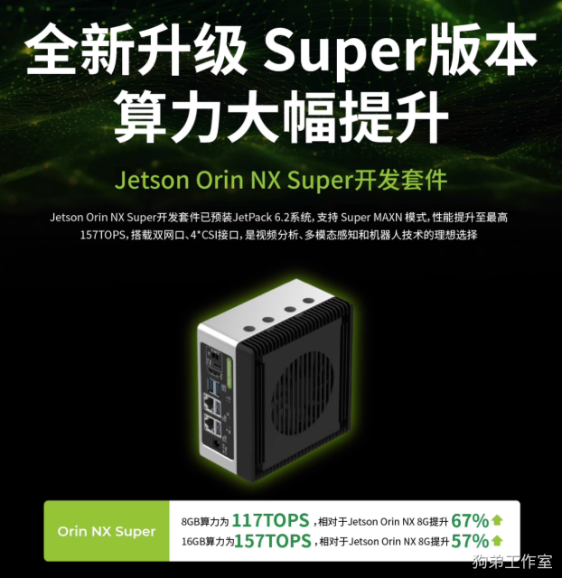
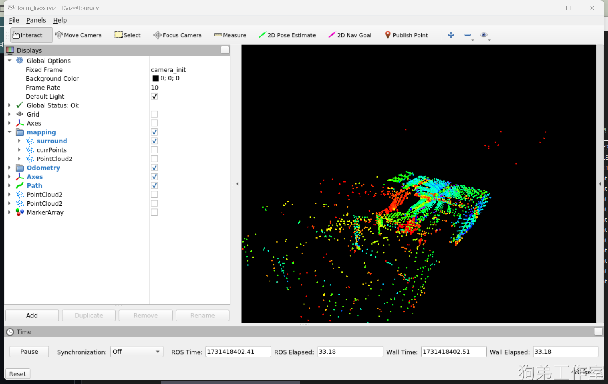
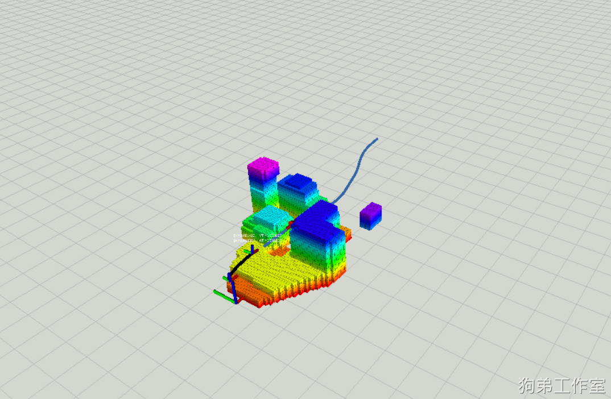
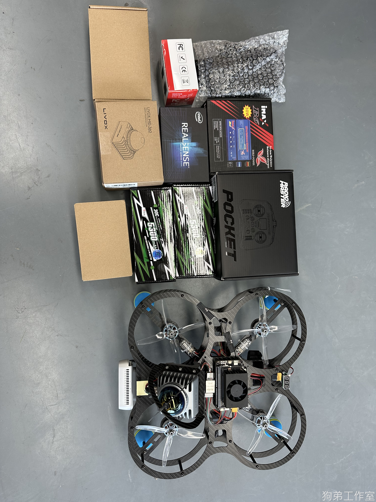
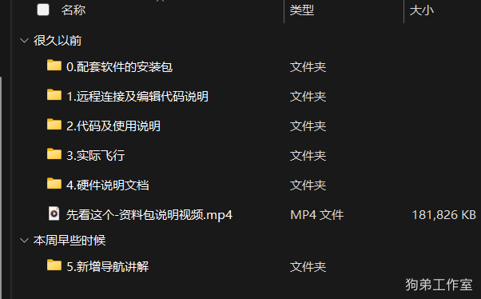
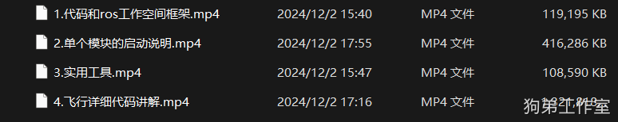
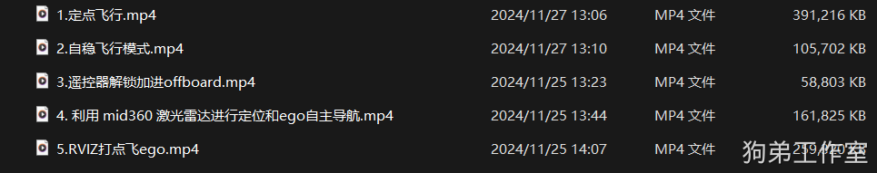
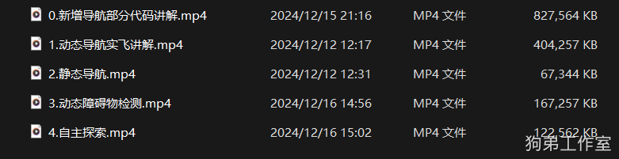

# 四好学生

本文档按原始资料的图文顺序重建，图片保留在对应上下文位置，便于作为中文知识库继续整理。

四好学生无人机：**为大幅降低开发门槛，提高开发效率，使开发人员能够专注于高价值的任务和功能优化。**

**顶级的硬件和软件配置，超高性价比。**

更加细节的介绍请看：【发货使用】“四好学生”通用无人机平台详细说明

## 详细介绍

### 1.所使用的模块
> 1.飞控：pix 4（PX4）
>
> 2.雷达：mid360
>
> 3.【新】超强机载电脑：Jetson orin nx super 8G ，算力免费从从 70T 升到 117T。
>
>

>
> 4.深度相机：D435
>

预装功能很丰富，涵盖定位、建图、导航、探索、识别，部分见 B 站视频：

动态障碍物识别：

[【很强】YOLO+深度+雷达=动态检测_哔哩哔哩_bilibili](https://www.bilibili.com/video/BV1NwB2YkEAF?vd_source=4289c781adc3a9ced242221ce6b3f4e0&spm_id_from=333.788.videopod.sections)

多种动态导航方式：

[[实测]比EgoPlanner更好用的导航算法，变航向更加丝滑_哔哩哔哩_bilibili](https://www.bilibili.com/video/BV1iiAneSETM?vd_source=4289c781adc3a9ced242221ce6b3f4e0&spm_id_from=333.788.videopod.sections)

自主探索：

[开心，和卡内基梅隆大学的大佬成功联动起来了_哔哩哔哩_bilibili](https://www.bilibili.com/video/BV1GyXeYxEHi/?share_source=copy_web&vd_source=b81b30e10db63e2763d014ff412d88c4)

### 2.电池、载重、续航、体积 、定位精度
> “四好学生”整机重量
>

电池：4S 5300mah

最大起飞重量：1.9kg

续航： 悬停 9-10 分钟

重量：1.46 kg（包含电池）

轴距：250mm

定位精度：1 cm。

##

>

>
> 发货配套资料：
>
>

>
>

>
>

>
>

>

> 1. 机载电脑软件环境，支持完全二次开发，所有的代码都在无人机上的机载电脑内。
>
> 2. 提供完善的设备维护和使用支持，官方提供标准机型用户操作视频供参考，教程视频会通过百度网盘链接提供。
>
> 3.支持任意发票。
>

## 网站可用性与来源备注

本文档保留原始图文结构作为知识库参考；公开到网站前仍需检查价格、账号、密码、购买渠道、QQ、激活码等敏感信息。

来源文件：
  - out/p/4hao.md
