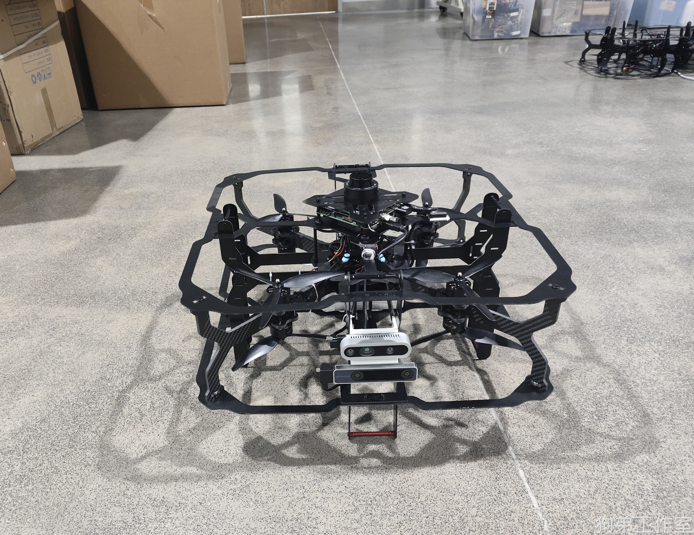
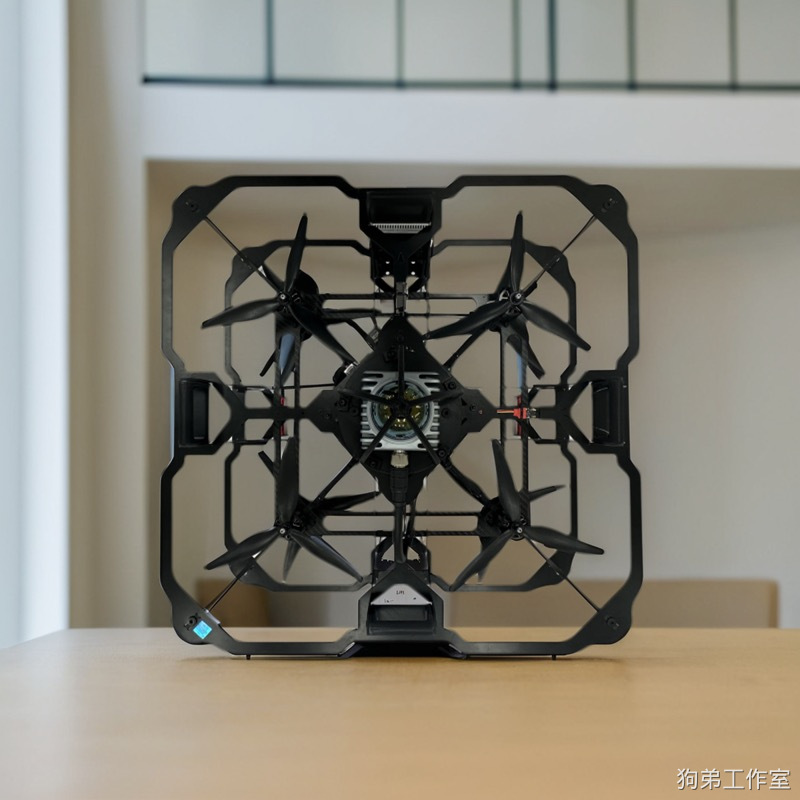
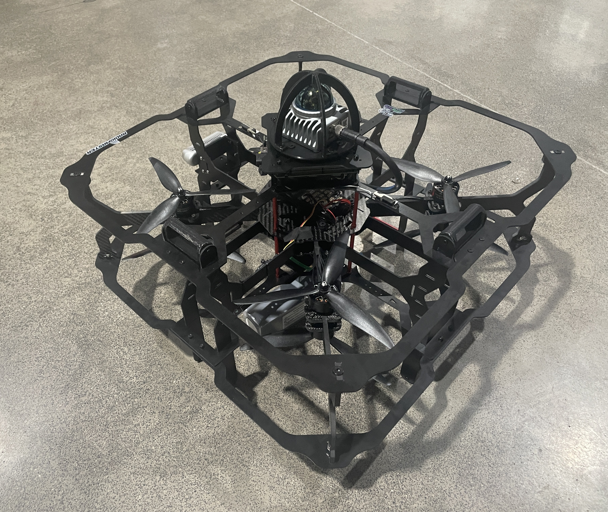
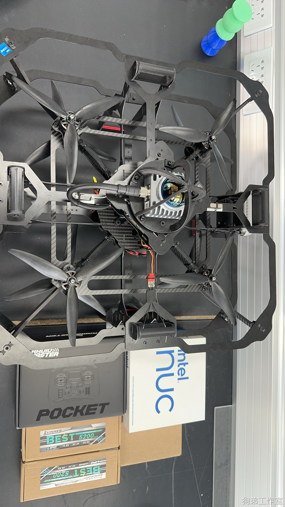
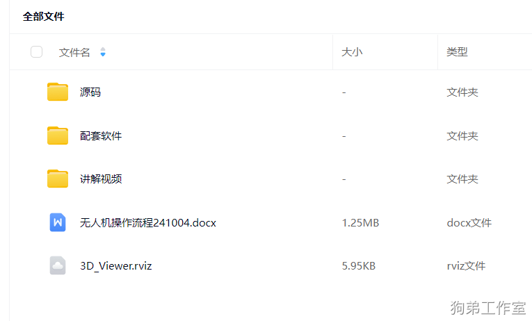
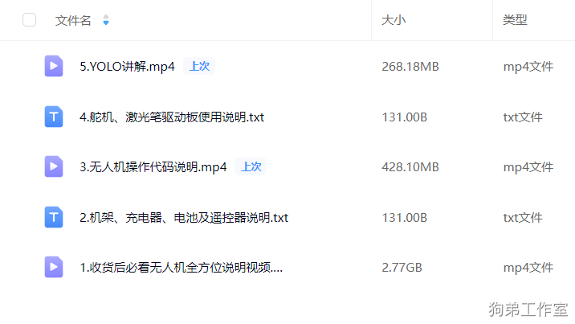

# 五好学生

第一版介绍：[共轴双桨四旋翼设计_哔哩哔哩_bilibili](https://www.bilibili.com/video/BV1r4421U7Rk/?vd_source=4289c781adc3a9ced242221ce6b3f4e0)

**第二版相较于第一版的区别**

**1.雷达从二维雷达升级到了 mid360 三维激光雷达**

**2.拿掉了 T265， 定位方式由 T265 更换为 mid360 激光雷达定位**

**3.其它的都一致**

五好学生无人机，是一款共轴双桨设计的高安全性、 载重能力强、飞的特稳的无人机平台。

四好学生是五好学生的小型化。

## 详细介绍

### 1.所使用的模块
1. 飞控：Holybro pixhawk 4+PM06电源模块（pixhawk 6c 有一些 bug,所以继续采用pixhawk 4，使用起来更加丝滑和顺手）
2. 雷达：mid360 三维激光雷达
3. 机载电脑：Intel NUC 13 i5-13 代芯片 16G 运行内存 512G 固态硬盘
4. 深度相机：D435
5. 电调：四合一电调（60A）× 2
6. USB 摄像头：星光级1080P无畸变
7. 遥控器：Radiomaster POCKET遥控器（常规的美国手操作）

### 2.电池、载重、续航、速度、体积 、定位精度
五好学生整机重量3kg 左右。

电池：发货电池为 6S 5200mah 电池。

载重：3-4kg （带电池）。甚至可搭载  6s 22000mah （重量 2.65kg）电池 定点飞行。

[语雀卡片链接](https://www.yuque.com/woshihenyouxiude/lwkpvm/ou0mage3khx4t58g#a2dFK)

续航： 6S 5200mah 电池定点悬停时间约 7 分钟；6S 12000mah 电池定点悬停时间约 13 分钟；

6S 22000mah 电池定点悬停时间约 20 分钟

速度：最大平飞速度 2.5m/s 左右

体积：轴距为 360mm, 外形为 50*50cm

定位精度：1 - 3cm。      超稳定点飞行视频：[每 天 都 要 飞 飞 机_哔哩哔哩_bilibili](https://www.bilibili.com/video/BV1YaxseEEqh/?vd_source=4289c781adc3a9ced242221ce6b3f4e0)

### 3.功能
**导航**

1.    Mid360提供定位数据,  Mid360提供点云数据  基于航点程序进行Ego _planner飞行。
2.    Mid360提供定位数据,  深度相机d435提供深度图像数据  基于航点程序进行Ego _planner飞行。
3.    Mid360提供定位数据,  Mid360提供点云数据  基于Rviz打点进行Ego _planner飞行。
4.   Mid360提供定位数据, 无避障导航飞行。

**建图**

 基于 Mid360 建图

**识别**

 基于 USB 摄像头 + YOLO

[语雀卡片链接](https://www.yuque.com/woshihenyouxiude/lwkpvm/ou0mage3khx4t58g#xaaBg)

发货配套内容：

## 售价
1. 机载NUC软件环境，支持完全二次开发，所有的代码都在无人机上的机载电脑内。
2. 提供完善的设备维护和使用支持，官方提供标准机型用户操作视频供参考，教程视频会通过百度网盘链接提供。
3. 赠送一台备用防摔机架.
4. 支持任意发票，可直接向我的公司账户付款，也可在 B 站工房内下单，详情请咨询狗弟工作室 QQ:480475357。
