# 四/五/六系列使用与交付说明


**目录：**

**硬件说明**

**接线说明**

**电脑软件说明**

**QGC 中已完成的操作说明**

**程序及代码讲解-飞行指令**

**自主探索 | 动态避障 | 导航 | 定位 | 建图 | 视觉  融为一体**

注意：以下的新版本说明为 2025.06.01 所购买的产品。


### 实体飞行和代码详细讲解 请观看 发货配套的视频。


## 硬件说明：


### 1.电池 ：
电池为格式正品 4S 5300mah，充满电的状态 下 单节电池为 4.2V ，总电压为 16.8V ，用到 15V 左右需要充电。新电池需要充满电后再使用。插电池的时候切记要对准后一次性插上去，不要反复接触和断开，否则电压会反复地、断崖式地、在 16.8V 到 0V 直接切换，对稳压芯片不友好。

[语雀卡片链接](https://www.yuque.com/woshihenyouxiude/lwkpvm/kuld1zdq69o0d0gt#nhGz5)


### 2.充电器：
使用教程： [【强哥教你玩航模】B6充电器使用方法_哔哩哔哩_bilibili](https://www.bilibili.com/video/BV17s411Y7nE/?spm_id_from=333.337.search-card.all.click&vd_source=4289c781adc3a9ced242221ce6b3f4e0)

或者看这个[共轴双桨四旋翼设计_哔哩哔哩_bilibili](https://www.bilibili.com/video/BV1r4421U7Rk/?spm_id_from=333.788&vd_source=4289c781adc3a9ced242221ce6b3f4e0) 从 4 分 26 秒开始讲解充电器


### 3.电机：
TMOTOR 正品 KV2550 电机


### 4.电调：
穿越机单体无刷电调 4S


### 5.稳压模块：
16.8V 稳出 12V，给机载电脑和 mid360 激光雷达供电


### 6.飞控和标配的 PM06 分电板：
Holybro Pixhawk4 和 配套的 PM06分电板


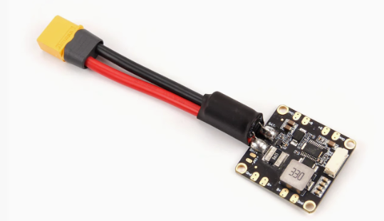


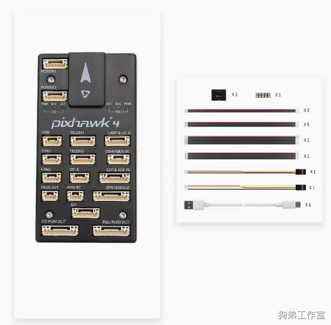


### 7.接收机和遥控器：
[pocket 多协议版本对频_哔哩哔哩_bilibili](https://www.bilibili.com/video/BV13y4y1F7dp/?share_source=copy_web&vd_source=d5e39e1fabffc68d67d0b2e89e297e73)(我们是内置射频，选用的flysky D 协议)

标准美国手（发货时已和接收机配对好了，到手即用，你不要再进行配置！）


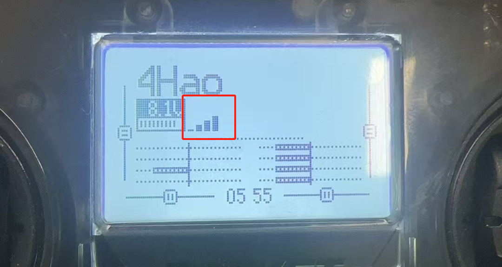


遥控器和接收机成功连接时，屏幕上才会出现信号（此时接收机上的灯快速闪烁），没出现代表没有成功连接，接收机是由飞控上的 5V 进行的供电。


### 8.普通相机（选配）：
100 度视角 无畸变。


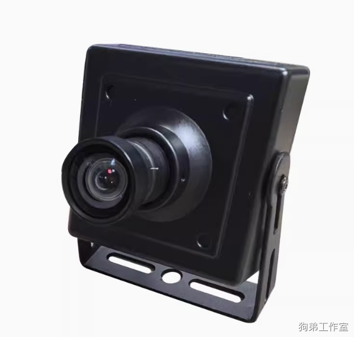


### 9.深度相机：
说明链接：[Depth Camera D435](https://www.intelrealsense.com/depth-camera-d435/)


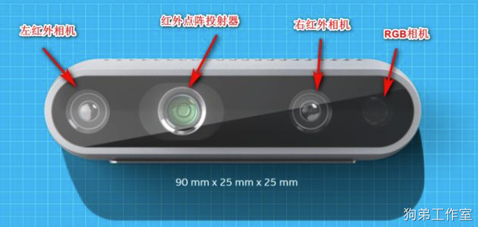


### 10.mid360 激光雷达：
技术参数说明链接：[Specs - Mid-360 激光雷达 - Livox](https://www.livoxtech.com/cn/mid-360/specs)


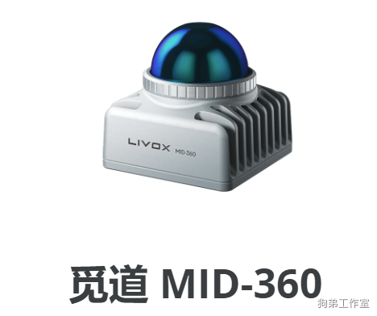


### 11.Jetson orin NX  SUPER 8G 超强机载电脑：
雷达硬件注意事项：不能随便垫高或拉低等任何改变其角度的行为，否则会导致定位数据不准；

已安装了 jetpack5.1.2  ubuntu20.04  ros noetic 20 .04 PCL 1.10.0  Eigen版本3.3.7 ，cmake version 3.27.5  gcc version 9.4.0 。

新版本为 jetpack5.1.5。


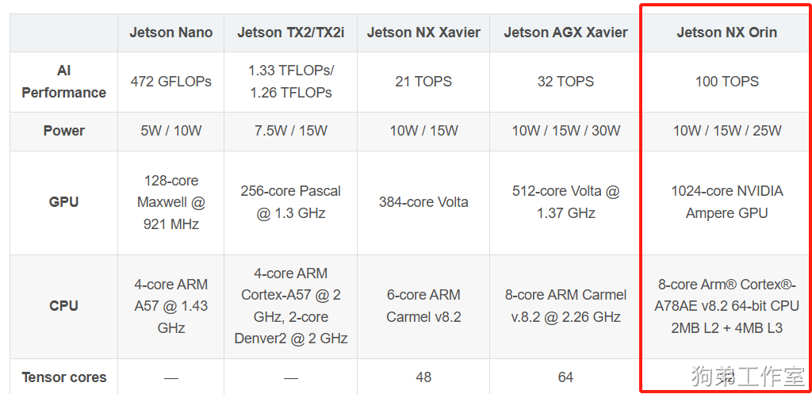


载板  官方文档：[kit/ORIN-board](https://gitee.com/kit-miao/orin-board/tree/master/V2%E7%89%88%E6%9C%AC%E8%B5%84%E6%96%99) ，你无需操作什么，都已经配置好了！


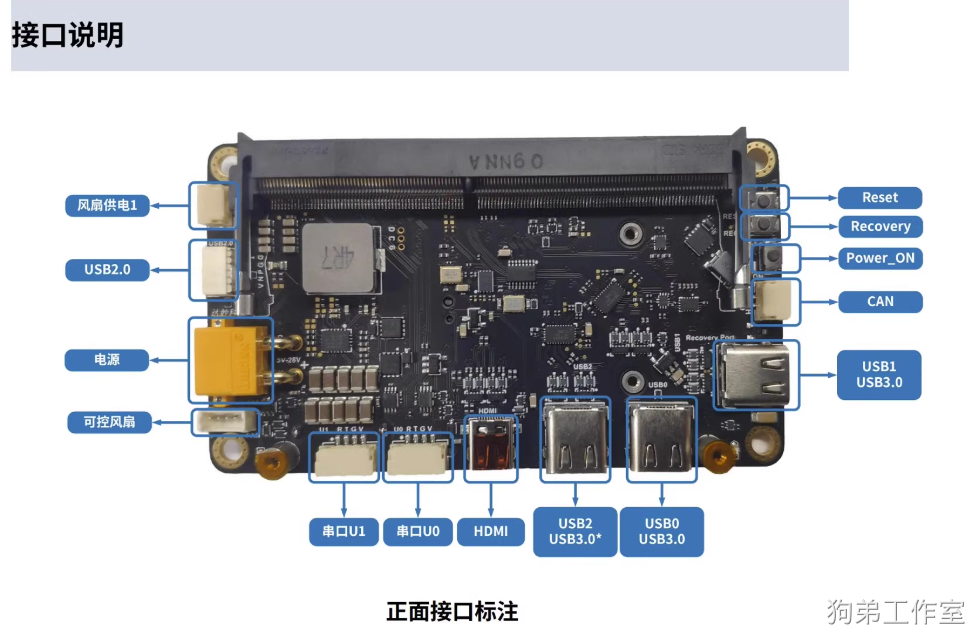


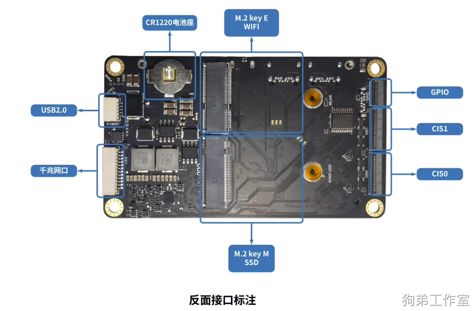


## 供电系统说明
电池（16.8V）：给四个电调供电，给PM06分电板供电，给稳压模块供电；

PM06分电板：给飞控供电（5V），并且 给飞控发送当前电池的电压值；

稳压模块：将电池的 16V 左右的电压，稳压到 12V，给机载电脑和 mid360 供电；

机载电脑：通过 USB 线给深度相机或普通相机供电。

[语雀卡片链接](https://www.yuque.com/woshihenyouxiude/lwkpvm/kuld1zdq69o0d0gt#Q7U5I)

上电后的指示灯说明：

[语雀卡片链接](https://www.yuque.com/woshihenyouxiude/lwkpvm/kuld1zdq69o0d0gt#mNhCA)

同时 mid360 上电后会嗡嗡响，里面的电机一直在运动。


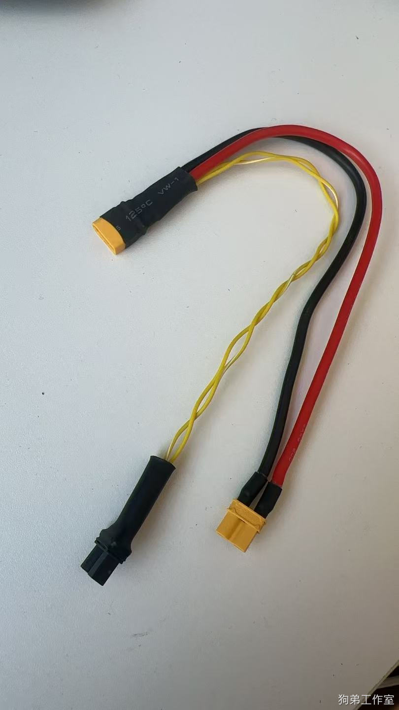


**可自己做一根这样的 XT30  1 转 2 的转接线，用适配器同时给机载电脑和 Mid360 同时供电。**


## 接线说明


### 飞控上的线：


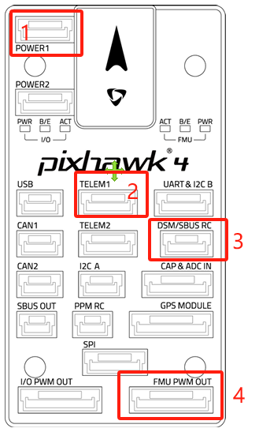


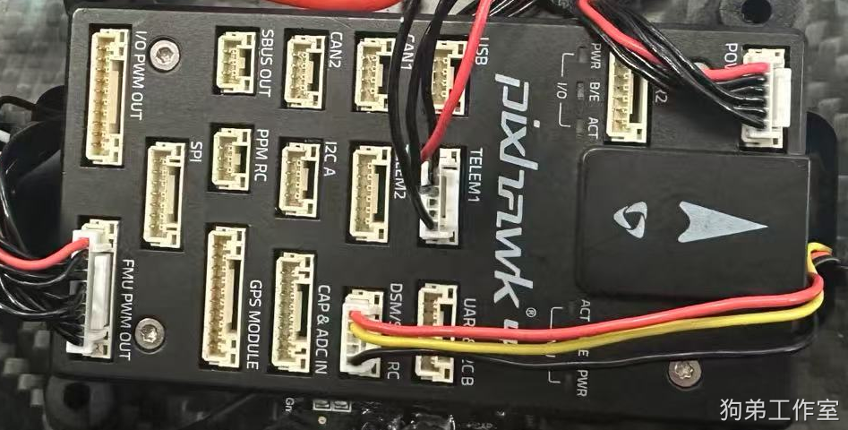


1.与 PM06 分电板的输出口连接，是飞控的电源输入；

2.与机载电脑的串口 U1 相连，用于机载电脑和 PX4 飞控之间的mavros 通信；

3.与遥控器接的收机相连接；

4.与电调信号线相连，用于控制 4 个电机。


### mid360 的线：
网口通信线和供电线


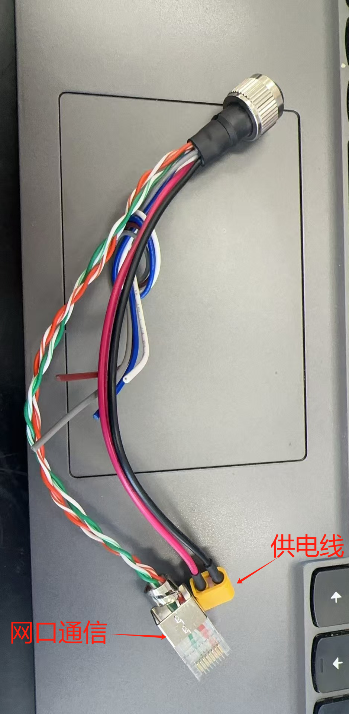


1. 网口通信线连接机载电脑的网口，用于和机载电脑通信

2. 供电线与稳压模块的 12V 输出连接，是 mid360 的供电口


### 深度相机的线：
一根 typec 转 typec 的 usb3.0 线，一端连接 D435,一端连接机载电脑的 USB3.0 的口


### 机载电脑上的线：


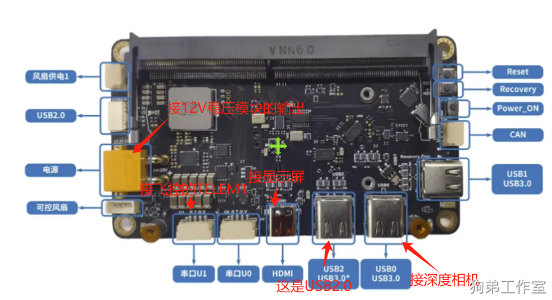


电源：接稳压模块输出的 12V，是整个机载电脑的供电口；

串口 U1：接飞控板上的 TELEM1，用于 mavros 通信；

HDMI：接显示屏；

USB0: 接深度相机；

千兆网口：通过转接头连接 mid360 的网口，与之通信。


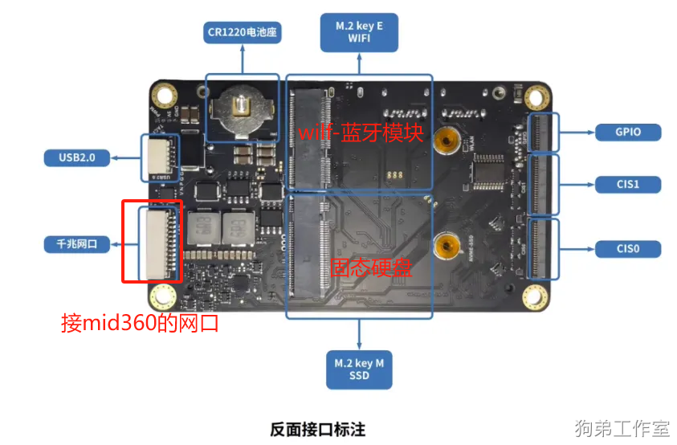


## 电脑软件说明
下面所讲到的代码都是在自己的电脑上下载安装并运行的，不是在无人机上的机载电脑上，特此说明。


### mobaxterm 用于 SSH 远程连接
ssh 远程登陆的步骤：

1. 给飞机上机载电脑连接显示器/鼠标/键盘，密码是 1  ，将自己的电脑和飞机上的机载电脑都连接同一个 wifi,及在同一个局域网内

2. 获取机载电脑的 ip,打开机载电脑的终端，输入 ip a 指令，找到 wlan,就是 wifi 给机载电脑分配的 ip  例如


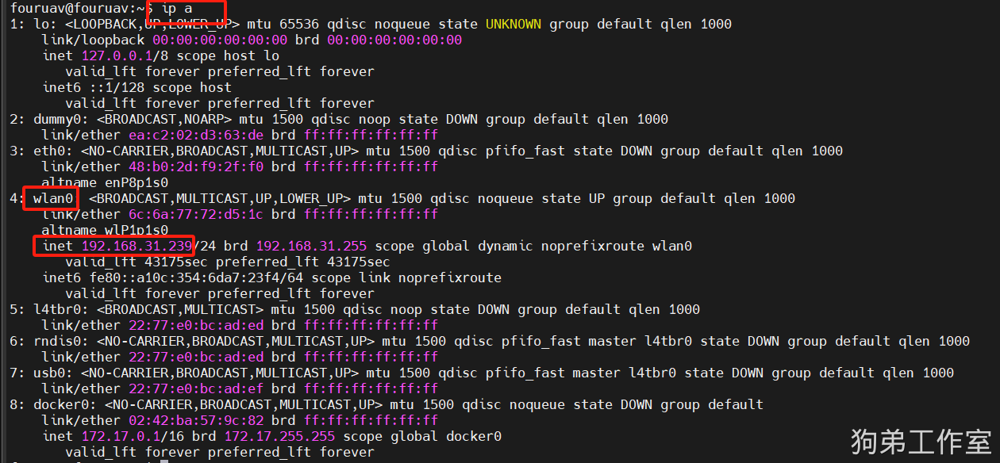


此时我的机载电脑的 ip 为 192.168.31.239

3.


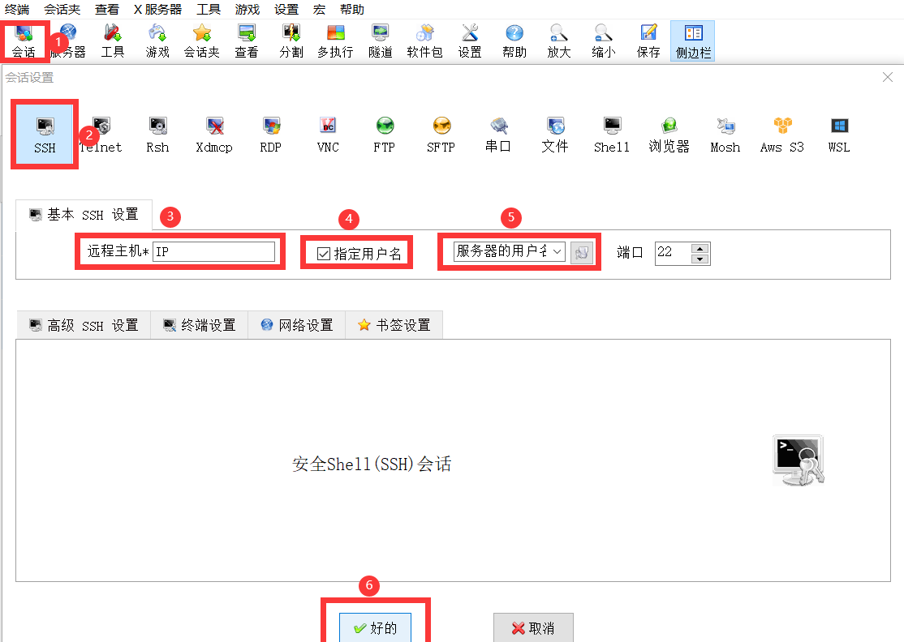


①.单击左上角的”Session”按钮

②.在弹出框中点击“SSH”选项

③.在“Remote host”中输入IP 值（192.168.31.239 根据自己的实际 ip 去替换）

④.勾选“Specify username”并输入用户名(这个就是你服务器中用户名：fouruav)

⑤.点击 OK，输入 password(密码是数字 1 输完直接回车就行 密码不会显示出来) ，回车进入控制台

第一次连接需要上述比较麻烦的过程，后面直接在 User sessions 双击自己连接过的 ip 即可直接进入。


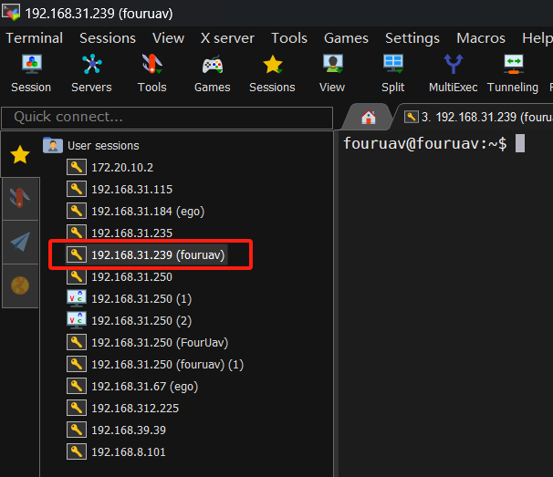


进入以后，左侧会显示这个机载电脑的文件系统，可以方便的增删查改，也可以通过鼠标拖拽的方式复制和移动文件。


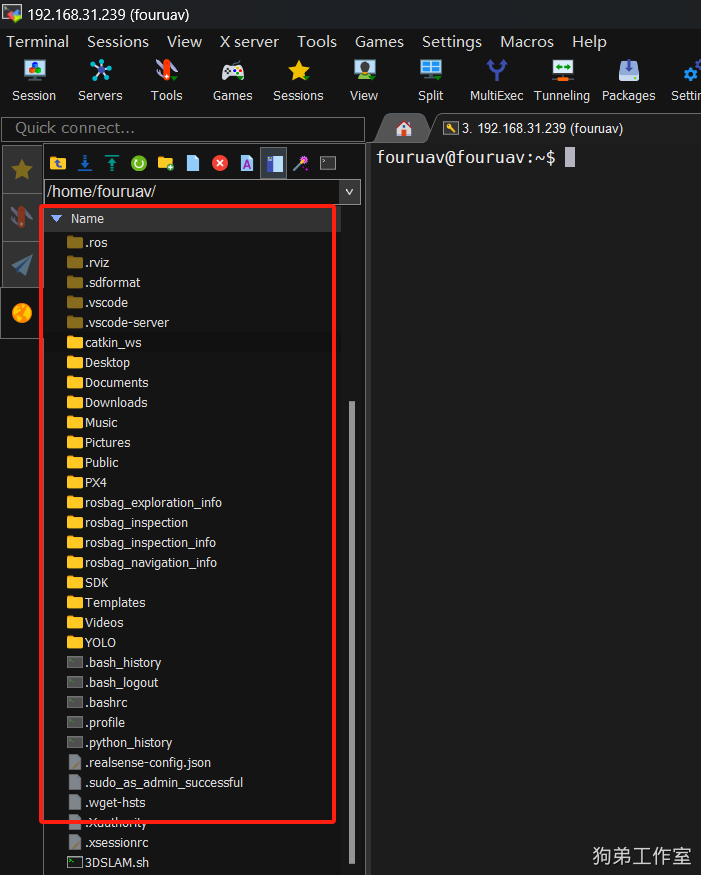


右键后点击 Duplicate tab 可开启一个新的终端。


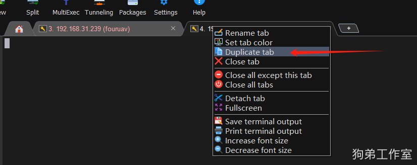


注：将下面 X11 开启后，mobaxterm 才能弹出 rviz\rqt\vscode\gedit 等可视化界面。


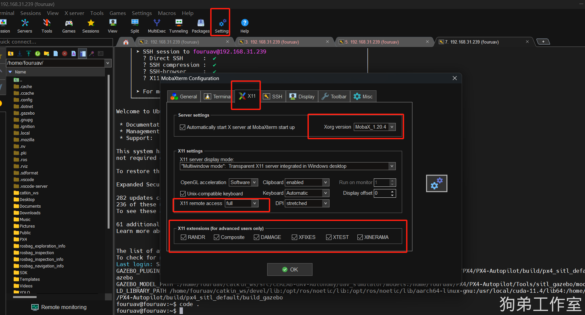


机载电脑上电后，开机大致需要 15-20s 的时间。


### QGC 地面站（PX4 配套地面站软件）


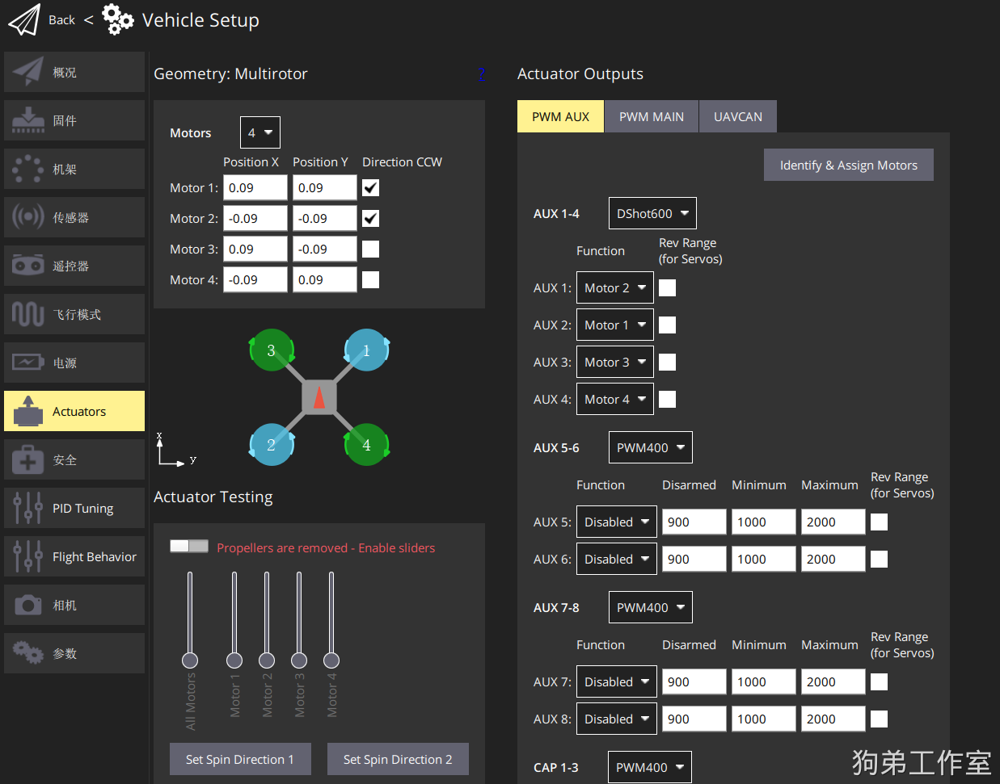


可视化界面，增删查改 PX4 飞控的各种参数和状态。


### VScode 代码编辑器
比 linux 原装的编辑器更加方便且好用；

在自己电脑上下载后，可利用此软件远程登陆到机载电脑上，对代码进行增删查改。

[vscode 使用ssh进行远程开发 (remote-ssh)，首次连接及后续使用，详细介绍_remote ssh怎么用-CSDN博客](https://blog.csdn.net/qq_46123200/article/details/136193576)

也可在机载电脑的终端内，输入 code .  指令，打开 Vscode 编辑器。


### vnc 远程可视化登陆软件（需要外界显示屏或 HDMI 诱骗器）
[VNC Viewer安装教程（保姆级安装）-CSDN博客](https://blog.csdn.net/yushaoyyds/article/details/133926519)

参考这篇博客，看到 4.2 节，输入机载电脑的 ip 就行，后面的就不用管了。


## 在 QGC 中，已完成的工作说明
我们已经在 QGC 中将飞机所有的参数全部配置好了，此处只是想让你更清楚地了解是怎么配置 PX4 的，你看看就行，请不要再进行重复的配置！！


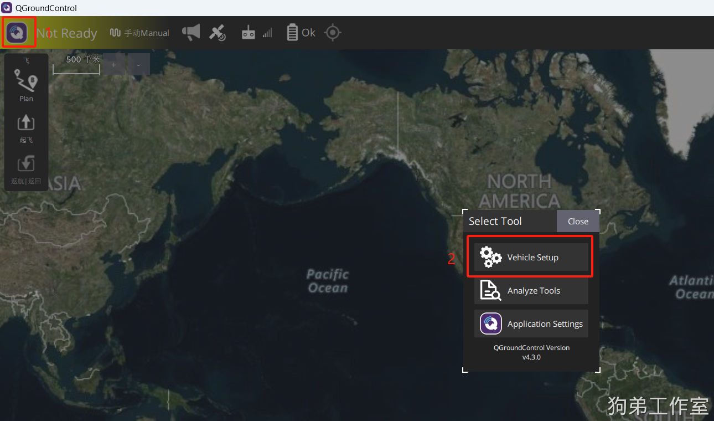


点击 1 2 处进行设备配置界面。


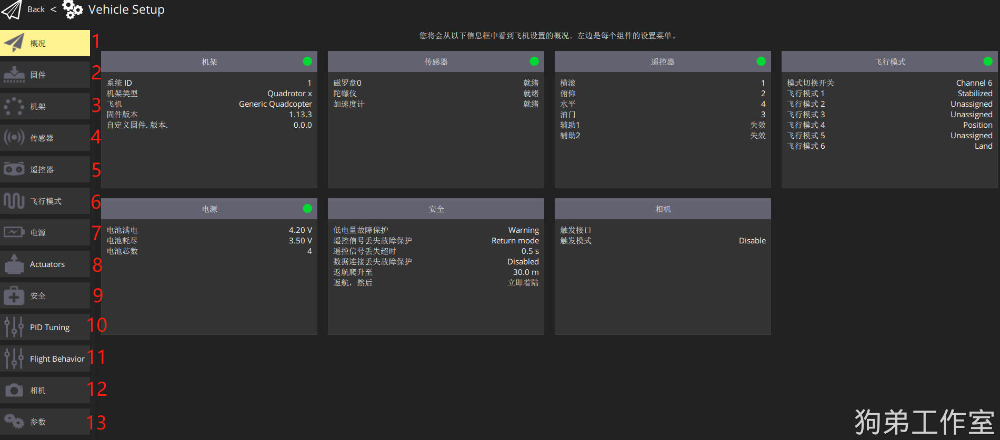


#### 1.概况：显示了飞控整体的情况；


#### 2.固件：飞控和你的笔记本通过 usb-microtyprc 连接，插拔一次进入烧录状态。我们已将烧录好了 PX4 1.13 固件；


#### 3.传感器：按照地面站指示去校准 PX4 飞控中的各种传感器，我们已经全部校准完了（特别注意，我们四好学生的飞控朝向并不是机头，所以我们在进行传感器校准的时候，选择了逆时针旋转 90，及通过软件的方式，间接让飞控指向了机头）；


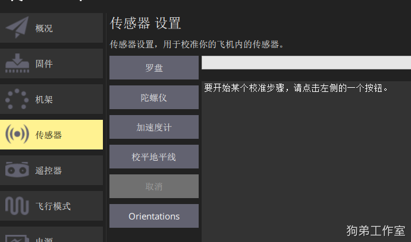


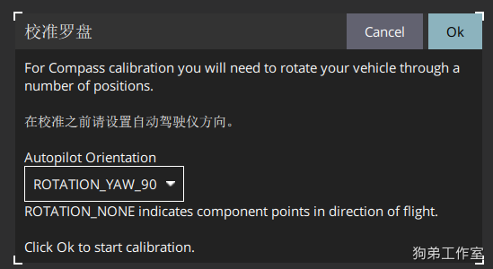


#### 4.机架


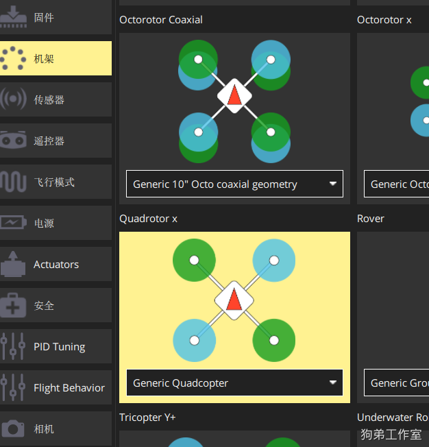


#### 5. 遥控器：
按照指示校准自己的遥控器按钮和拨杆，我们已经全部校准完了；


#### 6.飞行模型


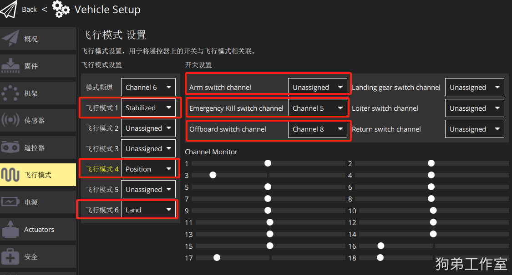


地面站中的配置与实物图的关系，如下图所示：


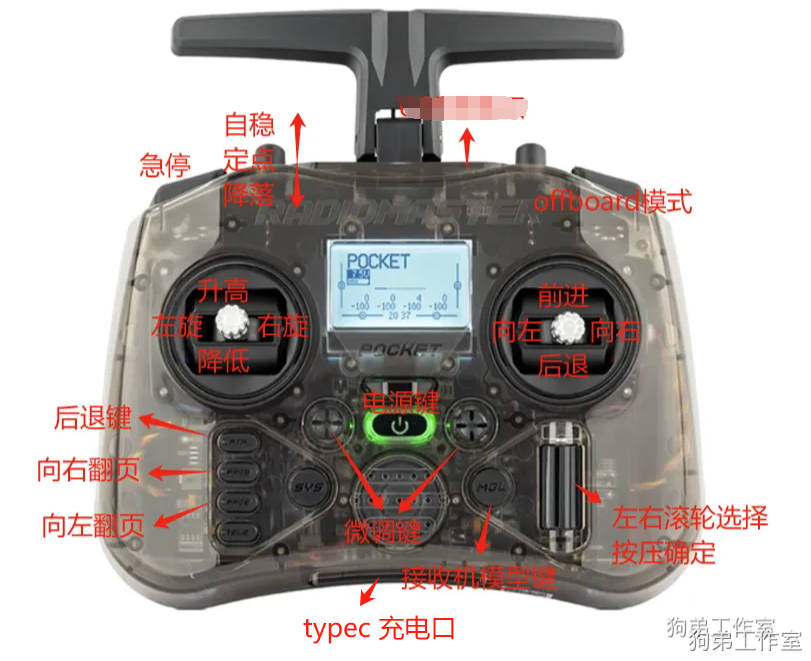


值得注意的是，Arm switch channle 及无人机的解锁没有设置，因为默认下图的解锁方式（左边遥感，往右下角推并保持 2 -3 秒），上锁是往左下角推并保持 2 -3 秒


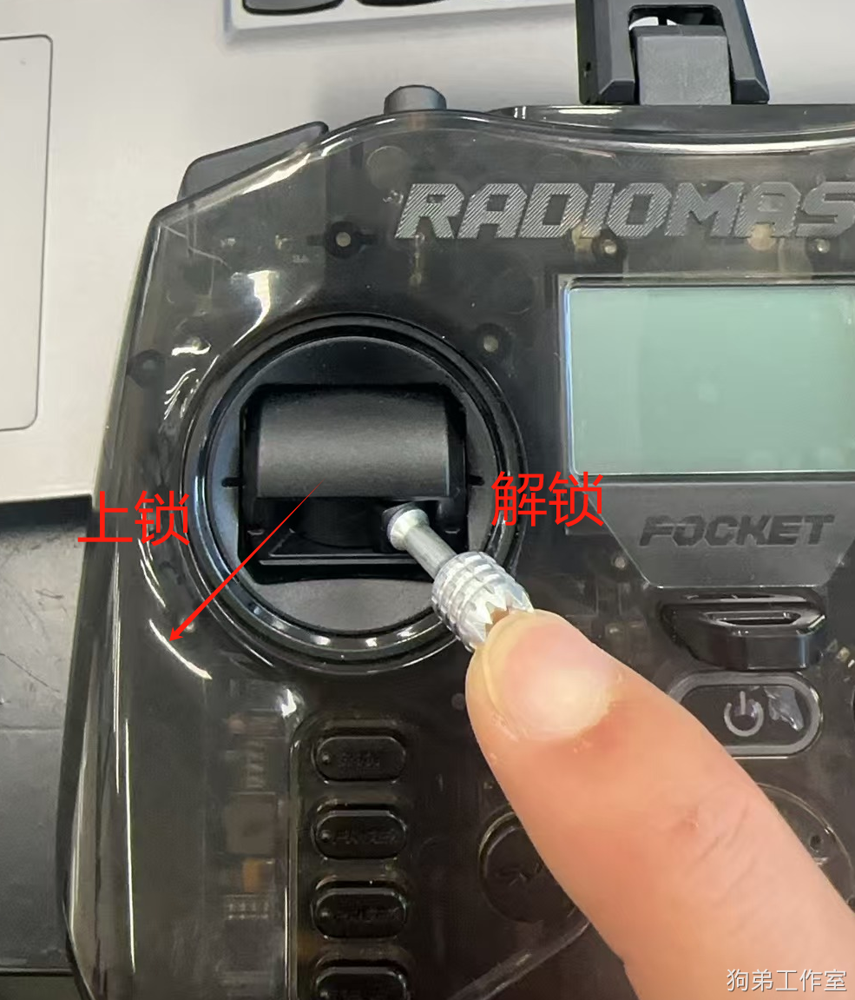


遥控器注意事项：

[语雀卡片链接](https://www.yuque.com/woshihenyouxiude/lwkpvm/kuld1zdq69o0d0gt#f9vEI)


#### 7.电源


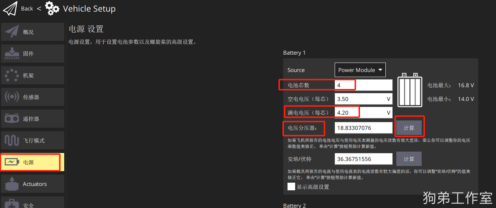


在此部分设置了电机的芯数和满电电压。同时地面站可显示电池当前的电压值（因为有 PM06 分电板的存在，上面有电流计），若值不太准时，可电机电压分压器后面的计算，输入实际的电池电压，可对此数据进行校准。


#### 8.电机


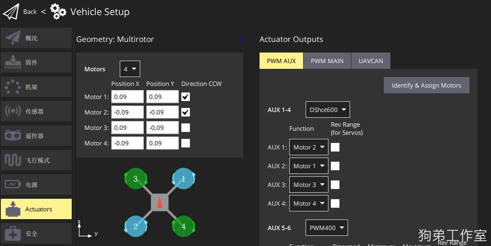


设置了电机的位置和转向，以及电调的协议是 Dshot600(使用此协议后，便不用再进行电调的校准，这个会自己校准，很方便)


#### 9-12 :不用管，没有进行任何配置


#### 13:参数
此处为调整 PX4 各种飞行参数的地方，我们调整的重要参数有：

1.此参数将 EKF 定位融合设置为 24（雷达或深度相机） ，若用 GPS 定位的话，需要改回 1


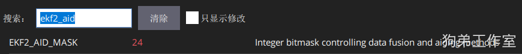


2.高度数据也改为通过雷达或深度相机获得


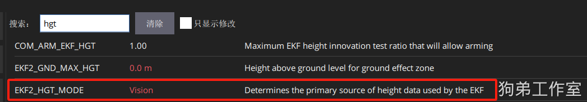


3.飞控的 TELEM1  设置为与机载电脑通信的串口，波特率为 921600，下图截错了，应该是  92160 机载电脑波特率的十分之一。


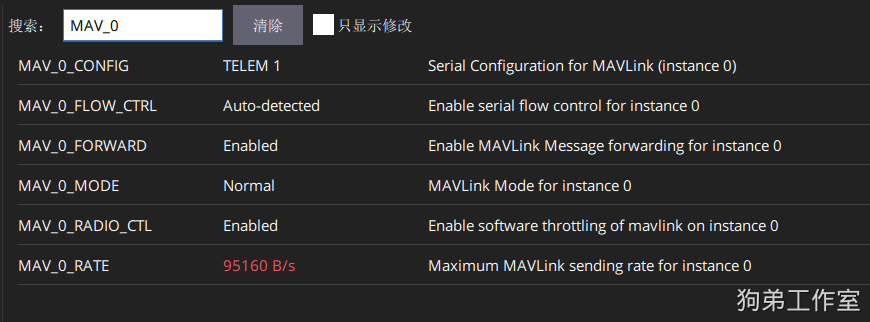


4.降落速度从 0.7m/s 减小到了 0.3m/s


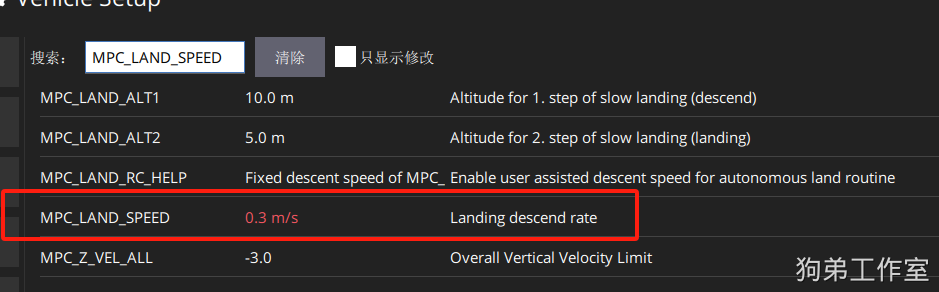


## ★程序及代码讲解


### 整体所用到的 代码说明


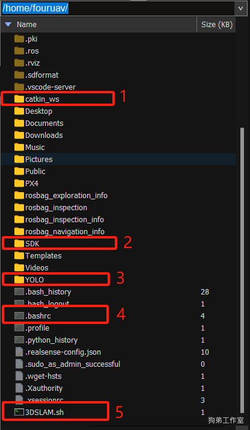


1.ROS 工作空间；2.各个模块的 SDK 包；3.YOLO 代码；4.系统配置文件；5.mid360 一键启动文件；  6.mavros 对应的依赖库 GeographicLib安装在了/usr/share/GeographicLib/ 路径下，Jetson Orin NX 的串口 U1 与 PX4 的 TELEM1 连接实现串口通信；

7.在Document里面放入了 opencv 4.6(已支持 gpu 加速)及opencv_control 安装目录为/usr/bin 。

新版本的 opencv 位于 SDK 文件夹内！


### ROS 工作空间内代码说明


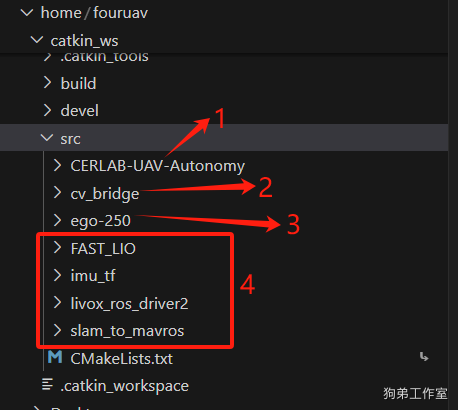


1.CERLAB-UAV-Autonomy 是一个开源项目，预投入使用

2.cv_bridge是vision_opencv中的一个包，（因为 opencv 的数据和 ROS 的数据需要转化，因此需要通过 cv_bridge 这个桥接工具）。已经安装好了，此包也不用理会。如果需要使用别的版本的 OpenCV，只需将 cv_bridge ./CMakeLists.txt中第20行（添加自己安装的带有 GPU 加速的 OpenCV 的 build 文件的路径） include("~/Documents/opencv-4.6.0/build/OpenCVConfig.cmake") 修改为相应的路径。

3.ego-250:包含两部分，1.egoctrl_v1 是控制器，上接 ego_planner 算法所规划结果的输出，下接 PX4 飞控去控制无人机做出相应的动作。2.是 ego_planner 算法的本体代码

注：代码编译用的 catkin_make


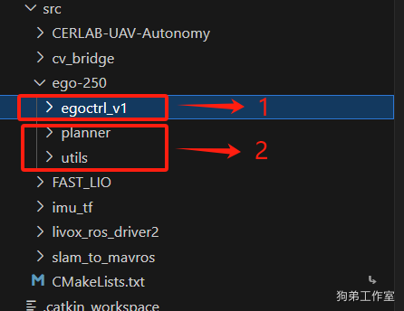


4.imu_tf 是处理 mid360 内置 imu 数据的角度转换；livox_ros_driver2 是 mid360 官方的驱动器，驱动 mid360 开始运行并输出点云；FAST_LIO 基于mid360 输出的点云进行 SLAM,进行建图和定位；slam_to_mavros 将FAST_LIO 输出的结果转换为 MAVROS 格式，并发送至 PX4。


### 启动单个硬件模块


#### 启动飞控：roslaunch mavros px4.launch
mavros 功能包本体代码的位置在 /opt/ros/noetic/share/mavros，其中的 px4.launch 代码如下：


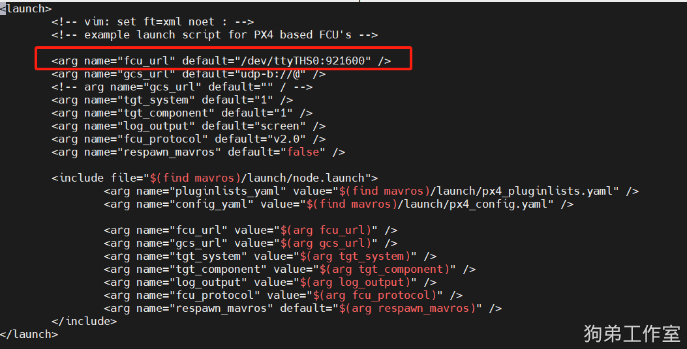


设置了是通过机载电脑的串口 1，波特率是 921600 与 PX4 飞控通信。

执行此代码后，无人机上的飞控才能通过 wifi,与你自己笔记本上的 QGC 地面站远程连接。

新版：如果你的./3DSLAM.sh 里面有roslaunch egoctrl_v1 px4.launch 指令，说明 px4.aunch 已经被我们移动到"/home/fouruav/catkin_ws/src/ego-250/egoctrl_v1/launch/px4.launch"，这样方便修改。


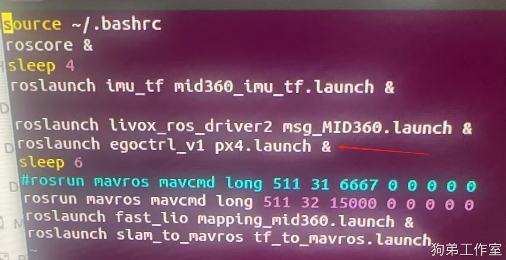


#### 启动 D435：roslaunch realsense2_camera rs_camera.launch
D435 深度相机的功能包位置在 /opt/ros/noetic/share/realsense2_camera ，启动这个指令后（提示WARNING (messenger-libusb.cpp:42) control_transfer returned error, index: 768, error: Resource temporarily unavailable, number: 11 是正常现象，不用理会即可），我们就可以获得深度相机输出的深度图、彩色图等所有信息，我们可以通过 rostopic list 指令来进行查看。


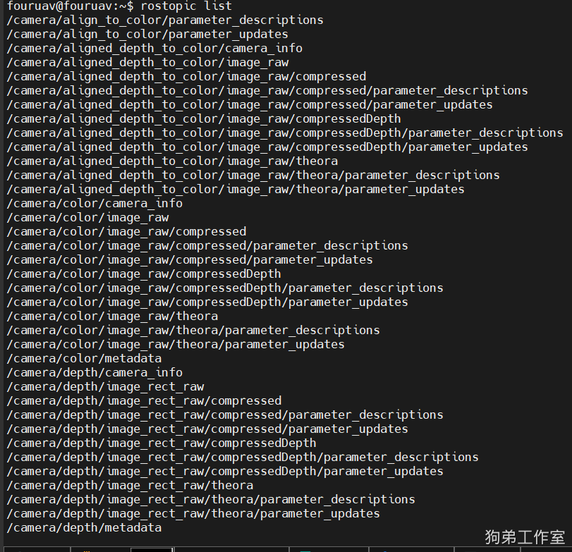


#### 启动 mid360 激光雷达：
在~目录下（cd ~），运行 ./3DSLAM.sh  指令,此 sh 文件包含一系列的执行程序，如下图所示：

```bash
source ~/.bashrc
roscore &
sleep 4
roslaunch imu_tf mid360_imu_tf.launch &
# 进行了mid360的imu姿态变换
roslaunch slam_to_mavros tf_to_mavros.launch &
# 进行了mid360的话题变换为mavros系列话题
roslaunch livox_ros_driver2 msg_MID360.launch &
# 启动了mid360获取雷达点云数据
roslaunch mavros px4.launch &
# 启动飞控和机载电脑之间的mavros通信
sleep 6
rosrun mavros mavcmd long 511 32 15000 0 0 0 0 0
# 启动mavros的响应
roslaunch fast_lio mapping_mid360.launch
# 开始建图并获取定位数据
```

启动此代码后，无人机便有了定位数据，才可以切换到定点模型飞行，没有定位数据无法切换到定点模式。

所建立的地图会保存在/home/fouruav/catkin_ws/src/FAST_LIO/PCD/目录下。

新版：如果你的./3DSLAM.sh 里面有roslaunch egoctrl_v1 px4.launch 指令，说明 px4.aunch 已经被我们移动到"/home/fouruav/catkin_ws/src/ego-250/egoctrl_v1/launch/px4.launch"，这样方便修改。


### 实用工具：


#### 1.Jtop
Jtop 是非常实用的 jetson-stats 性能监控软件，是目前针对 NVIDIA Jetson 系列最好的性能监控工具，  在终端内输入 jtop


#### 2. 切换输入法（外接鼠标键盘显示屏的时候）
ctrl+空格 切换 中英文输入法


#### 3. realsense-viewer
在终端内输入realsense-viewer ，即可使用英特尔官方的软件，可视化查看 D435 深度相机或其它英特尔设备。


#### 4.VNC 远程可视化连接（需外接显示屏或 HDMI 诱骗器，不推荐）
通过该[https://developer.nvidia.com/embedded/learn/tutorials/vnc-setup#h.8sxn8e3pnc9a](https://developer.nvidia.com/embedded/learn/tutorials/vnc-setup#h.8sxn8e3pnc9a)链接进行的配置，机载电脑的 VNC 功能已经被我们开启，切勿你自己再进行操作，链接就是告诉你是怎么配置的！

如果你需要使用 VNC 的话，按下面的操作：


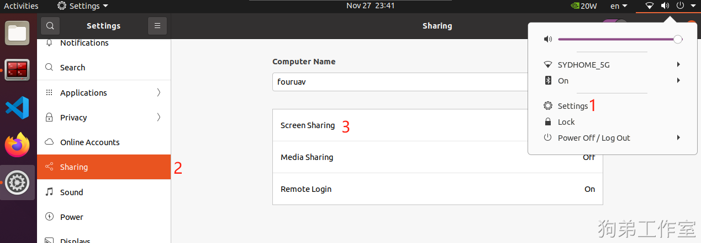


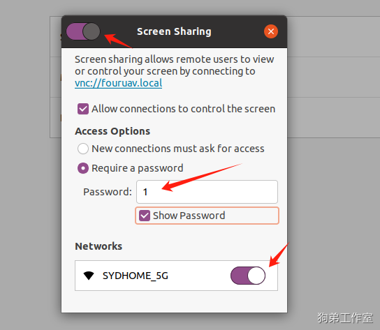


然后 在你的电脑上打开 VNC 软件 输入机载电脑的 ip 后，输入密码。（也需要连接同一个 wifi）


### 上手飞行常用指令：  （无人机机载电脑账号：fouruav    密码：1）
前置操作：

1. 打开遥控器和 QGC 地面站；

2. 无人机接上电池；

3. 打开 ssh 先远程连接上。


#### 1.    利用 mid360 激光雷达 进行 定位和 ego 自主导航
** Mid360提供定位数据,  Mid360提供点云数据  基于航点程序进行Ego _planner飞行。**

```bash
./3DSLAM.sh
roslaunch ego_planner single_run_in_expmid.launch
roslaunch egoctrl_v1 egoctrl.launch
roslaunch egoctrl_v1 run_mid_ego.launch
```

以上命令依次获取无人机定位数据（记得检查定位数据是否正常输出）、启动 egoplanner（mid360 提供的障碍物点云信息）、启动 ego 控制器（上至航点程序，下至 egoplanner 算法），并启动 task_node 综合指令发布程序。

./3DSLAM.sh 是在~目录下的，我们必须在~目录，即我们的主目录下输入这个指令哦！

解锁无人机 按下 offboard 模式按键 无人机将在机载电脑的控制下，按照task_node 综合指令发布程序自主飞行对应的视频教程如下，以后切换到offboard 模式都是这样！

[语雀卡片链接](https://www.yuque.com/woshihenyouxiude/lwkpvm/kuld1zdq69o0d0gt#TaiGg)

飞行结束后，如果不打算继续飞行的话，可以在终端内输入 ： sudo shutdown now  让机载电脑关机，也可以直接拔电池。

egoplanner 的更多参数说明请看这个：[【开源无人机】Ego-Planner参数讲解_哔哩哔哩_bilibili](https://www.bilibili.com/video/BV1QDeEenEqW?spm_id_from=333.788.videopod.sections&vd_source=4289c781adc3a9ced242221ce6b3f4e0)


#### 2. 利用 mid360 激光雷达定位 和 利用深度相机进行 ego 自主导航
**Mid360提供定位数据,  深度相机d435提供深度图像数据  基于航点程序进行Ego _planner飞行。**

```bash
./3DSLAM.sh
roslaunch realsense2_camera rs_camera.launch
roslaunch ego_planner single_run_in_expd435.launch
roslaunch egoctrl_v1 egoctrl.launch
roslaunch egoctrl_v1 run_mid_ego.launch
```

以上命令依次获取无人机定位数据（记得检查定位数据是否正常输出）、启动 d435 获得深度图像数据、启动 egoplanner（d435 提供的障碍物点云信息）、启动 ego 控制器（上至航点程序，下至 egoplanner 算法），并启动 task_node 综合指令发布程序。

随后解锁无人机，按下 offboard 模式按键，无人机将在机载电脑的控制下，按照 task_node 综合指令发布程序自主飞行。


#### 3. 利用 mid360 激光雷达 定位和ego 手动打点导航（推荐用 5 新增自主导航，ego 太老了）
**Mid360提供定位数据,  Mid360提供点云数据  基于Rviz打点进行Ego _planner飞行。**

```bash
./3DSLAM.sh
roslaunch ego_planner single_run_in_expmid.launch
roslaunch egoctrl_v1 egoctrl_yuanshi.launch
```

以上命令依次获取无人机定位数据（记得检查定位数据是否正常输出）、启动 egoplanner（mid360 提供的障碍物点云信息），并启动控制器（上至 rviz，下至 egoplanner 算法）。

随后解锁无人机，按下 offboard 模式按键，无人机将在机载电脑的控制下飞到 1 m，然后按照 rviz 打点的位置飞行。在 rviz 上打点飞行。


#### 4.  利用 mid360 激光雷达定位 切换到定点模式后 利用遥控器 手动定点飞行
```bash
./3DSLAM.sh
```

启动该命令获取无人机定位数据（记得检查定位数据是否正常输出）。

随后用遥控器切换到定点模式，解锁无人机。油门杆向上推动，0-50% 的范围无效，50%-100% 的范围内开始启动，缓慢推动加速无人机起飞，飞到一定高度后，将油门杆回中，此时无人机将保持悬停状态。使用遥控器控制运动，最后将遥控器拨到降落模式降落。


### 5. 【新】新增自主导航/探索/感知部分
先打开 QGC 地面站和遥控器（此处遥控器仅开机即可，代码会自动控制无人机解锁和进入 offboard 模式）。

膨胀、速度等参数都可以自己设置。

无人机不需要起飞，给机载电脑上电和 mid360 上电，这是单独的一个纯检测功能。

```bash
./3DSLAM.sh
qidongd435
roslaunch onboard_detector detector_with_learning_module.launch
```

以上命令依次获取无人机定位数据（记得检查定位数据是否正常输出）、通过快捷指令启动深度相机并将像素强制改为 640*480，并开启动态障碍物检测。

```bash
./3DSLAM.sh
qidongd435
roslaunch onboard_detector detector_with_learning_module.launch
roslaunch remote_control dynamic_navigation_rviz.launch
roslaunch autonomous_flight dynamic_navigation.launch
```

以上命令依次获取无人机定位数据（记得检查定位数据是否正常输出）、通过快捷指令启动深度相机并将像素强制改为 640*480、开启动态障碍物检测、打开显示地图的 rviz，并执行导航。无人机会自动解锁并飞到 1 m，等待 rviz 打点飞行，按 ctrl+c 降落（新版本支持遥控器降落）。

```bash
./3DSLAM.sh
roslaunch remote_control navigation_rviz.launch
roslaunch autonomous_flight navigation.launch
```

以上命令依次获取无人机定位数据（记得检查定位数据是否正常输出）、打开显示地图的 rviz，并执行导航。无人机会自动解锁并飞到 1 m，等待 rviz 打点飞行，按 ctrl+c 降落（新版本支持遥控器降落）。

```bash
./3DSLAM.sh
roslaunch remote_control exploration_rviz.launch
roslaunch autonomous_flight dynamic_exploration.launch
```

以上命令依次获取无人机定位数据（记得检查定位数据是否正常输出）、打开显示地图的 rviz，并执行探索。无人机会自动解锁并飞到 1 m，等待用户按回车指令继续，按 ctrl+c 降落（新版本支持遥控器降落）。

`qidongd435`（快捷指令）会启动深度相机并将像素强制改为 640*480；`roslaunch onboard_detector detector_with_learning_module.launch` 是动态障碍物检测命令。第二行和第三行启不启动都可以，默认别启动。

<details class="lake-collapse"><summary id="ua84e1e32">自主探索参数详细说明：</summary><p id="u7f4446e4" class="ne-p">**1. 定位与区域范围 **</p><p id="ud073f7eb" class="ne-p">**odom_topic**</p><p id="u1f6243ab" class="ne-p">作用：指定无人机里程计信息的ROS话题。</p><p id="ud6016b6f" class="ne-p">"/mavros/local_position/odom"：MAVROS（PX4飞控）的默认里程计话题。
注意：需根据实际使用的飞控系统选择正确的话题。
**local_region_min & local_region_max**
作用：定义无人机当前局部探索的边界范围（单位：米）。
示例：[-5, -5, -2]到[5, 5, 2]表示无人机在前后左右各5米、高度-2米到2米的区域内进行近距离探索。
影响：限制实时路径规划的局部搜索空间，避免计算资源浪费。</p><p id="u19d9f6ca" class="ne-p">**global_region_min & global_region_max**
作用：定义全局探索的任务区域范围（单位：米）。
示例：[-20, -20, 0.7]到[20, 20, 1.2]表示全局任务在前后左右各20米、高度0.7米到1.2米的区域内进行。
影响：决定整个探索任务的边界，超出范围的目标点将被忽略。</p><p id="u855664d4" class="ne-p">**2. 采样与路径规划**
**local_sample_thresh**
作用：局部区域内生成采样点的最大数量。
调整建议：增大此值会增加局部路径的多样性，但可能降低实时性。</p><p id="u20fed6fc" class="ne-p">**global_sample_thresh**
作用：全局区域内生成采样点的最大数量。
调整建议：增大此值可覆盖更多潜在路径，但会增加计算复杂度。</p><p id="u8a3a61f5" class="ne-p">**frontier_sample_thresh**
作用：前沿（未知与已知区域边界）区域的采样点数量。
调整建议：</p><p id="u117aab58" class="ne-p">增大：前沿探索更密集，适合复杂环境。
减小：探索更分散，节省计算资源。
**dist_thresh**
作用：采样点之间的最小间隔（单位：米）。
示例：0.8表示两个采样点至少相距0.8米。
调整建议：</p><p id="u44ee266f" class="ne-p">复杂环境：减小此值（如0.5）以捕捉更多细节。
空旷环境：增大此值（如1.0）以提高效率。
**3. 安全与避障**
**safe_distance_xy & safe_distance_z**
作用：无人机与障碍物的水平（XY）和垂直（Z）方向安全距离（单位：米）。
示例：safe_distance_xy: 0.3表示无人机与障碍物水平方向保持至少0.3米距离。
注意：Z轴安全距离通常设为0以允许贴地飞行。</p><p id="u1d8c4ba7" class="ne-p">**safe_distance_check_unknown**
作用：是否将未知区域视为障碍物。
选项：</p><p id="ucc435aaf" class="ne-p">true：保守策略，提高安全性，但可能限制探索范围。
false：激进策略，允许进入未知区域，但风险更高。
**4. 传感器参数（摄像头）**
**horizontal_FOV & vertical_FOV**
作用：雷达或深度相机的水平和垂直视场角（单位：弧度）。范围外的被忽略。
示例：1.57弧度≈90度，表示摄像头的视野范围为90度。</p><p id="ud931f769" class="ne-p">**dmin & dmax**
作用：雷达或深度相机的最小和最大有效探测距离（单位：米）。
示例：dmin: 0.3表示0.3米内无法探测障碍物，dmax: 2.0表示2.0米外的障碍物不可见。</p><p id="u27c0c827" class="ne-p">**5. 路径规划图结构**
**nearest_neighbor_number**
作用：每个采样点连接的最邻近节点数量。
调整建议：增大此值（如20）可能找到更优路径，但增加计算量。</p><p id="u6ff92a87" class="ne-p">**frontier_nearest_neighbor_number**
作用：前沿区域节点的最邻近连接数。
调整建议：前沿区域需更多连接以覆盖未知区域。</p><p id="u7977510e" class="ne-p">**max_connect_dist**
作用：两个节点之间的最大允许连接距离（单位：米）。
示例：1.5表示超过1.5米的节点不会直接连接。
影响：限制路径的连续性，避免长距离跳跃。</p><p id="u3d1e0d2e" class="ne-p">**6. 目标点选择**
**min_goal_candidates & max_goal_candidates**
作用：每次规划时生成的目标候选点数量范围。
调整建议：</p><p id="u59320ada" class="ne-p">增大：探索更全面，但计算量增加。
减小：适合快速决策，但可能错过更优目标。
**information_gain_update_distance**
作用：触发信息增益更新的最小移动距离（单位：米）。
示例：1.0表示无人机每移动1米重新评估探索目标。
调整建议：动态环境中可减小此值以快速响应环境变化。</p><p id="u9e16fb62" class="ne-p">**yaw_penalty_weight**
作用：偏航角变化的惩罚权重，用于路径选择。
调整建议：</p><p id="u56c554e0" class="ne-p">增大：减少转向，生成更平滑路径。
减小：允许频繁转向，可能缩短路径但增加控制难度。
参数调整策略
安全性优先：</p><p id="ue7516938" class="ne-p">增大安全距离（safe_distance_xy）。
启用safe_distance_check_unknown。
减小max_connect_dist。
探索效率优先：</p><p id="u0c37f5ec" class="ne-p">减小dist_thresh和frontier_sample_thresh。
增大max_goal_candidates。
减小information_gain_update_distance。
计算资源受限：</p><p id="u8788c9d7" class="ne-p">减小local_sample_thresh和global_sample_thresh。
减小nearest_neighbor_number。
减小min_goal_candidates。
通过合理调整这些参数，可以平衡无人机的安全性、探索效率和计算资源消耗。</p></details>
飞行过程中遥控器应握在手中，在终端按ctrl+c 结束代码（新版本已支持遥控器降落），否则代码会一直控制无人机解锁和切换到 offboard 模式。若在飞行过程中电脑和无人机断开了连接，你应该想办法重新让两者重新组网，重新远程登陆进机载电脑，在终端内执行 rosnode list  列出活动节点，再执行rosnode kill + 最后执行的那个导航或探索节点的名字 杀死节点即可。


### YOLO 部分（选装，需配合普通的 USB 相机使用）
注：已全部安装好，切勿自己再重复安装，此处只是为了告诉你是怎么安装的。

[https://forums.developer.nvidia.com/t/pytorch-for-jetson/72048](https://forums.developer.nvidia.com/t/pytorch-for-jetson/72048)    根据此网站的Instructions 安装了PyTorch v2.1.0。

[https://github.com/pytorch/vision](https://github.com/pytorch/vision)    torchvision 的版本安装的是0.16（与安装的 torch 相对应）。

```bash
cd ~/YOLO/yolov5
python detect.py --weights yolov5s.pt --source 6
```

其中 `yolov5s.pt` 替换为你的权重文件，数字 `6` 是你的 USB 摄像头编号。

USB摄像头编号的方法，先把摄像头（通过 usb 口或拓展坞或 typec 口）插在机载电脑上，在终端输入 ls /dev/ |grep video ；输出如下：


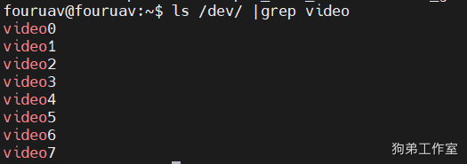


然后把摄像头拔掉，再次输入ls /dev/ |grep video ，输出如下：


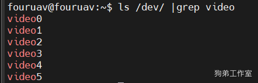


对比发现少了 video6 video7,每个摄像头会占用两个数字，我们用第一个数字编号。那这样就知道了我们的摄像头编号是 6 。

新版：cd ~/YOLO     然后运行 python YOLO.py 即可。


## 补充说明 1：编译工作
若你在工作空间catkin_ws 的 src 中新添加了自己的功能包或修改了 cpp 文件，需要进行编译：

1. 若没有删除 devel 和 build 文件，则直接cd 进工作空间内（~/catkin_ws），使用 catkin_make 指令编译（推荐）

2. 若把 devel 和 build 文件删除掉了，

```bash
cd livox_ros_driver2
```

```bash
source /opt/ros/noetic/setup.sh
./build.sh ROS1
```

 然后再去使用 catkin_make 编译。


## 补充说明 2：无人机好像比之前飘了不少，没之前稳了
在你没有修改代码的前提下：使用一根较长的数据线 把无人机的飞控侧面的数据口 和 你的笔记本上连接，利用你电脑上的 QGC 对飞控进行重新的校准即可。注意不要使用机载电脑内部的QGC 去校准飞控，就用你自己的电脑。

若是你自己代码控制的不稳，那就跟校不校准没有关系了。


## 补充说明 3：有些路由器会导致启动 launch 文件后 QGC 没有反应，可以切换为你的笔记本电脑具体的 ip，第 7 行换成第 6 行，端口号什么的不用变。
先在终端执行 roscd mavros  再执行 cd launch  接着执行 sudo nano px4.launch

使用 nano 文本编辑器对文件进行修改，随后 ctrl+o 保存 ，ctrl+x 退出。

（新版：如果你的./3DSLAM.sh 里面有roslaunch egoctrl_v1 px4.launch 指令，说明 px4.aunch 已经被我们移动到"/home/fouruav/catkin_ws/src/ego-250/egoctrl_v1/launch/px4.launch"，进入到这个对应的目录去修改！）


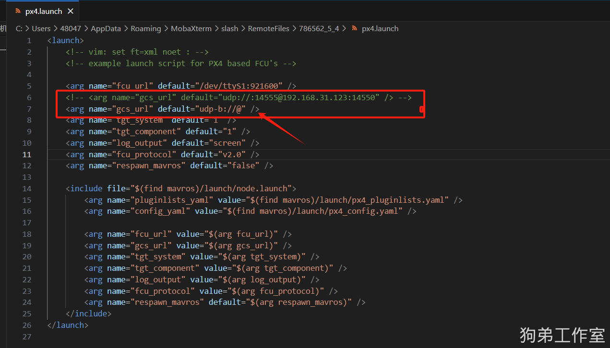


## 补充说明 4：Ego 的目标点高度已被固定为 1m,修改方式如下
/home/fouruav/catkin_ws/src/ego-250/planner/plan_manage/src/ego_replan_fsm.cpp 220行屏蔽掉，把下面的 221 行解注释。即将Z=1 修改为 Z 等于目标航点发布的高度 msg->pose.position.z


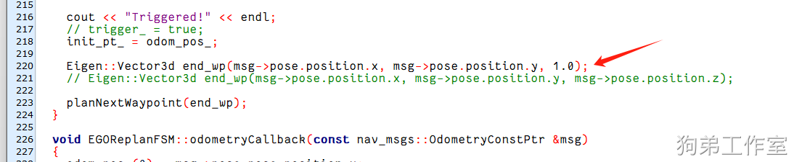


修改后保存，然后 cd 进工作空间（~/catkin_ws）内使用 catkin_make 重新编译。

补充说明 5：旋转角度说明：雷达  pitch抬头为负 低头为正 往左偏 roll为负 ，yaw正值是逆时针 负值顺时针

##
