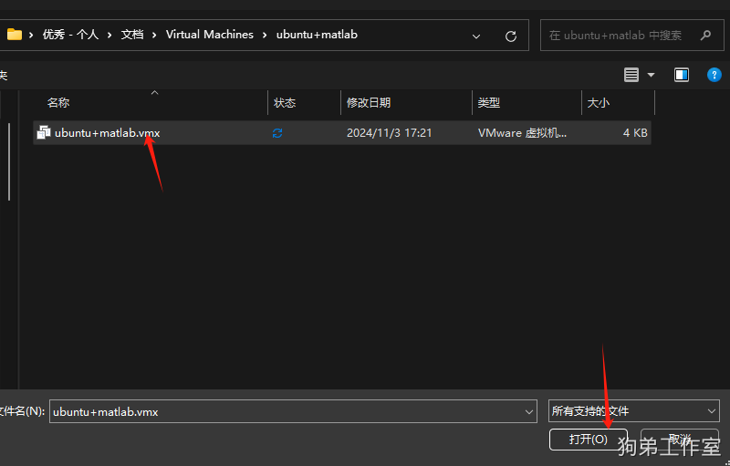
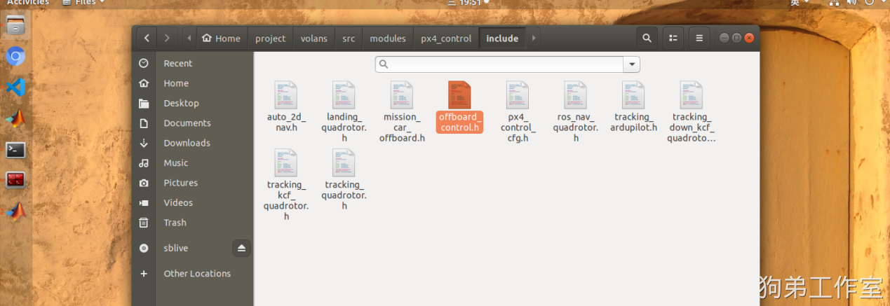
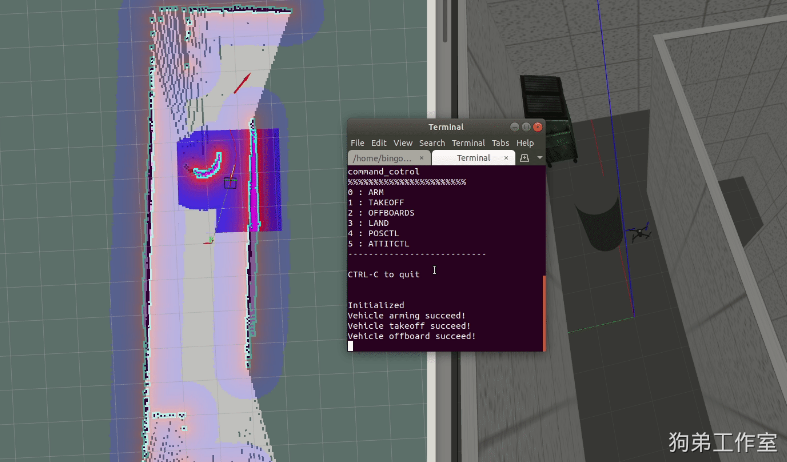
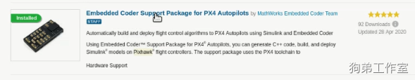
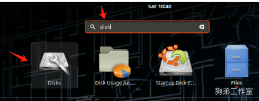

# GDStudio MATLAB 虚拟机资料


此文档为长期维护版本，以此版本为准哦~

使用方法：我把我搭建好的虚拟机压缩包通过百度网盘链接给你，不用新建虚拟机，你直接用你的虚拟机打开我的虚拟机文件就可以直接用！

** （因 B 站“工房”全部升级为“小店”，现推荐使用 通过此链接进入小店购买：**

[https://mall.bilibili.com/neul-next/detailuniversal/detail.html?isMerchant=1&page=detailuniversal_detail&saleType=10&itemsId=11756762&loadingShow=1&noTitleBar=1&msource=merchant_share](https://mall.bilibili.com/neul-next/detailuniversal/detail.html?isMerchant=1&page=detailuniversal_detail&saleType=10&itemsId=11756762&loadingShow=1&noTitleBar=1&msource=merchant_share)


##### 将百度网盘链接里面的压缩包下载到你的电脑本地


##### 在windows里面解压这个.rar压缩包（解压整个包！一定要先把压缩包解压出来，跟你正常解压压缩包是一样的， 记住路径。 最好用 7Z winrar 等这种专门的解压软件，不要用什么 360 解压、wps 解压之类的）


##### 然后打开你 电脑上的 VMware 虚拟机软件 在左上角 文件 点击 打开(O)
> 注：如果你电脑上没有VMware 虚拟机软件或者打开后电脑会**蓝屏/黑屏等问题**，可以用下面链接的这个版本的 VMWARE：
>
> 通过网盘分享的文件：VMware workstation v16.2.2.exe等2个文件.zip
>
> 链接: [https://pan.baidu.com/s/1hCUOSXBoLULDuRGrN-T6JA?pwd=w8wk](https://pan.baidu.com/s/1hCUOSXBoLULDuRGrN-T6JA?pwd=w8wk) 提取码: w8wk
>
> --来自百度网盘超级会员v7的分享
>


##### 进去解压后的文件路径 打开ubuntu+matlab.vmx 文件，不要选错文件了





##### 5.打开后选择我已复制了此虚拟机即可 。


##### 6. 按照 补充说明 1 更换offboard_control.h 并编译
VMware15 16 17版本都可以。VMWARE虚拟机-密码 bingo 所有功能都全部完全优化，而且屏幕尺寸得到了调整、VMWARE虚拟机和Windows之间可自由复制、可上网，代码全部可见，地面站、matlab代码可直接用、gazebo fps50左右，十分流畅！！！！此虚拟机是我的虚拟机的百分百复制体！！！！

所有的**账号密码**都是 **bingo**   ！


##### 7.至此虚拟机就配置好了。 如果你不是老手，请跟着我B站视频，从 第7节 开始学习！不要自己乱操作哦！ 除了视频以外的功能还处于暂未开发阶段哦，需要的话可以自己进行增删改查。
```plain
注：合集中的 前4节课 是很早之前的了，属于入门内容，看看就行，不用跟着操作，这个虚拟机是后面的动手操作内容，你拿这个平台直接用就行，跟着我B站视频，从 第7节(https://www.bilibili.com/video/BV1Km411y75k/?vd_source=4289c781adc3a9ced242221ce6b3f4e0)开始学习！
本虚拟机基于开源项目进行修复和优化，开源链接就是视频简介里的那个哦，特此声明！！！！！前四节课是网络资源，很好的入门课，特别适合新手入门，不是原创，我自己再重新录制一遍的话也属于粗糙模仿，后面的课程基于开源项目做了增删改查和大范围优化，特此声明！！！！
1.资料和文档在虚拟机的桌面上，不要看其它位置的哦。
2.桌面上的教学视频你不要跟着操作，那是装包的过程记录！！再次强调，那些操作我已经做过了，你不要再去进行编译等操作！

```


## 补充说明 1：新版本更新了全新的代码源，导致之前的坐标系紊乱
请将文件夹中的offboard_control.h将下图中的替换掉，此文件夹的路径是 Home-project-volans-src-modules-px4_control-include! 否则再进行matlab+A*算法时无人机会乱飞！

替换掉以后，打开终端执行 cd ~/project/volans  进入工作空间，然后执行 **catkin build **px4_control 去重新编译更改的代码就可以了！





offboard_control.h 文件也可以从这里下载：

[offboard_control.h](https://www.yuque.com/attachments/yuque/0/2025/txt/38514181/1739779508083-8abbe628-d700-4e32-8943-0422d355ac0b.txt)


## 补充说明 2：自主导航功能
运行

roslaunch simulation ros_2Dnav_demo_px4.launch

在键盘控制界面解锁无人机，并控制无人机起飞。然后在rviz界面使用2D Nav Goal 设置目标点，然后在键盘控制界面输入0 解锁、2运行offboard模式。

无人机可自行前往目标点！





也可在线调参，在终端中输入如下命令即可。

rosrun rqt_reconfigure rqt_reconfigure

也可运行自主探索未知区域

roslaunch simulation ros_Auto2Dnav_demo_px4.launch

然后在键盘控制界面输入0 解锁、2运行offboard模式

无需任何操作！无人机自己会去探索这篇领域！


## 补充说明 3：matlab需要你自己的 licens
针对B站上[组合拳]matlab写算法->PX4去控制->ROS来可视化这节课，里面所提到的PX4工具包因为版权问题，你们自己百度一下怎么安装吧。matlab的add ones需要licens,我的账号没法公开，要用的话需要使用你自己的，B站上所有的视频都不需要这个licens，都是可以跑的，没有这个不影响该平台的使用，如果你想进行该操作的话，就需要自己搞个账号，如果你没有的账号的话，就无法在 matlab 软件中进行此操作，这个是matlab 软件的限制，我也没有办法，介意勿拍，特此声明。同时PSP里面的PX4源码我给删掉了，需要的话你们去PX4官网上再重新下载一份。





## 补充说明 4：ompl3Drrt路径规划时教程已上传B站


## 补充说明 5：拓展虚拟机的存储空间
1. 先在 VMware 设置界面调整存储大小，

2. 然后开启此虚拟机，打开软件中心，搜索 disk





重新设置一下分区的大小即可。


## 补充说明 6：恢复出厂设置
在虚拟机的快照部分，点击恢复出厂设置的快照，就会恢复到最初的状态，记得提前保存自己的代码，然后按照 补充说明 1 更换offboard_control.h 并编译，就完成了。


## 补充说明 7：Could not get lock /var/lib/dpkg/lock-frontend
见下方：

[【已解决】Could not get lock /var/lib/dpkg/lock-frontend-CSDN博客](https://blog.csdn.net/lun55423/article/details/108907779)


## 补充说明 8：(定位问题)EKF 的选择
不论你要做什么操作，都需要让无人机先知道自己在什么位置，有两种方式可以让无人机获取定位的数据：

**无人机利用相机/激光雷达+算法等非GPS方式得到无人机的定位数据统称为视觉定位；**

**无人机利用GPS得到无人机的定位数据叫做GPS定位。**

根据你实际的情况来切换 EKF 配置，从而调整定位模式。桌面上的使用
