# GDStudio WSL 仿真平台安装教程

本文档按原始资料的图文顺序重建，图片保留在对应上下文位置，便于作为中文知识库继续整理。

**此平台需要激活：添加李工 QQ 号：860582941**

**将你的订单截图和所获取的电脑序列号发送给李工，他回给你激活码！**

## 购买注意事项：
1.安装需要35~70个G的内存，后期只需要35个G左右。

2.必须要win11系统+Nvidia显卡(像nvidia MAX250很久前出显卡不能适配，其它的可以)。 win10无法用GPU

3.该平台需要激活码才能使用，激活码会与你的电脑硬件绑定，一机一码，激活后才能使用，考虑到学生没多少米，额外提供了基础版提供一个激活码；豪华版提供三个激活码，并额外赠送我们整理的以前的视频和ppt等。两者的内的平台是完全一样的。

4.可以先按照本文档安装 WSL 平台，2.1.1 配置电脑 和 2.1.2 开始安装WSL 中不出现问题的话，再来购买激活码哦。。

4.该平台预装好的内容包括XTdrone语雀使用文档中的目录前30个，其中只有视觉SLAM/二维激光SLAM（Cartographer）/多无人机编队（ROS2）没安装，这三个有些没必要，还有就行视觉追踪行人那节课，需要自己再重新配置环境（每个电脑的cuda不一样），介意勿拍哦。

接下来该教程有4个图文并茂的步骤：

1：简要介绍

2：安装WSL并将XTDrone平台导入电脑

3：介绍终端和Vscode

4：激活平台

(**安装后，在B站上跟着我的****Xtdrone 29讲视频教程****进行学习！！！！！，Xtdrone 29讲超级详细，足够你学会这个平台，所以不再推出冗余的文档教程了，特此告知**。)

#### **1. 简要介绍**
WSL是什么呢？WSL是Windows Subsystem for Linux的简写，指的是windows的一个子系统，这个子系统的作用是在windows下运行linux操作系统。你可以把这个理解为一个运行在你windows系统内的一个软件（微信，QQ之类的）。从使用者的角度看，在windows上就可以运行本来只能在liunx下运行的各种软件和应用程序了。注：win 挂上外网梯子后，WSL 也相当于挂上了梯子。
WSL类似于虚拟机软件(比如virtualbox、vmware workstation等），但是它不像虚拟机那么卡(经过配置，我们的这个平台能够自适应你的电脑Nvidia GPU，运行特稳定且流畅，不会让你在使用中卡的很难受！)，也没有双系统那么麻烦(我们的这个平台不需要再费劲去刷双系统！不需要重启电脑去切换系统！不需要重新配置！导入后直接用，就跟你使用微信和QQ类似，顺手打开就直接使用了！)。这是未来的主流方向，大家一定不要错过哦，我们工作室用过wsl之后，就再也不想去碰虚拟机和双系统。

**B站工房同款****豪华版****： （因 B 站“工房”全部升级为“小店”，现推荐使用 bilibili APP 扫描下方二维码进行购买）。或者通过此链接购买：**

[https://mall.bilibili.com/neul-next/detailuniversal/detail.html?isMerchant=1&page=detailuniversal_detail&saleType=10&itemsId=11298401&loadingShow=1&noTitleBar=1&msource=merchant_share](https://mall.bilibili.com/neul-next/detailuniversal/detail.html?isMerchant=1&page=detailuniversal_detail&saleType=10&itemsId=11298401&loadingShow=1&noTitleBar=1&msource=merchant_share)

**B站工房同款****基础版（已开源）****： **

[https://mall.bilibili.com/neul-next/detailuniversal/detail.html?isMerchant=1&page=detailuniversal_detail&saleType=10&itemsId=11756736&loadingShow=1&noTitleBar=1&msource=merchant_share](https://mall.bilibili.com/neul-next/detailuniversal/detail.html?isMerchant=1&page=detailuniversal_detail&saleType=10&itemsId=11756736&loadingShow=1&noTitleBar=1&msource=merchant_share)

**视频介绍链接：**

[【自制】论文实验｜项目验收｜仿真竞赛｜算法验证不可或缺的无人机仿真平台_哔哩哔哩_bilibili](https://www.bilibili.com/video/BV1D24vekEPE/?spm_id_from=333.788&vd_source=4289c781adc3a9ced242221ce6b3f4e0)

**豪华版额外赠送所整理的资料如下：**

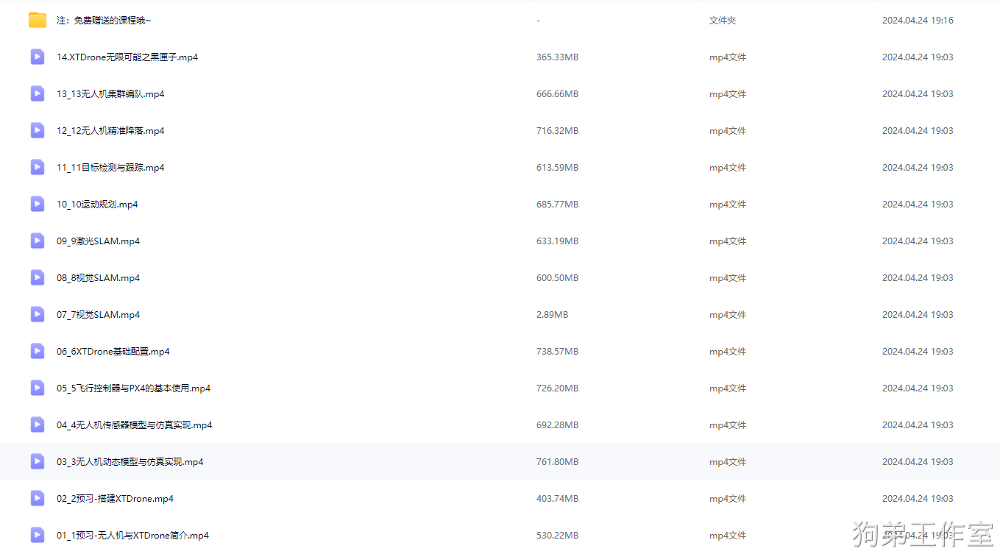

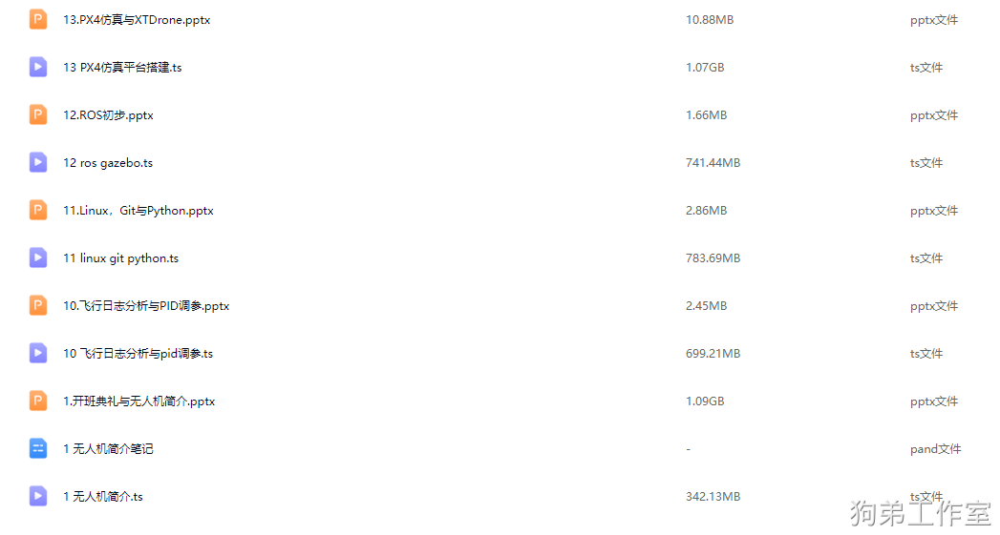

## **2.安装教程**

### 2.1 安装WSL
**提示：安装过程中需要重启电脑，请提前保存好自己的文件。**

**提示：网盘下载下来的.tar文件先不要进行任何操作，最后一步才用到。大小为31.68G,成功将此文件导入电脑后就可将此.tar文件删除了，不会影响平台的运行。**

#### 2.1.1 配置电脑
1.  在设置中搜索“查看开发者驱动器防病毒行为”并打开“开发人员模式”

如图1所示。

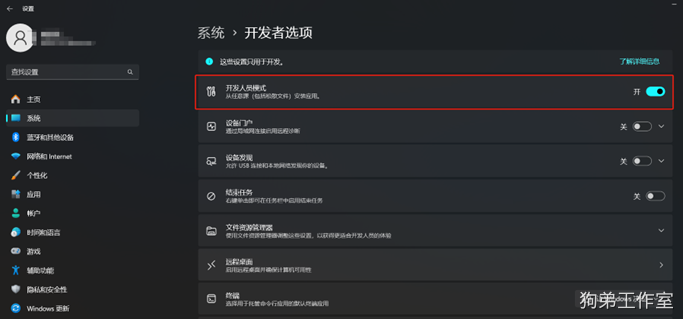

图1 打开“开发人员模式”的截图展示

 2.  开启“适用于Linux的Windows子系统”

控制面板-程序-程序和功能-“启用或关闭Windows功能”，如图2所示。

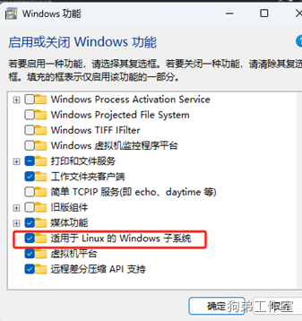

图2 打开“适用于Linux的Windows子系统”的截图展示

同时，还是在这个窗口，开启“Hyper-V”，（有的话开启，没有这个的话就不用管），如图3所示。

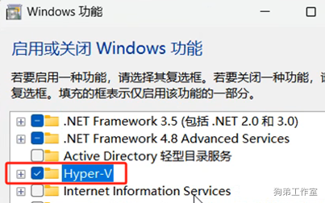

图3 打开“Hyper-V”的截图展示

然后点击确定，可以看到图4所示的画面，进度条满了后，点击立即重启电脑。

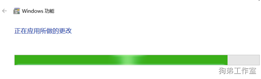

图4 电脑的反应画面

#### 2.1.2 开始安装WSL
1.       打开 PowerShell (终端管理员)  或者使用Windows 命令提示符（搜索栏输入cmd ，右键单击并选择“以管理员身份运行”）。

2.       输入 wsl --install  （若报错看文档最后的附录 5）命令，如图5所示。然后 **重启计算机**。

提示网络问题，或者连接不上服务器之类的，可以挂个梯子再重试。

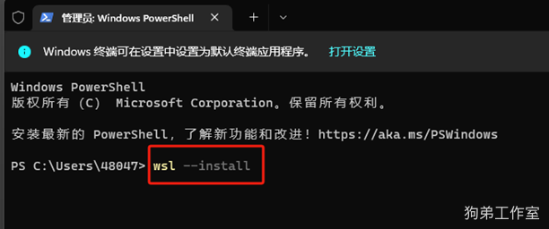

图5 在终端管理员内输入指令 和 运行后的结果

3.  进入WSL的官方网站   [https://learn.microsoft.com/zh-cn/windows/wsl/install-manual#step-4---download-the-linux-kernel-update-package](https://learn.microsoft.com/zh-cn/windows/wsl/install-manual#step-4---download-the-linux-kernel-update-package)   下载更新包，如图6所示。点击打开 msi 文件 进行更新。

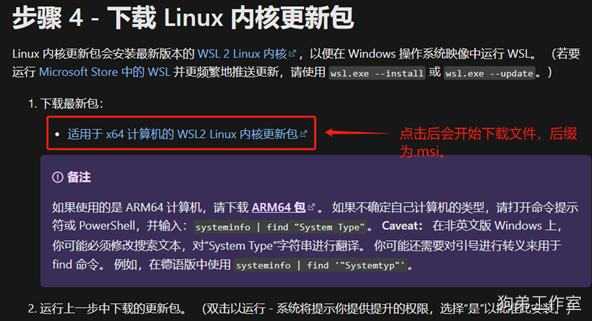

图6 进入网站并点击链接下载更新包

4.  来到上一步的网站，找到如图7所示的“步骤3”，以**管理员身份打开**PowerShell并运行，然后 **重启**，具体细节见图7。

dism.exe /online /enable-feature /featurename:VirtualMachinePlatform /all /norestart

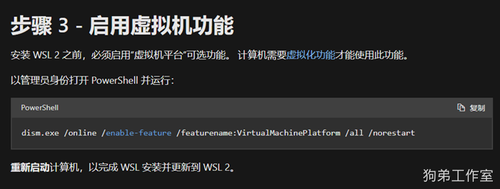

图7  网站上的“步骤3”的具体执行步骤

5.    将 WSL 2 设置为默认版本
打开 PowerShell，然后在安装新的 Linux 发行版时运行以下命令 wsl --set-default-version 2 ，如图8所示，将 WSL 2 设置为默认版本（WSL 2 为最新**版本 2**）。

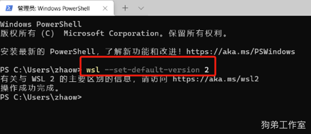

图8  在终端管理员内将 WSL 2 设置为默认版本

6.    更新WSL
在终端管理员内输入 wsl --update --web-download
有的电脑更新快，有的慢（慢的话可以尝试换个网络或者挂个美国的梯子，一般都速度都是比较快的），总之等这个进度条满后，WSL就完全安装好了。
7. **WSL 属于微软的东西，与我的平台无关。如果实在是安装不上 WSL，可以去咸鱼搜索用户 “专业IT技术服务”，我在咸鱼上与店家已协商好，从我这边过去的用户是优惠价 15 元，报我的 B 站名字即可，让这个店家帮忙远程解决一下。谢谢理解。**

### **2.2  将XTDrone平台导入WSL**
终端管理员内使用 wsl --import 命令导入你拿到的xtdrone-GDstudio-x.x.tar文件,此文件为XTDrone平台，发行版为Ubuntu-18.04。

wsl --import (发行版) (安装位置) (文件路径以及文件名称)

例如，我想在我的 C盘 wsl2 文件夹中导入XTDrone平台（d:\save\linux\ 是我xtdrone-GDstudio-x.x.tar文件所在的路径 ，根据你的电脑位置进行修改，不用非得是 c 盘，任意盘都可以，但是最好放进固态硬盘里面。）

wsl --import Ubuntu-18.04 c:\wsl2 d:\save\linux\xtdrone-GDstudio-x.x.tar

注意 ：路径中都不要有中文！

到这里就完成了所有的安装工作了，使用  wsl -l -v  命令来检查每个发行版的 WSL 版本（若有两个系统的话，可以根据附录 2，将系统切换到我的 Ubuntu-18.04 上！！！！），基于WSL的XTDrone已经在你的电脑上部署好了！**里面装包和配置化境的工作都提前整好了**，  不用再装包和配置了  。

该平台密码为： 1234   （在终端内输入的密码是不会显示的，需要时输完直接按回车即可）。

 windows 和 **XTDrone**平台 可以互传文件，直接在 文件夹 或者 vscode 中复制 粘贴即可，跟你平常复制粘贴文件是一样的。

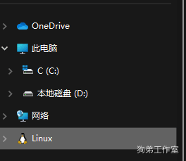

安装完后，你的文件管理器最下面会出现，**XTDrone**平台的文件夹，里面包含了代码和配置文件等全部内容。

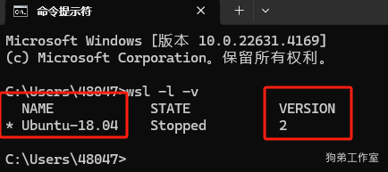

在 windows 的 PowerShell 中输入 wsl -l -v  ，NAME 下出现 Ubuntu-18.04 说明安装成功，同时 wsl 的 VERSION 要是最新版本 2。

## 3.准备工作
操作linux系统只需要两样东西，第一是终端，我们需要在终端内输入各种命令行；第二是代码文本编辑器，这里我们使用windows上的Vscode。

### **3.1   terminator终端**
以管理员模式下打开 PowerShell (终端管理员)  或者使用Windows 命令提示符（搜索栏输入cmd ，右键单击并选择“以管理员身份运行”）。

输入wsl,我们就进入了Xtdrone平台的内部，这个就相当于我们将安装好Xtdrone的虚拟机或双系统开机。

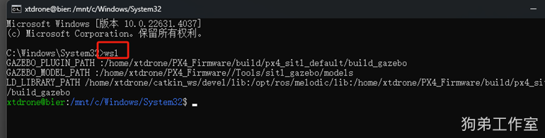

然后我们在终端内输入 terminator, 打开这个终端软件（可任意分屏，很好用）。

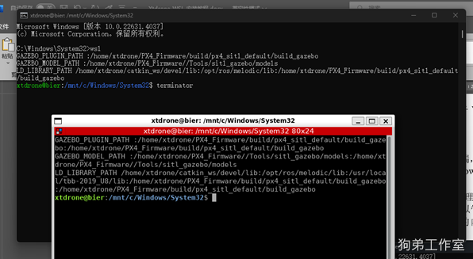

随后我们将此terminator固定在任务栏或开始界面，以后点击此terminator，就可以直接进入Xtdrone平台的内部并执行指令（ 以后你点开，他就跳过输入wsl那一步，自动开机了 ）。

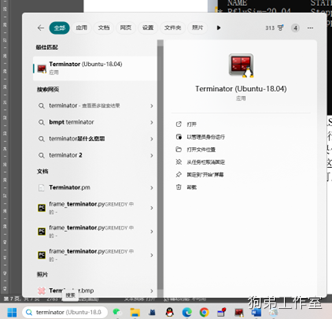

可在搜索栏搜索terminator 然后进行固定。

当然，这里我们只是推荐，你也可以习惯的方式（例如vscode软件的终端等）去运行。

### **3.2  Vscode代码编辑器**
进入VSCode 官网  [Download Visual Studio Code - Mac, Linux, Windows](https://code.visualstudio.com/Download)， 在你的 **windows里面下载 ,**

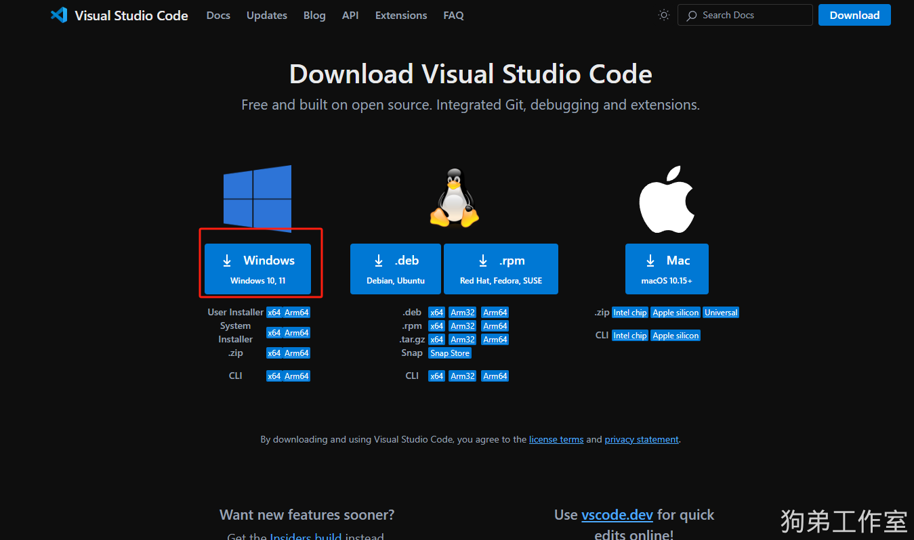

安装 VSCode，安装时把这**两个勾选上**。

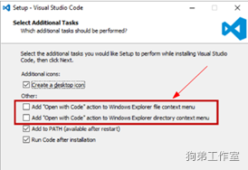

才能用鼠标右键去指定VSCode软件去打开文件夹。（ 更新win11 24h2后，资源管理器不显示wsl2目录 看附录 8）

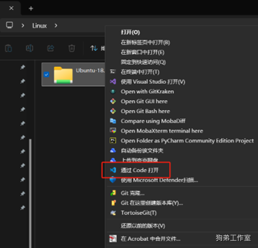

WSL + VSCode 常规使用有三种打开方式，

**第****一****种是鼠标右键选择打开方式为Vscode（不把上图两个勾选上，这里无法实现，但不影响后面的两种方式）。（推荐！！！！！）后面两种现在用不了！就用这个方式来打开文件！**

第二种是直接在 WSL 终端中打开 VSCode，在Xtdrone平台的terminator输入 code .  (code 和 .之间有个空格) ，然后VSCode会被调出，就可以在 VSCode 中进行代码开发了。我们推荐先进入主目录后，再执行此操作，否则将会打开终端当前所处路径的文件夹。（打不开的话就用第一种方式）

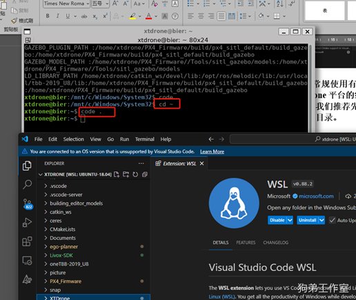

第三种是打开VSCode 软件，调出命令面板（快捷方式 CTRL+SHIFT+P），键入 WSL，你将看到可用的XTDrone的文件列表，打开后就可以在 VSCode 中进行代码开发了。（打不开的话就用第一种方式）

**注：**第二种和第三种方式 这里我们需要给 VSCode 安装 WSL 插件，打开 VSCode，点击左下角插件图标，搜索 WSL，安装插件。这样的话，我们就可以用Vscode来操作我们的Xtdrone中的代码。下载后，会出现“Starting Vs Code in wsL (Ubuntu-18.04):正在下载服务器..”这个下载有时候快，有时候满，总之需要进度条走满才行。

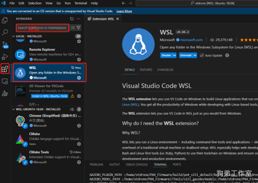

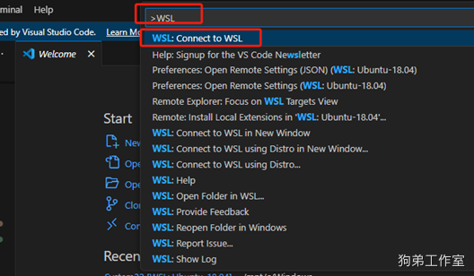

点击打开文件夹，就可以选择你准备打开的XTDrone中的文件夹了。

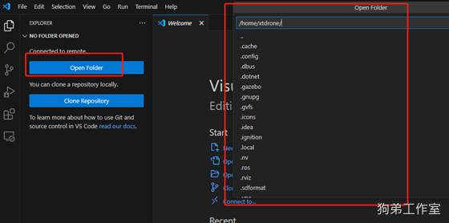

当然，你也可以用你习惯的任何编辑器去进行代码的增删改查工作，只要能打开就行。

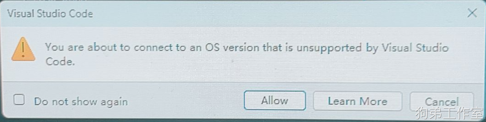

出现这个警告无影响！

## 4.激活平台
打开terminator,输入

cd ~/CMakeLists/

python3 getinfo.py

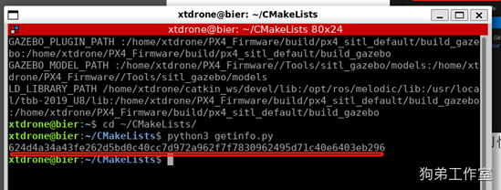

终端会弹出一个序列码，请添加好友，并将该序列码发送给李工（附上你的购买截图），他将给你一个激活码，一机一码。

该激活码会与你的电脑进行绑定，基础版有一次绑定机会，豪华版有三次绑定机会哦~

请将狗弟给你的的激活码复制在 ~/ CmakeLists/ CmakeLists.txt内（推荐用 vscode 操作，并且注意把原来的码的删掉），保存后，关闭即可，重启（sudo reboot）你的xtdrone平台，就激活成功了。

至此，(**请到文档最后看一下附录 1 用户反映的EKF问题**)，只要你是**打算跟着课程从头开始，就进行切换！**切换完以后，就跟着 B 站视频去学习，不要跟着赠送的额外视频包去学，一定要去看 B 站的配套视频。

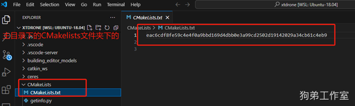

**注：编译请用catkin build package_name1 package_name2   ，对 ros 功能包 进行****单独编译，（什么是 ros 功能包见附录 3 用户反映的功能包问题）****。只有修改 C++文件和新添功能包的时候才需要编译，修改其它的不用去编译。**

**如果直接使用catkin build编译所有包，egoplanner包会报错。同时，具体操作请观看配套视频，官方仿真说明文档里面有很多的内容不是很准确和完整。**

**该平台为 Ubuntu-18.04 PX4 为 1.13 版本，记得先看视频再操作，你需要什么功能就去看对应的视频 里面都有教程！**

**这个是已经安装配置好的平台，你不需要再去执行仿真平台基础配置、编译、装包等动作，你要做的是去启动和使用这个平台。装好后就去看 B 站上视频（不是赠送的视频）学习即可！！！！！！！！！**

## **附录 1 用户反映的EKF问题：**
**现在平台的****EKF****是****视觉定位****的，PX4 为 1.13 版本 比如说你现在需要用键盘控制无人机飞行，使用的是GPS来进行定位（eg:视觉SLAM之前都是用的****GPS****来定位）。记得按照XTDrone使用文档（https://www.yuque.com/xtdrone/manual_cn/ekf_settings）的****PX4飞控EKF配置****章节来进行EKF的切换（如果你是从头开始，就进行切换！），如下图所示，切换到GPS定位。如果你需要用视觉定位的话，就不需要切换。（无人机利用相机/激光雷达+算法等非GPS方式得到无人机的定位数据统称为视觉定位，无人机利用GPS得到无人机的定位数据叫做GPS定位）更多详细信息请观看Xtdrone第7讲  **[**视频链接**](https://www.bilibili.com/video/BV1SE421F7xS/?vd_source=4289c781adc3a9ced242221ce6b3f4e0)** 。**

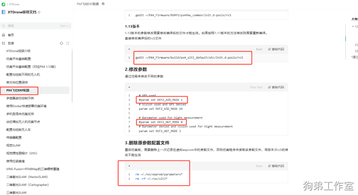

**如果你的定位方式和EKF设置的不统一，就会报如错**AttributeError: 'NoneType' object has no attribute 'x'**。错误原因：没有无人机自身的定位数据。**

## 附录 2 用户反映的wsl双平台问题：

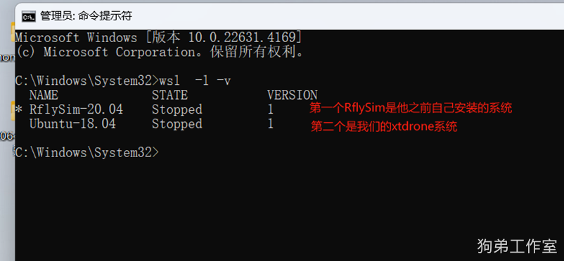

如上图所示，首先，这个用户的VERSION 是1，说明他没有将 WSL 2 设置为默认版本，没有在安装新的 Linux 发行版时运行这个命令wsl --set-default-version 2  ，此时可执行wsl --set-version Ubuntu-18.04 2    将版本设为WSL2 ，如果你VERSION就是2的话就不用再执行了。

其次，有两个NAME, 即两个系统，这时需要我们在终端执行  wsl --set-default Ubuntu-18.04  ，切换到我们的xtdrone平台，如果你没有两个平台，可忽略。

注销（卸载）当前安装的Linux的Windows子系统（名称要与list获取的一致）wsl --unregister Ubuntu-18.04  。Ubuntu-18.04 替换为你需要卸载的名字。

## **附录 3 用户反映的功能包问题：**

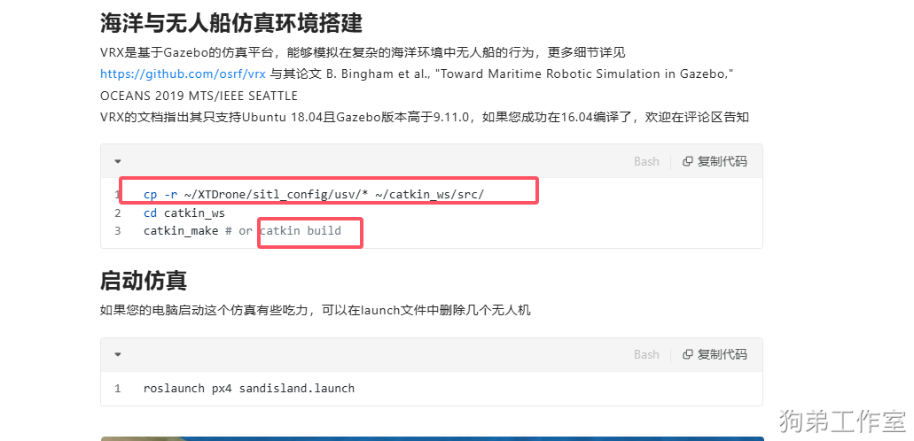

以这节为例，我们需要将下图的文件都拷贝到自己的工作空间

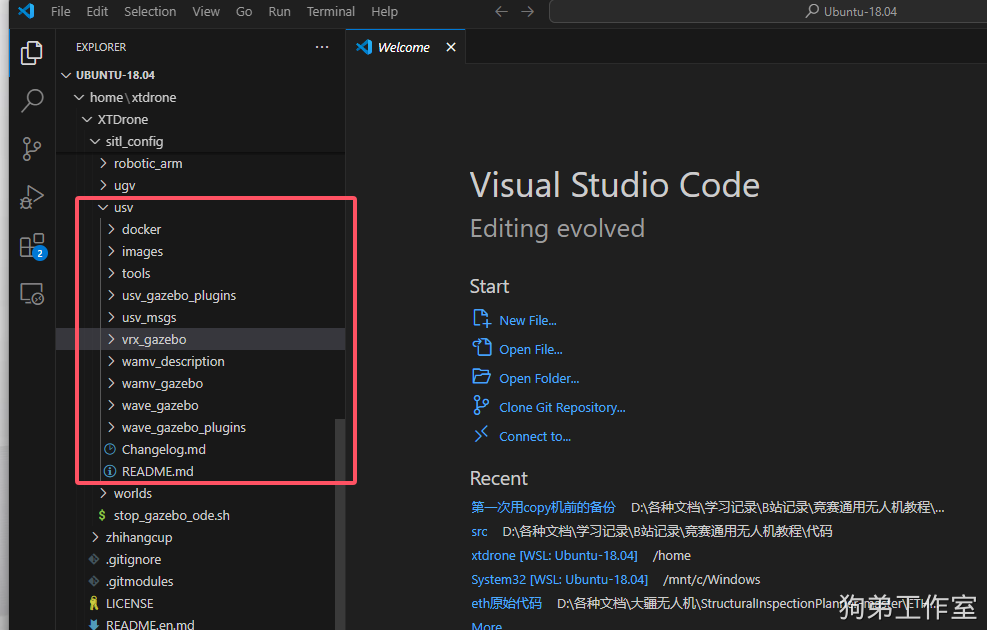

这个里面以 usv_msgs 为例，这里面带CMakeLists.txt和package.xml的的文件夹都是ros的功能包 不带的不是。

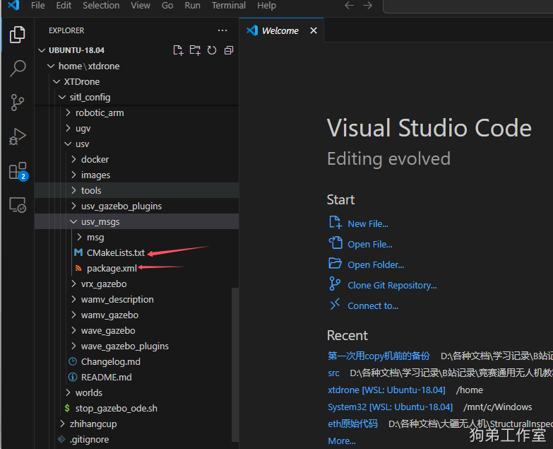

拷贝到工作空间后，cd catkin_ws

catkin build usv_gazebo_plugins usv_msgs vrx_gazebo wamv_description wamv_gazebo wave_gazebo wave_gazebo_plugins

指定所有的待编译的功能包进行编译，一次可以编译很多的功能包 功能包名字中间用空格隔开。

## 附录 4 iris 无人机模型文件夹内看不到 sdf 文件：

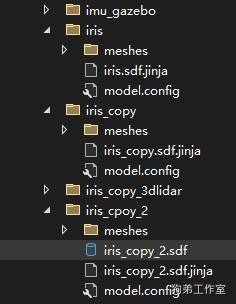

这是用 visual studio 编辑器打开的，看不到 sdf 文件，其实是编辑器的问题，但是 在 win 系统文件夹里面是有 sdf 文件的，所以我们还是推荐用VSCode 软件去编辑代码。

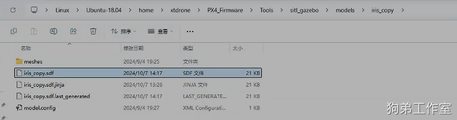

## 附录 5  wsl --install wsl：检测到localhost代理配置，但未镜像到WSL，并且下图也一直安装不上：

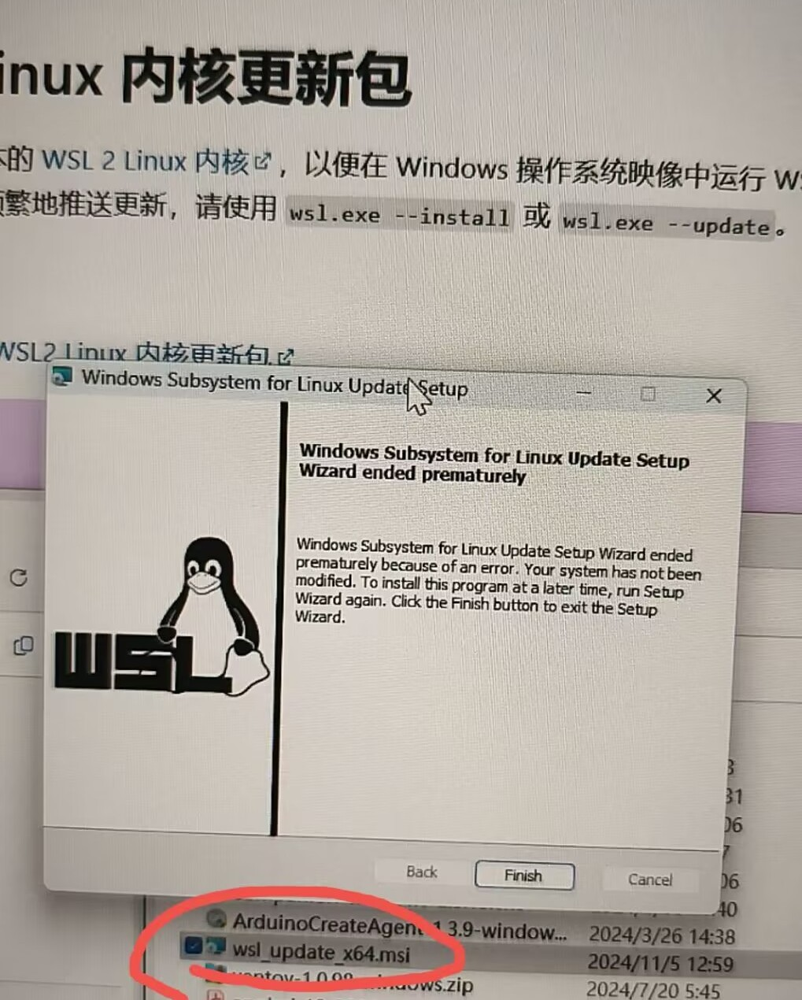

解决方案：[wsl: 检测到 localhost 代理配置，但未镜像到 WSL。NAT 模式下的 WSL 不支持 localhost 代理。_wsl: 检测到 localhost 代理配置,但未镜像到 wsl。nat 模式下的 wsl 不支持-CSDN博客](https://blog.csdn.net/weixin_50925658/article/details/135111897)

## 附录 6  WslRegisterDistribution failed with error: 0x80071772 Error: 0x80071772
[https://blog.csdn.net/u014451778/article/details/144717588](https://blog.csdn.net/u014451778/article/details/144717588)

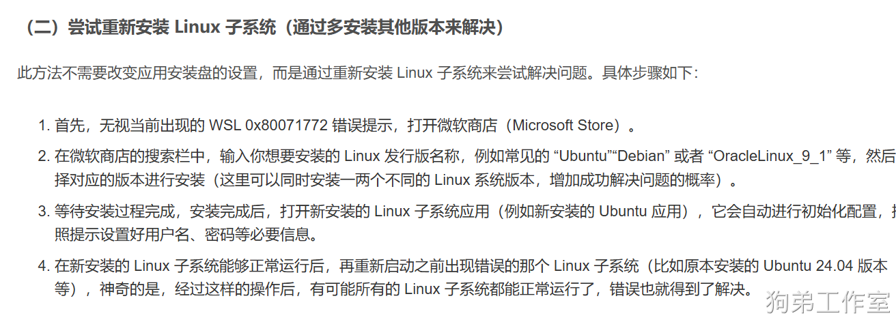

## 附录 7  重装我的这个仿真平台
重装平台后，相当于回到了最初的状态，注意保存自己的代码。

1.在终端输入 wsl -l -v  查看平台名称

2. 注销（卸载）当前安装的Linux的Windows子系统（名称要与list获取的一致）

在你笔记本的终端 执行  wsl --unregister Ubuntu-18.04  。Ubuntu-18.04 为我这个平台的名字。

3.按照文档的 **2.2  将XTDrone平台导入WSL 节 将我的平台再次导入**

4.请将狗弟给你的的激活码再次复制在 ~/ CmakeLists/ CmakeLists.txt内。

5.按照附录 1 调整你的 ekf 配置。

## 附录 8 更新win11 24h2后，资源管理器不显示wsl2目录
即使 WSL2 文件未出现在文件资源管理器中，您也可以使用以下方法访问它们：
打开文件资源管理器，然后在地址栏中输入以下路径：    \\wsl$

然后单击 Enter

## 附录 9 打开 QGC
先打开 QGC 再去启动 launch 文件。

## 网站可用性与来源备注

本文档保留原始图文结构作为知识库参考；公开到网站前仍需检查价格、账号、密码、购买渠道、QQ、激活码等敏感信息。

来源文件：
  - out/p/gd-sim-wsl.md
